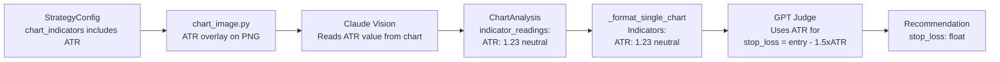

# Add ATR to Chart Indicators and GPT Stop Loss Logic

## Current State

- **Default `chart_indicators`** for all 7 strategy templates and the
  `StrategyConfig` default: `["RSI", "MACD", "Volume", "EMA_50", "EMA_200"]` (5
  indicators)
- **ATR is already supported** in `INDICATOR_MAP` as `"Average True Range"` in
  [services/chart_image.py](src/backend/services/chart_image.py) and already
  appears in `short_tf_indicators`, but is **not** in the primary indicator list
- **Claude's prompt**
  ([pipeline/prompts/claude_chart.py](src/backend/pipeline/prompts/claude_chart.py))
  treats all indicators generically via `indicator_readings[]` with a free-form
  `value: str` field -- no ATR-specific extraction guidance
- **GPT's stop loss rules**
  ([pipeline/prompts/gpt_debate.py](src/backend/pipeline/prompts/gpt_debate.py))
  require `stop_loss` for BUY/SELL but give no methodology -- GPT picks stop
  levels on its own with no ATR anchoring

## Changes Required

### 1. Add ATR to default indicator list

**Files:** [templates/strategies.json](templates/strategies.json),
[pipeline/schemas.py](src/backend/pipeline/schemas.py)

- Change default `chart_indicators` from 5 to 6:
  `["RSI", "MACD", "Volume", "EMA_50", "EMA_200", "ATR"]`
- Update in both the `StrategyConfig.chart_indicators` default factory and
  `PipelineResult.chart_indicators` default factory in `schemas.py`
- Update all 7 strategy templates in `templates/strategies.json` to include
  `"ATR"` in their `chart_indicators` array

### 2. Add ATR-specific extraction guidance to Claude's prompt

**File:**
[pipeline/prompts/claude_chart.py](src/backend/pipeline/prompts/claude_chart.py)

- Add ATR-specific instructions to the system prompt telling Claude to read the
  ATR value as a **numeric reading** (e.g., `"value": "1.23"`) and provide
  context on what it means for volatility
- Bump `PROMPT_VERSION` from `"v5"` to `"v6"`

Example addition to the prompt's indicator guidance section:

```
ATR (Average True Range):
- Read the current ATR value from the indicator pane (it is a single numeric value)
- Report the exact numeric value (e.g., "1.23") -- GPT uses this downstream for stop loss placement
- Signal: "neutral" is typical; use "bearish" if ATR is spiking (high volatility risk), "bullish" if ATR is contracting (low risk entry)
- In notes, mention whether ATR is expanding, contracting, or stable relative to recent history
```

### 3. Add ATR-based stop loss guidance to GPT's judge prompt

**File:**
[pipeline/prompts/gpt_debate.py](src/backend/pipeline/prompts/gpt_debate.py)

- Enhance the "Risk management rules" section of the `JUDGE_SYSTEM_PROMPT` to
  instruct GPT to use ATR for stop loss placement when ATR data is available in
  the chart analysis indicators
- Bump `PROMPT_VERSION` from its current value

Example addition to the risk management rules:

```
ATR-based stop loss (PREFERRED method when ATR data is available):
- Find the ATR value in the indicator readings from Claude's chart analysis
- For BUY: stop_loss = entry_price - (1.5 x ATR) as a baseline; adjust tighter
  (1.0x ATR) for scalps or wider (2.0x ATR) for swing trades based on the
  strategy's trading style and timeframe
- For SELL: stop_loss = entry_price + (1.5 x ATR) baseline with same adjustments
- If ATR is unavailable, fall back to support/resistance-based stops
- Always cross-check the ATR-derived stop against key_levels -- if a strong
  support/resistance level is nearby, prefer the structural level
```

### 4. Enhance ATR data formatting for GPT

**File:**
[pipeline/prompts/gpt_debate.py](src/backend/pipeline/prompts/gpt_debate.py)

- In `_format_single_chart()`, optionally highlight the ATR indicator reading
  separately (or rely on existing generic formatting since ATR will flow through
  as `ATR: 1.23 (neutral)` which GPT can already parse)
- The existing generic indicator formatting at line 269-271 already handles
  this, so this step may be a no-op -- the key change is in the judge prompt
  instructions (step 3)

### 5. No schema changes needed

- `IndicatorReading.value` is a `str` field, and ATR will flow through as
  `"1.23"` -- GPT can parse this from the formatted text
- No new typed `atr_value` field is needed on `ChartAnalysis` or
  `Recommendation` since the ATR value is a per-timeframe metric used for
  calculation, not a final output
- No TypeScript type changes needed in
  [types/index.ts](src/frontend/src/types/index.ts)

## Data Flow (After Changes)



## Files Changed (4)

| File                                           | Change                                                  |
| ---------------------------------------------- | ------------------------------------------------------- |
| `templates/strategies.json`                    | Add `"ATR"` to `chart_indicators` in all 7 templates    |
| `src/backend/pipeline/schemas.py`              | Add `"ATR"` to default `chart_indicators` lists         |
| `src/backend/pipeline/prompts/claude_chart.py` | ATR extraction guidance, bump version to v6             |
| `src/backend/pipeline/prompts/gpt_debate.py`   | ATR-based stop loss rules in judge prompt, bump version |
