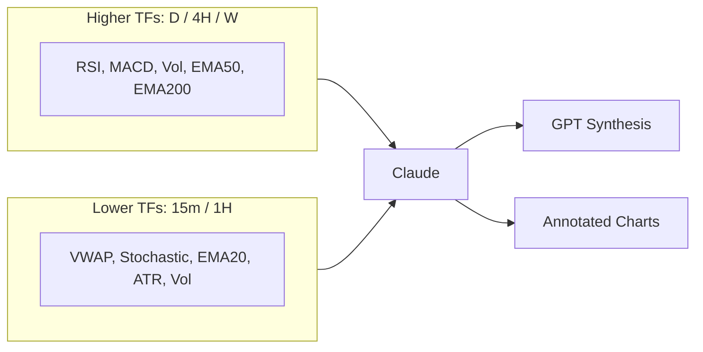

# Add Short-Timeframe Indicators (15m/1H) to Claude Pipeline

## Problem

Higher timeframes (D, 4H, W) now work with RSI, MACD, Volume, EMA 50, EMA 200.
The user wants 15m and 1H charts analyzed by Claude with a **different**
indicator set optimized for short-term trading: VWAP, Stochastic, EMA 20, ATR,
Volume.

Currently the architecture has a single `chart_indicators` list applied to all
timeframes. We need per-timeframe-group indicator sets.

## Solution

Add two new fields to `StrategyConfig`:

- `short_timeframes: list[str]` -- which timeframes use the short-term indicator
  set
- `short_tf_indicators: list[str]` -- the indicator set for those timeframes

The Claude stage loop gains a second pass over `short_timeframes`, using
`short_tf_indicators` for chart fetching and prompt construction. Everything
else (GPT piping, annotated charts, frontend display) works automatically
because the output is the same `ChartAnalysis` model regardless of which
indicator set was used.



## Implementation Steps

### Step 1: schema-fields

Add fields to `StrategyConfig` in
[src/backend/pipeline/schemas.py](src/backend/pipeline/schemas.py), after the
existing `additional_timeframes` field:

```python
short_timeframes: list[str] = Field(default_factory=lambda: ["15m", "1H"])
short_tf_indicators: list[str] = Field(
    default_factory=lambda: ["VWAP", "Stochastic", "EMA_20", "ATR", "Volume"]
)
```

### Step 2: db-migration

Create
[src/backend/database/migrations/005_short_timeframes.sql](src/backend/database/migrations/005_short_timeframes.sql):

```sql
ALTER TABLE strategies
ADD COLUMN IF NOT EXISTS short_timeframes TEXT;

ALTER TABLE strategies
ADD COLUMN IF NOT EXISTS short_tf_indicators TEXT;
```

### Step 3: strategy-service

Update [src/backend/services/strategy.py](src/backend/services/strategy.py):

In `_row_to_config()` -- parse the two new JSON columns (same pattern as
`additional_timeframes`):

```python
short_tf_raw = row.get("short_timeframes")
if isinstance(short_tf_raw, str):
    short_tf = json.loads(short_tf_raw)
elif isinstance(short_tf_raw, list):
    short_tf = short_tf_raw
else:
    short_tf = ["15m", "1H"]

short_tf_ind_raw = row.get("short_tf_indicators")
if isinstance(short_tf_ind_raw, str):
    short_tf_ind = json.loads(short_tf_ind_raw)
elif isinstance(short_tf_ind_raw, list):
    short_tf_ind = short_tf_ind_raw
else:
    short_tf_ind = ["VWAP", "Stochastic", "EMA_20", "ATR", "Volume"]
```

Pass both to the `StrategyConfig(...)` constructor. In `create_strategy()`, add:

```python
"short_timeframes": json.dumps(config.short_timeframes),
"short_tf_indicators": json.dumps(config.short_tf_indicators),
```

### Step 4: claude-stage

Update `run_chart_analysis()` in
[src/backend/pipeline/stages/claude.py](src/backend/pipeline/stages/claude.py).

After the existing `additional_timeframes` loop (line 221-233), add a second
loop for short timeframes. The key difference: pass `indicators_override` so
`_analyze_ticker` uses `short_tf_indicators` instead of `chart_indicators`.

Add `indicators_override: list[str] | None = None` parameter to
`_analyze_ticker`. In the function body, use it for both `fetch_chart_image`
(line 149) and `build_chart_prompt` (line 130-131):

```python
effective_indicators = indicators_override or config.chart_indicators
```

Replace `config.chart_indicators` at line 149 with `effective_indicators`.

In `run_chart_analysis`, the short-TF loop:

```python
for short_tf in config.short_timeframes:
    if short_tf != config.chart_timeframe:
        tasks.append(
            _analyze_ticker(
                ticker, config, sentiment, run_id, user_id,
                timeframe_override=short_tf,
                indicators_override=config.short_tf_indicators,
            )
        )
        task_tickers.append(ticker)
```

### Step 5: claude-prompt

Update `build_chart_prompt()` in
[src/backend/pipeline/prompts/claude_chart.py](src/backend/pipeline/prompts/claude_chart.py).

Add `indicators_override: list[str] | None = None` parameter. At line 123, use:

```python
effective_indicators = indicators_override or config.chart_indicators
f"Indicators on chart: {', '.join(effective_indicators)}",
```

### Step 6: templates-json

Add to every template in [templates/strategies.json](templates/strategies.json):

```json
"short_timeframes": ["15m", "1H"],
"short_tf_indicators": ["VWAP", "Stochastic", "EMA_20", "ATR", "Volume"],
```

### Step 7: supabase-sync

Run SQL against Supabase to add columns and set values:

```sql
ALTER TABLE strategies
ADD COLUMN IF NOT EXISTS short_timeframes TEXT;

ALTER TABLE strategies
ADD COLUMN IF NOT EXISTS short_tf_indicators TEXT;

UPDATE strategies
SET short_timeframes = '["15m","1H"]',
    short_tf_indicators = '["VWAP","Stochastic","EMA_20","ATR","Volume"]'
WHERE is_template = true;
```

### Step 8: frontend-types

Add to `StrategyConfig` interface in
[src/frontend/src/types/index.ts](src/frontend/src/types/index.ts):

```typescript
short_timeframes: string[];
short_tf_indicators: string[];
```

### Step 9: quality-check

Run `ruff format`, `ruff check --fix`, verify backend auto-reloads cleanly.

## "No Strategy" runs

When running with no strategy selected, the orchestrator creates a default
`StrategyConfig` (line 152 of `orchestrator.py`). The Pydantic field defaults
ensure all 5 timeframes are produced:

- `chart_timeframe = "D"` (primary)
- `additional_timeframes = ["4H", "W"]` (higher TF set)
- `short_timeframes = ["15m", "1H"]` (lower TF set, **new**)
- `chart_indicators = ["RSI", "MACD", "Volume", "EMA_50", "EMA_200"]`
- `short_tf_indicators = ["VWAP", "Stochastic", "EMA_20", "ATR", "Volume"]`
  (**new**)

No special-case code needed -- the defaults handle it.

## Risks / Open Questions

- **Chart-Img API volume**: With 5 timeframes per ticker and 8 tickers, that is
  40 chart fetches + 40 Claude calls per run. PRO plan allows 500 daily
  Chart-Img calls, so ~12 runs per day. Claude rate limit semaphore (3
  concurrent) will throttle appropriately.
- **PRO plan 5-study limit**: Both indicator sets are exactly 5 studies each,
  right at the limit. No room for a 6th on either set.
- **Frontend ChartTab**: Already has
  `AVAILABLE_TIMEFRAMES = ["15m", "1H", "4H", "D", "W"]` and timeframe labels
  for all 5. No frontend component changes needed -- the pipeline will now
  produce `ChartAnalysis` objects for 15m and 1H that flow through
  automatically.

## Branch

Current feature branch off `dev`.
