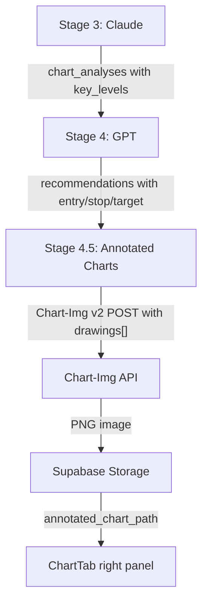

# Annotated Chart with Key Levels Overlay

## Constraint: PRO Plan Budget

Chart-Img PRO allows **5 combined `studies[] + drawings[]`** per request. The
annotated chart uses **0 studies** (the original chart already shows indicators
for Claude) and **up to 5 Horizontal Line drawings**. Priority order:

1. **Entry price** (blue, lineWidth 2) -- most actionable
2. **Stop loss** (red, lineWidth 2) -- critical risk level
3. **Take profit** (green, lineWidth 2) -- profit target
4. **Strongest support** (green, lineWidth 1) -- key technical level
5. **Strongest resistance** (red, lineWidth 1) -- key technical level

If recommendation data is missing (GPT failed / HOLD), all 5 slots go to key
levels ranked by strength.

## Data Flow



## Files Changed

### 1. Backend: [src/backend/services/chart_image.py](src/backend/services/chart_image.py)

Add `fetch_annotated_chart()` function. It takes:

- `ticker`, `timeframe` -- for the Chart-Img symbol/interval
- `key_levels: list[TechnicalLevel]` -- from Claude's analysis
- `entry_price`, `stop_loss`, `take_profit` -- from GPT's recommendation (all
  optional)
- `run_id`, `user_id` -- for storage path

It builds the `drawings[]` array with up to 5 `Horizontal Line` objects:

```python
drawings.append({
    "name": "Horizontal Line",
    "input": {"price": level.price},
    "override": {
        "lineWidth": 2,
        "lineColor": "rgb(59,130,246)",  # blue for entry
    },
})
```

Calls Chart-Img v2 POST with `studies: []` (no indicators on this chart) and
`drawings: [...]`. Uploads to Supabase under a separate path (`annotated/`
prefix) and returns the public URL.

### 2. Backend: [src/backend/pipeline/schemas.py](src/backend/pipeline/schemas.py)

Add `annotated_chart_path: str = ""` field to the `ChartAnalysis` model so each
timeframe's analysis can carry its own annotated chart URL.

### 3. Backend: [src/backend/pipeline/orchestrator.py](src/backend/pipeline/orchestrator.py)

After Stage 4 (GPT) completes, add a Stage 4.5 block:

- For each `ChartAnalysis` in `result.chart_analyses`, find the matching
  `Recommendation` by ticker
- Call `fetch_annotated_chart()` with the analysis key_levels + recommendation
  trade params
- Set `chart_analysis.annotated_chart_path = url`
- Wrap in try/except so failures don't break the pipeline
- Run all calls concurrently with `asyncio.gather(return_exceptions=True)`

### 4. Frontend: [src/frontend/src/types/index.ts](src/frontend/src/types/index.ts)

Add `annotated_chart_path: string` to the `ChartAnalysis` interface.

### 5. Frontend: [src/frontend/src/components/recommendations/ChartTab.tsx](src/frontend/src/components/recommendations/ChartTab.tsx)

Replace the `PriceLevelMap` in the right panel with:

- The **annotated chart image** (using `ExpandableChartImage` for the expand
  button, same pattern as the left panel)
- Below it, a **compact key levels legend** (condensed version of the SVG data:
  colored dots with price labels)
- Fallback: if `annotated_chart_path` is empty, show the existing
  `PriceLevelMap` SVG

### 6. Frontend: [src/frontend/src/components/recommendations/PriceLevelMap.tsx](src/frontend/src/components/recommendations/PriceLevelMap.tsx)

Keep as-is for the fallback scenario, no changes needed.

## API Usage Impact

- **+2 Chart-Img calls per ticker** (one per timeframe: Daily + 4H) added after
  GPT finishes
- These use 0 studies, only drawings, so they're lightweight renders
- With 6 tickers and 2 timeframes = 12 extra calls per pipeline run (well within
  500/day PRO limit)
