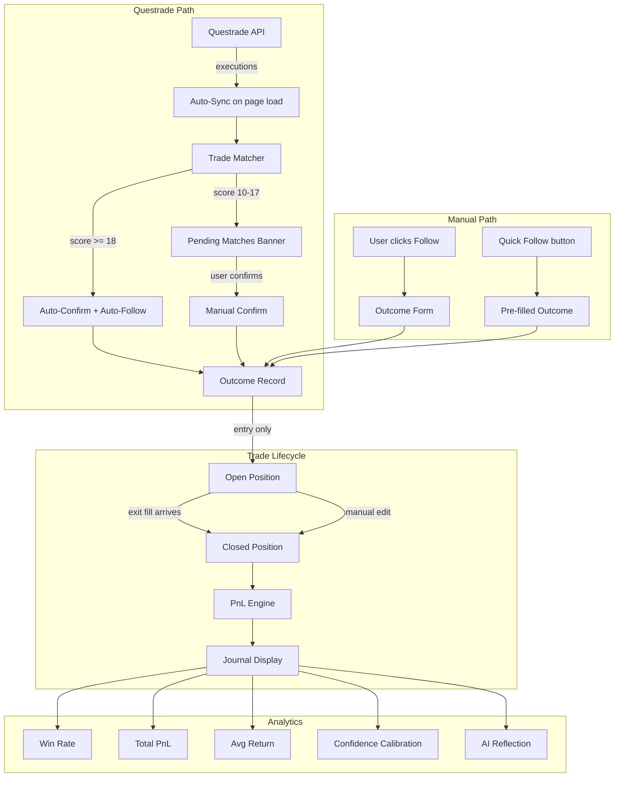

# Autonomous Trade Journal — World-Class PnL Tracking

## The Problem Today

The current journal requires **9 manual steps** to track a single trade:

1. Run pipeline, get recommendation
2. Go to Insights, click Follow
3. Open Questrade, place trade
4. Come back, click Sync
5. See pending match, click Confirm
6. Position appears (but shows "$0.00" if open)
7. Later sell on Questrade
8. Click Sync again, find exit match
9. Confirm exit match — PnL finally appears

Every step is friction. A world-class journal should feel like it **maintains
itself**.

---

## The Winning Flow

### With Questrade Connected (Primary Path)

```
User buys stock on Questrade based on recommendation
        ↓
Opens Insights page
        ↓
System auto-syncs last 7 days silently (cached, max once per 5 min)
        ↓
    ┌─────────────────────────────────────┐
    │ High confidence (score >= 18)?      │
    │ exact ticker + direction + recent   │
    ├──────── YES ────────┬───── NO ──────┤
    │                     │               │
    │ Auto-follow +       │ Show in       │
    │ Auto-confirm +      │ Pending       │
    │ Create outcome      │ Matches       │
    │ with entry data     │ Banner for    │
    │ + rec's SL/TP       │ manual review │
    └─────────────────────┴───────────────┘
        ↓
Position shows as "Open" with entry, shares, SL, TP, days held
        ↓
User sells on Questrade
        ↓
Next Insights visit → auto-sync picks up exit
        ↓
Exit auto-matched to open position → PnL calculated
        ↓
Position shows as "Closed" with full trade result
```

**The user's experience becomes 3 steps:**

1. Buy stock on Questrade
2. Open Insights — position is there, tracked
3. Sell stock — PnL appears automatically

### Manual Fallback (No Questrade or Override)

```
Recommendation appears → user clicks Follow
        ↓
One-click "Log at Rec Prices" OR custom entry form
        ↓
Position shows as "Open"
        ↓
User clicks Edit → adds exit price → PnL auto-calculates
```

### Key UX Principles

- **Questrade is the source of truth** — manual is the override layer
- **Auto-confirm for obvious matches**, review for ambiguous ones
- **Every field is always editable** — user can correct any auto-imported data
- **Open vs Closed is crystal clear** — no more "$0.00" for live positions
- **PnL is direction-aware** — BUY profits when price rises, SHORT profits when
  price falls
- **SL hit = exit** — if stop loss was triggered, treat SL as exit price for PnL

---

## Architecture Changes

### 1. Auto-Sync on Page Load

Currently sync is user-triggered ("Sync Trades" button). Change to:

- **Silent auto-sync** when Insights mounts and Questrade is connected
- **Debounce**: cache last sync time, skip if synced within 5 minutes
- **No spinner blocking the page** — sync happens in background, results merge
  in
- **Keep manual Sync button** for force-refresh

**Files:** [InsightsView.tsx](src/frontend/src/views/InsightsView.tsx),
[useInsights.ts](src/frontend/src/hooks/useInsights.ts)

### 2. Auto-Confirm High-Confidence Matches

Add a confidence threshold to `find_matches`. When score >= 18 (exact ticker +
direction match + within 3 days), **skip the pending match step entirely** and
create the outcome directly.

Score breakdown for auto-confirm:

- Ticker exact match: +10
- Direction match (entry or exit): +5
- Time proximity (within ~2 days): +3 to +5
- Total: 18+ = auto-confirm

**Files:** [trade_matcher.py](src/backend/services/trade_matcher.py),
[questrade.py](src/backend/api/questrade.py)

### 3. Auto-Follow for Unmatched Decisions

When auto-confirming an entry that has no "following" decision yet,
**auto-create the decision**. The user bought the stock — that IS their decision
to follow.

This eliminates the requirement to manually click "Follow" before Questrade can
match.

```python
# In auto-confirm flow:
# 1. Check if "following" decision exists for this recommendation
# 2. If not, create one with reason="Auto-followed from Questrade"
# 3. Create outcome with Questrade entry data
```

**Files:** [trade_matcher.py](src/backend/services/trade_matcher.py) (new
`auto_confirm_and_follow` function),
[questrade.py](src/backend/api/questrade.py)

### 4. Direction-Aware PnL Engine

Centralize PnL calculation into a single function used by both backend
(Questrade confirm) and frontend (manual forms). Current logic is scattered
across `confirm_match`, `OutcomeForm`, `EditOutcomeForm`, and `FeedbackTab`.

```python
def calculate_pnl(
    action: str,        # "BUY" or "SHORT"
    entry_price: float,
    exit_price: float,
    shares: int,
    commission: float = 0.0,
) -> dict:
    sign = -1 if action == "SHORT" else 1
    gross = round(sign * (exit_price - entry_price) * shares, 2)
    net = round(gross - commission, 2)
    pct = round(sign * ((exit_price - entry_price) / entry_price) * 100, 2) if entry_price else None
    return {"pnl_dollars": gross, "net_pnl": net, "pnl_percent": pct, "gross_pnl": gross}
```

SL-as-exit fallback: if `exit_price` is null but `stop_loss` is set and the
trade is being closed, use `stop_loss` as exit.

**Files:** New utility in
[src/backend/services/pnl.py](src/backend/services/pnl.py), frontend equivalent
in [src/frontend/src/lib/pnl.ts](src/frontend/src/lib/pnl.ts)

### 5. Enhanced Open Position Card

The "Open" status card should show:

- Entry price and shares (from Questrade or manual)
- Planned SL and TP (from recommendation or user override)
- Days held (calculated from entry timestamp)
- Commission paid so far
- Source badge (Questrade / Manual)
- Quick-close button: "Close Position" → opens form pre-filled with SL/TP as
  potential exits

### 6. Enhanced Closed Trade Card

The "Closed" card should show at a glance:

- Gross PnL and Net PnL (after commission)
- PnL % return
- Entry → Exit with direction arrow
- Shares, holding days
- R-multiple if SL was set: `PnL / (entry - stop_loss) per share`
- Commission total
- Source badges for entry and exit

### 7. One-Click Manual Entry

For manual users, add a "Quick Follow" button on the Follow action that:

- Creates the decision
- Pre-fills outcome with recommendation's entry, SL, TP
- User only needs to type actual shares
- One click instead of Follow → expand → fill form → save

---

## Data Flow Diagram



---

## Implementation Tasks

### Backend

**Task 1: PnL utility module** — Create `src/backend/services/pnl.py` with
centralized `calculate_pnl()` function. Replace scattered PnL logic in
`questrade.py` confirm_match and `outcomes.py`.

**Task 2: Auto-confirm in trade matcher** — Add `AUTO_CONFIRM_THRESHOLD = 18.0`
to `trade_matcher.py`. New function `auto_confirm_and_follow()` that: (a)
creates "following" decision if missing, (b) creates outcome with Questrade
entry data + rec's SL/TP, (c) marks match as "auto_confirmed". Modify
`find_matches` to call this for high-score matches instead of inserting pending
matches.

**Task 3: Auto-sync caching** — Add `last_synced_at` field to `questrade_tokens`
table. New endpoint `POST /api/brokerage/smart-sync` that checks last sync time,
skips if within 5 minutes, otherwise runs full sync. Returns both auto-confirmed
results and pending matches.

**Task 4: Sync response schema** — New `SyncResultResponse` Pydantic model that
returns
`{ auto_confirmed: [...], pending_review: [...], skipped_reason?: string }` so
the frontend knows what happened.

### Frontend

**Task 5: Auto-sync on Insights mount** — In `InsightsView.tsx`, add a
`useEffect` that calls `smart-sync` when Questrade is connected. Show a subtle
toast for auto-confirmed trades ("2 trades auto-linked from Questrade"). No
blocking spinner.

**Task 6: PnL utility** — Create `src/frontend/src/lib/pnl.ts` with
`calculatePnl()` matching backend logic. Replace the scattered `useEffect` PnL
calculations in `OutcomeForm`, `EditOutcomeForm`, and
`FeedbackTab.OutcomeSection`.

**Task 7: Open Position card redesign** — Richer display: days held (live
counter from entry_timestamp), entry price, shares, SL/TP, commission, source.
"Close Position" button that opens edit form with exit fields focused.

**Task 8: Closed Trade card enhancement** — Show gross/net PnL, PnL %,
R-multiple (if SL set), entry/exit prices with direction indicator, holding
days, commission breakdown.

**Task 9: Quick Follow button** — On "pending" status rows, add a secondary
button: "Follow + Log at Rec Prices" that creates decision + outcome in one API
call with recommendation's entry/SL/TP pre-filled (user still confirms shares).

**Task 10: FeedbackTab parity** — Update `FeedbackTab.tsx` to use the same
"open" vs "closed" status distinction and the shared PnL utility. Currently it
treats any outcome as "closed."

### Database

**Task 11: Migration** — Add `last_synced_at TIMESTAMPTZ` to `questrade_tokens`.
Add `auto_confirmed BOOLEAN DEFAULT FALSE` to `pending_matches`. Add
`auto_followed BOOLEAN DEFAULT FALSE` to `decisions`.

### TypeScript Types

**Task 12: Schema sync** — Add `SyncResultResponse`, update
`PendingMatchResponse` with `auto_confirmed`, update `Decision` type with
`auto_followed`. Mirror all backend Pydantic changes.

---

## What This Does NOT Include (Future Phases)

- **Scaling in/out** (multiple entries per position) — requires an executions
  table
- **MAE/MFE tracking** — requires intraday price data
- **Calendar view** — UI-only addition, no schema changes
- **Setup/mistake tagging** — new columns + tag management UI
- **Live unrealized PnL** — requires real-time price feed
- **Auto-scheduled sync** — background worker, not user-triggered
- **Partial fill support** — FIFO matching like Tradervue

These are all natural extensions of the architecture above but are not needed
for the core "autonomous journal" experience.
