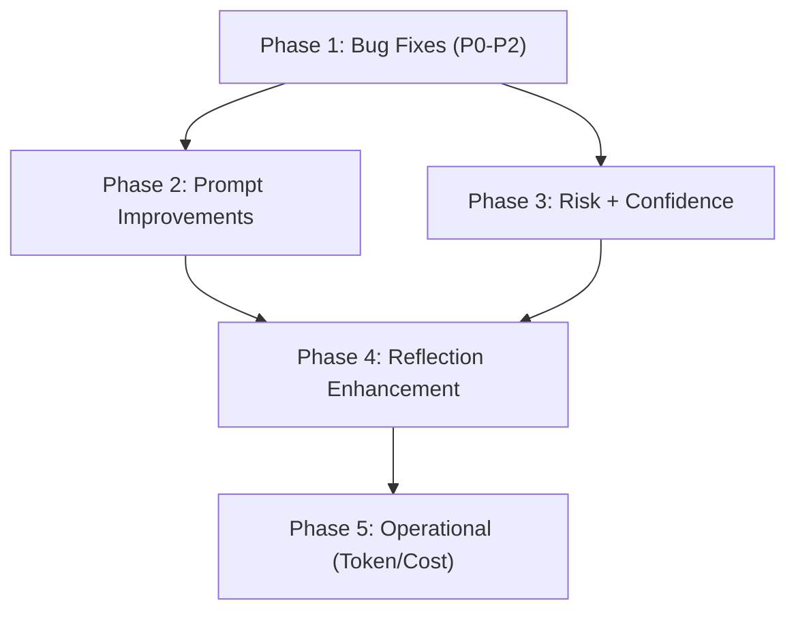

# Backend Deep Dive Fixes

## Phase 1: Bug Fixes (P0 - P2)

These are correctness issues that can cause runtime crashes or wrong behavior.
All are surgical, low-risk fixes.

### 1a. P0: Python 2 Exception Syntax (5 files)

The comma syntax `except X, Y:` catches `X` and binds the exception to the name
`Y` -- it does NOT catch both types. Fix all to tuple syntax `except (X, Y):`.

| File                                                                         | Line | Current                                   | Fix                                         |
| ---------------------------------------------------------------------------- | ---- | ----------------------------------------- | ------------------------------------------- |
| [services/reflection.py](src/backend/services/reflection.py)                 | 87   | `except json.JSONDecodeError, TypeError:` | `except (json.JSONDecodeError, TypeError):` |
| [services/reflection.py](src/backend/services/reflection.py)                 | 655  | `except json.JSONDecodeError, TypeError:` | `except (json.JSONDecodeError, TypeError):` |
| [api/questrade.py](src/backend/api/questrade.py)                             | 266  | `except ValueError, TypeError:`           | `except (ValueError, TypeError):`           |
| [services/technical_analysis.py](src/backend/services/technical_analysis.py) | 845  | `except ValueError, TypeError:`           | `except (ValueError, TypeError):`           |
| [ml/inference.py](src/backend/ml/inference.py)                               | 67   | `except TypeError, ValueError:`           | `except (TypeError, ValueError):`           |

Note: `services/trade_matcher.py` lines 374/455 already use correct tuple syntax
-- no fix needed.

### 1b. P0: Analysis Mode Hardcoded Canadian Market Bias

**File:**
[pipeline/prompts/perplexity_analysis.py](src/backend/pipeline/prompts/perplexity_analysis.py)
lines 14-19

`ANALYSIS_SYSTEM_PROMPT` hardcodes "focus on the Canadian market (TSX, TSXV)"
and "prefer the Canadian listing." Discovery mode dynamically adapts to the
strategy's market settings; analysis mode does not.

**Fix:** Make `build_analysis_prompt()` accept a `config: StrategyConfig`
parameter and dynamically build the market focus section from
`config.fmp_screener.exchange` / `.country` (same pattern as discovery). If no
FMP config, default to a market-neutral prompt ("You are a financial research
analyst").

### 1c. P1: `config.is_crypto` AttributeError

**File:** [pipeline/orchestrator.py](src/backend/pipeline/orchestrator.py) lines
585, 962

`config.is_crypto` is accessed but `StrategyConfig` has no top-level `is_crypto`
field. The field lives on `FmpScreenerConfig`.

**Fix:** Replace both occurrences with:

```python
is_crypto=config.fmp_screener.is_crypto if config.fmp_screener else False,
```

### 1d. P2: `live_quotes` Variable Scoping

**File:** [pipeline/orchestrator.py](src/backend/pipeline/orchestrator.py) line
740

`live_quotes` is assigned inside a conditional block but referenced later.
Currently unlikely to cause a runtime crash due to flow guards, but fragile.

**Fix:** Initialize `live_quotes: dict = {}` at function scope (alongside other
variables like `fmp_map`, `charts`, etc.) before any conditional blocks.

### 1e. P2: `_update_annotated_paths` N+1 Updates

**File:** [pipeline/orchestrator.py](src/backend/pipeline/orchestrator.py) lines
1125-1132

Individual `UPDATE` queries in a loop, one per chart analysis.

**Fix:** Batch the updates using `asyncio.gather` to run all updates
concurrently (PostgREST doesn't support multi-row update-by-different-IDs in a
single call, but we can parallelize):

```python
await asyncio.gather(*(
    client.table("stage_outputs")
    .update({"raw_response": ca.model_dump_json()})
    .eq("id", row_map[(ca.ticker, ca.timeframe)])
    .execute()
    for ca in analyses_with_paths
    if (ca.ticker, ca.timeframe) in row_map
))
```

---

## Phase 2: Prompt System Improvements

### 2a. Inject `strategy_type` and `description` into GPT Judge Prompt

**Files:**

- [pipeline/prompts/gpt_debate.py](src/backend/pipeline/prompts/gpt_debate.py)
  -- `build_judge_prompt()`
- [pipeline/stages/gpt.py](src/backend/pipeline/stages/gpt.py) -- pass `config`
  through

Add a `## STRATEGY CONTEXT` section to the judge user prompt (in
`build_judge_prompt`) that includes:

```
Strategy: {config.name} ({config.strategy_type})
Description: {config.description}
Trading style: {config.trading_style}
```

This gives GPT awareness of whether it's processing swing vs intraday vs
mean_reversion, which should influence its entry timing and risk guidance.

### 2b. Feed Track Agreement / Directional Conflict into GPT Judge

**Current state:** Track agreement is computed AFTER GPT returns (orchestrator
lines 725-730). GPT emits its own `track_agreement` but doesn't see a
pre-computed conflict summary.

**Fix:** Before calling `run_debate()`, compute a lightweight directional
conflict summary from Gemini sentiments and Claude chart analyses:

- In [pipeline/orchestrator.py](src/backend/pipeline/orchestrator.py), after
  stages 2+3 complete but before stage 4, build a per-ticker conflict string
- Pass it into `build_judge_prompt()` as a new `## TRACK CONFLICT SUMMARY`
  section
- Example: "CONFLICT for AAPL: Gemini sentiment is bearish (-0.6, negative news
  flow) while Claude chart is bullish (ascending triangle, RSI 45). The judge
  must explicitly resolve this."

### 2c. Extract Model Names to Config

**Current hardcoded locations:**

| File                                                              | Line | Constant                           |
| ----------------------------------------------------------------- | ---- | ---------------------------------- |
| [stages/gpt.py](src/backend/pipeline/stages/gpt.py)               | 46   | `GPT_MODEL = "gpt-5.4"`            |
| [stages/gemini.py](src/backend/pipeline/stages/gemini.py)         | 31   | `GEMINI_MODEL = "gemini-2.5-pro"`  |
| [stages/claude.py](src/backend/pipeline/stages/claude.py)         | 39   | `CLAUDE_MODEL = "claude-opus-4-6"` |
| [stages/perplexity.py](src/backend/pipeline/stages/perplexity.py) | 49   | `AGENT_MODEL = "openai/gpt-5.4"`   |
| [stages/regime.py](src/backend/pipeline/stages/regime.py)         | 27   | `AGENT_MODEL = "perplexity/sonar"` |

**Fix:** Create a `ModelConfig` in schemas or a new `pipeline/model_config.py`
that reads from env vars with the current values as defaults:

```python
GPT_MODEL = os.getenv("SF_GPT_MODEL", "gpt-5.4")
GEMINI_MODEL = os.getenv("SF_GEMINI_MODEL", "gemini-2.5-pro")
CLAUDE_MODEL = os.getenv("SF_CLAUDE_MODEL", "claude-opus-4-6")
PERPLEXITY_MODEL = os.getenv("SF_PERPLEXITY_MODEL", "openai/gpt-5.4")
REGIME_MODEL = os.getenv("SF_REGIME_MODEL", "perplexity/sonar")
```

Each stage imports from this central location. Enables A/B testing and cheaper
model substitution per strategy.

---

## Phase 3: Risk and Confidence System Improvements

### 3a. Wire `risk_score` into Position Sizing

**File:**
[pipeline/stages/risk_validator.py](src/backend/pipeline/stages/risk_validator.py)

Currently `risk_score` only produces a tiny `(1 - risk_score) * 0.07` penalty in
calibration. Position sizing is unaffected.

**Fix:** In `validate_risks()`, after all risk checks, add:

```python
if risk_assessment and risk_assessment.risk_score < 1.0:
    risk_size_factor = max(0.25, risk_assessment.risk_score)
    rec.position_size_pct = round(rec.position_size_pct * risk_size_factor, 2)
```

Add hard blocks for extreme risk:

- Altman Z-score < 1.0 (from FMP context) -> `risk_approved = False`
- Piotroski < 2 -> `risk_approved = False`

### 3b. Wire `reflection_metrics` into Calibration

**Current gap:** Orchestrator calls `calibrate_recommendations` at line 817-823
WITHOUT passing `reflection_metrics`. The historical scoring component defaults
to 0.10.

**Fix:** In orchestrator, after `load_reflection_context()`, also load
structured metrics from the latest reflection row and pass them into
`calibrate_recommendations()`:

```python
reflection_metrics = await load_reflection_metrics(user_id)
calibrate_recommendations(recs, ..., reflection_metrics=reflection_metrics)
```

This connects the existing outcome-based confidence buckets and pattern stats to
the deterministic calibration path, making the historical_pattern component
data-driven instead of always 0.10.

### 3c. Build Calibration Curve from Historical Outcomes

**New file:**
[services/calibration_curve.py](src/backend/services/calibration_curve.py)

Query `decisions` + `outcomes` tables to compute:

1. Bin GPT confidence into buckets (0.5-0.6, 0.6-0.7, 0.7-0.8, 0.8-0.9, 0.9-1.0)
2. Compute actual win rate per bucket
3. Apply isotonic regression (monotonic calibration) if enough data (50+
   outcomes)
4. Store calibration mapping in DB or cache
5. Add API endpoint `GET /insights/calibration` to surface in Insights UI

This replaces the arbitrary 40/60 blend weights with empirically learned values
over time. Start with the fixed blend as fallback when < 50 outcomes exist.

---

## Phase 4: Reflection System Enhancement

### 4a. Make Reflections Strategy-Specific

**File:** [services/reflection.py](src/backend/services/reflection.py) --
`generate_reflection()`

Currently queries all decisions/outcomes for a user with no strategy filter.

**Fix:** Add optional `strategy_id` parameter. When provided, filter
decisions/outcomes queries by strategy_id. Generate strategy-specific memory
injection that includes only patterns relevant to that strategy type.

### 4b. Auto-Generate Reflections

**File:** [api/outcomes.py](src/backend/api/outcomes.py) or a new background
task

After outcome recording, check if the user has accumulated N new unprocessed
outcomes (configurable, default 5). If so, auto-trigger `generate_reflection()`.
Use a simple counter or timestamp-based check -- no scheduler needed.

---

## Phase 5: Operational Improvements

### 5a. Token Budget Management

**File:** New utility in
[pipeline/token_budget.py](src/backend/pipeline/token_budget.py)

Add `tiktoken`-based token counting for GPT prompts. Before calling the judge:

1. Count tokens in the composed prompt
2. If exceeding 80% of model context (128k for GPT-5.4), truncate lower-priority
   sections (historical reflection first, then per-ticker detail)
3. Log a warning when truncation occurs

### 5b. Per-Run Cost Tracking

**Files:** [pipeline/orchestrator.py](src/backend/pipeline/orchestrator.py),
[pipeline/schemas.py](src/backend/pipeline/schemas.py)

Add a `PipelineCostTracker` that accumulates estimated cost per LLM call (input
tokens x price + output tokens x price). Persist total cost in the
`pipeline_runs` table. Surface in the Insights UI.

---

## Implementation Order

The phases are ordered by impact and risk:



- **Phase 1** is all quick, surgical fixes (can be done in parallel)
- **Phase 2** is moderate complexity, high value
- **Phase 3** requires careful testing with real data
- **Phase 4** builds on Phase 3's reflection_metrics wiring
- **Phase 5** is additive, no existing behavior changes
