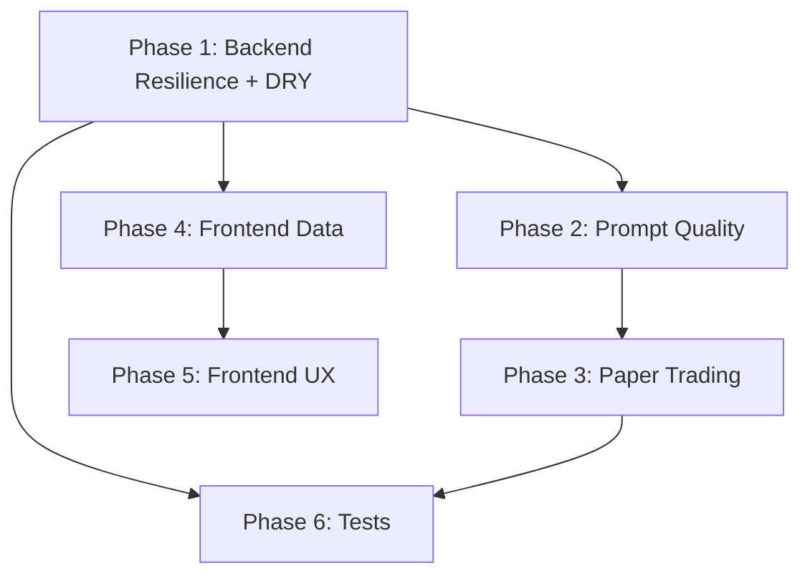

# Deep Dive Remainder Plan

The [prior plan](backend_deep_dive_fixes_fcbc32da.plan.md) completed 15 backend
tasks (bug fixes, prompt wiring, risk/confidence, reflections, token budget,
cost tracking). This plan covers **everything else** from
[deepdive.plan.md](deepdive.plan.md).

---

## What Was Already Done (for reference)

P0 bugs (exception syntax, Canadian bias, `is_crypto`, `live_quotes`, N+1
updates), strategy context in GPT judge, track conflicts to judge, model config
extraction, risk-score position sizing, reflection metrics wiring, calibration
curve, strategy-specific reflections, auto-reflections, token budget, cost
tracking.

---

## Phase 1: Backend Resilience and DRY (Priority P2-P3)

### 1a. Unify Perplexity retry with shared `with_validation_retry` + circuit breaker

**Files:**
[pipeline/stages/perplexity.py](src/backend/pipeline/stages/perplexity.py),
[pipeline/validation.py](src/backend/pipeline/validation.py)

Perplexity uses a custom `_call_with_retry` loop (line ~488) instead of
`@with_validation_retry`. It lacks circuit breaker integration entirely
(`check_provider`/`record_success`/`record_failure` never called).

**Fix:**

- Refactor the core LLM call (`_call_agent_api`) into a shape compatible with
  `@with_validation_retry`
- The complication: Perplexity returns `(text, citations)` not just text. Either
  extend `with_validation_retry` to handle tuple returns, or split the citation
  tracking out
- Add `provider="perplexity"` circuit breaker
- Keep the empty-ticker retry logic (re-prompt when 0 tickers returned) as a
  wrapper around the decorated function

### 1b. Unify Regime retry with `with_validation_retry`

**File:** [pipeline/stages/regime.py](src/backend/pipeline/stages/regime.py)
lines 27-148

Regime uses a manual `for attempt in range(MAX_RETRIES + 1)` with a bare
`except Exception` and `asyncio.sleep(1)`. No circuit breaker, no error context
injection for self-correction. The validation retry log message on line ~137 is
unreachable because `validate_llm_json` raises on failure rather than returning
`None`.

**Fix:**

- Wrap the core call in
  `@with_validation_retry(schema=RegimeOutput, provider="perplexity")`
- Remove the manual retry loop
- Keep the heartbeat cache fallback as a wrapper

### 1c. Add exponential backoff to `with_validation_retry`

**File:** [pipeline/validation.py](src/backend/pipeline/validation.py) lines
99-175

Currently retries fire immediately with no delay. For rate-limited providers
this burns through retries instantly.

**Fix:**

- Add `base_delay: float = 1.0` parameter to the decorator
- Insert `await asyncio.sleep(base_delay * (2 ** attempt))` before each retry
- Keep attempt 0 (first call) immediate

### 1d. Add transient HTTP retry to GPT and Claude stages

**Files:** [pipeline/stages/gpt.py](src/backend/pipeline/stages/gpt.py)
`_call_gpt()`,
[pipeline/stages/claude.py](src/backend/pipeline/stages/claude.py)
`_call_claude_vision()`

Gemini has a proper transient retry with
`_TRANSIENT_CODES = {429, 500, 502, 503}` and exponential backoff. GPT and
Claude have none -- a single 429 or 502 fails the entire stage.

**Fix:**

- Extract Gemini's transient retry pattern into a shared utility (e.g.
  `pipeline/http_retry.py` or add to `validation.py`)
- Apply it as a decorator or wrapper to `_call_gpt` and `_call_claude_vision`
- Use the same `_TRANSIENT_CODES` set and exponential backoff

### 1e. Make Claude `max_tokens` configurable

**File:** [pipeline/stages/claude.py](src/backend/pipeline/stages/claude.py)
line ~108

Hardcoded `max_tokens=4096`. Should be a constant at module level (or in
`model_config.py`) so it can be tuned.

**Fix:**

- Add `CLAUDE_MAX_TOKENS: int = int(os.getenv("SF_CLAUDE_MAX_TOKENS", "4096"))`
  to [pipeline/model_config.py](src/backend/pipeline/model_config.py)
- Import and use in `claude.py`

### 1f. DRY orchestrator dict-building

**File:** [pipeline/orchestrator.py](src/backend/pipeline/orchestrator.py) lines
~794-818 and ~844-860

The same `ta_dict` / `fmp_dict` / `regime_dict` construction appears twice (once
for ML calibration, once for ML gate/shadow).

**Fix:**

- Extract into a helper function:

```python
def _build_ml_dicts(
    ta_snapshots: list, fmp_map: dict | None, regime_output: RegimeOutput | None
) -> tuple[dict, dict, dict | None]:
```

- Call it once, reuse the result for both calibration and gate/shadow

### 1g. DRY bull/bear prompt builders

**File:**
[pipeline/prompts/gpt_debate.py](src/backend/pipeline/prompts/gpt_debate.py)
lines ~645-782

`build_bull_prompt` and `build_bear_prompt` are structurally identical except
for the framing text ("optimistic" vs "pessimistic") and closing instruction.

**Fix:**

- Create `_build_debate_prompt(side: Literal["bull", "bear"], ...)` with shared
  logic
- `build_bull_prompt` and `build_bear_prompt` become thin wrappers that pass
  `side`

---

## Phase 2: Prompt Quality (Priority P1-P3)

### 2a. Add entry conditions to GPT judge prompt

**Files:**
[pipeline/prompts/gpt_debate.py](src/backend/pipeline/prompts/gpt_debate.py)
judge prompt, [pipeline/schemas.py](src/backend/pipeline/schemas.py)
`Recommendation`

The audit's #7 improvement: recommendations say "BUY at $190" but lack trigger
type, scaling plan, invalidation conditions, and concrete entry windows.

**Fix:**

- Add fields to `Recommendation` schema: `entry_trigger`
  (limit/market/breakout/pullback), `scaling_plan` (optional text),
  `invalidation_conditions` (list of strings)
- Make `entry_valid_window` mandatory with a default
- Add instructions to the judge prompt requiring these fields
- Bump `JUDGE_PROMPT_VERSION`
- Sync TypeScript types ([schema-sync skill](src/frontend/src/types/index.ts))

### 2b. Structured bull/bear debate

**Files:**
[pipeline/prompts/gpt_debate.py](src/backend/pipeline/prompts/gpt_debate.py),
[pipeline/stages/gpt.py](src/backend/pipeline/stages/gpt.py)

Currently bull and bear run independently. Bear doesn't respond to Bull's
specific points.

**Fix:**

- Run bull first, then pass bull's output into bear's prompt as context
- Bear prompt gets a new section: `## BULL CASE TO CHALLENGE` with bull's key
  arguments
- This makes the debate adversarial rather than parallel
- Requires sequential execution (bull -> bear -> judge) instead of parallel
  (bull || bear -> judge)
- **Trade-off:** Adds latency (~one extra GPT call duration). Worth it for
  quality.

### 2c. Few-shot examples in prompts

**Files:** Prompt modules in [pipeline/prompts/](src/backend/pipeline/prompts/)

No prompts have examples of ideal output. Adding 1-2 reduces retries and
improves consistency.

**Fix:**

- Add a `## EXAMPLE OUTPUT` section to the judge prompt with one redacted
  example
- Add a `## EXAMPLE` section to the Gemini sentiment prompt
- Keep examples compact (truncated fields) to avoid blowing token budget
- Bump prompt versions

### 2d. Prompt schema auto-sync

**Files:** [pipeline/schemas.py](src/backend/pipeline/schemas.py), all prompt
modules

JSON schemas in prompt text and Pydantic models can drift. No sync mechanism
exists.

**Fix:**

- Add a utility function `schema_to_prompt_text(model: type[BaseModel]) -> str`
  that generates the JSON schema block from a Pydantic model
- Use it in prompt builders instead of inline schema text
- This guarantees prompts always match the actual validation schema

---

## Phase 3: Auto Paper Trading (Priority P1)

### 3a. Price tracking for recommendations

**New file:** [services/paper_tracker.py](src/backend/services/paper_tracker.py)

The audit's #6 improvement: auto-track price at T+1d, T+3d, T+5d for every
recommendation to measure signal quality without manual outcome entry.

**Fix:**

- Create a `paper_trades` table (or add columns to `decisions`): `price_t1d`,
  `price_t3d`, `price_t5d`, `pnl_t1d`, `pnl_t3d`, `pnl_t5d`
- Background task after pipeline completes: schedule price lookups at T+1/3/5
  days
- Use FMP quote API to fetch prices
- Store results and compute simple P&L vs entry price
- Add `GET /insights/paper-performance` endpoint to surface aggregate stats
- This provides the data needed to empirically validate confidence calibration

---

## Phase 4: Frontend Data Surfacing (Priority P2)

### 4a. Surface missing data in OverviewTab

**File:**
[src/frontend/src/components/recommendations/OverviewTab.tsx](src/frontend/src/components/recommendations/OverviewTab.tsx)

Add display for: current price, daily price change %, 52-week high/low, relative
volume. All fields already exist on `FundamentalData` in TypeScript types.

### 4b. Surface sentiment confidence in SentimentTab

**File:**
[src/frontend/src/components/recommendations/SentimentTab.tsx](src/frontend/src/components/recommendations/SentimentTab.tsx)

Add `confidence` display next to sentiment score. Already on `SentimentAnalysis`
type.

### 4c. Make news URLs clickable

**File:**
[src/frontend/src/components/recommendations/OverviewTab.tsx](src/frontend/src/components/recommendations/OverviewTab.tsx)

`FundamentalData.news_urls` exists but is not rendered as links.

### 4d. Surface stage errors prominently

Currently only in Evidence Trail tab. Add a warning banner to the detail view
header when `stage_errors` is non-empty, summarizing which stages had issues.

### 4e. Add RegimeOutput TypeScript interface

**File:** [src/frontend/src/types/index.ts](src/frontend/src/types/index.ts)

No `RegimeOutput` type exists. Add it and surface regime data (from
`PipelineResult.meta`) in the UI.

### 4f. Promote screening summary from tooltip to visible text

**File:**
[src/frontend/src/components/recommendations/DetailView.tsx](src/frontend/src/components/recommendations/DetailView.tsx)

`screening_summary` is currently tooltip-only on the mode badge. Display it as
readable text.

---

## Phase 5: Frontend UX Improvements (Priority P2-P3)

### 5a. Ticker sidebar sorting/filtering by confidence

**Files:**
[src/frontend/src/components/search/ResultsScreen.tsx](src/frontend/src/components/search/ResultsScreen.tsx),
[TickerCardList.tsx](src/frontend/src/components/recommendations/TickerCardList.tsx)

Tickers show in API return order with no confidence indicator. Add:

- Confidence badge on each ticker card
- Sort dropdown (by confidence, by action, alphabetical)
- Filter by action type (BUY/SELL/NO_TRADE)

### 5b. Default chart analysis details to open

**File:**
[src/frontend/src/components/recommendations/ChartTab.tsx](src/frontend/src/components/recommendations/ChartTab.tsx)
line ~448

Change `useState(false)` to `useState(true)` for the details accordion. Claude
Vision's trend/bias is the most valuable data and shouldn't be hidden.

### 5c. Signal freshness with live price delta

**File:**
[src/frontend/src/components/recommendations/SynthesisTab.tsx](src/frontend/src/components/recommendations/SynthesisTab.tsx)

`SignalFreshnessBar` shows `price_at_signal` but no current price or % change
since signal. Add a delta indicator using the latest price from
`FundamentalData.price`.

### 5d. Confidence breakdown visualization

**File:** New component in
[src/frontend/src/components/recommendations/](src/frontend/src/components/recommendations/)

Add a visual breakdown (stacked bar or radar chart) showing the 5 confidence
components (track_agreement, technical_strength, trend_alignment,
historical_pattern, regime_fit) and applied penalties. Data already exists in
`ConfidenceBreakdown`.

---

## Phase 6: Test Infrastructure (Priority P3)

### 6a. Unit tests for validation and calibration

**New directory:** `src/backend/tests/`

Start with the highest-value, most testable modules:

- `pipeline/validation.py` — `extract_json`, `validate_llm_json`,
  `with_validation_retry`
- `services/calibration_curve.py` — bucket computation, isotonic regression
- `pipeline/confidence_calibration.py` — penalty application, blend weights
- `pipeline/token_budget.py` — token counting, truncation
- `pipeline/cost_tracker.py` — cost calculation

Use `pytest` + `pytest-asyncio`. Mock LLM calls and DB queries.

---

## Implementation Order



- **Phase 1** (resilience/DRY) is foundational — unifies retry patterns before
  adding new features
- **Phase 2** (prompt quality) builds on Phase 1's retry improvements
- **Phase 3** (paper trading) is independent but benefits from stable backend
- **Phase 4** (frontend data) is low-risk, can parallel with Phase 1
- **Phase 5** (frontend UX) builds on Phase 4's data surfacing
- **Phase 6** (tests) should cover both old and new code
