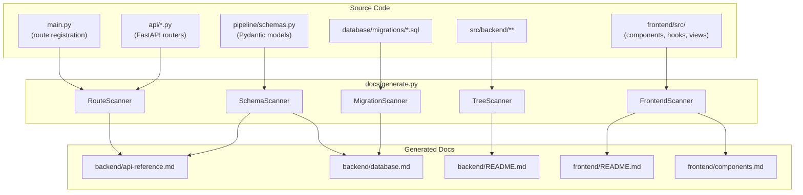

# Documentation Auto-Generation Script

## Approach

A single Python script at `docs/generate.py` that uses **AST parsing and
importlib introspection** to read the actual source code and regenerate
documentation sections. The script requires no new dependencies — it uses only
the Python standard library (`ast`, `pathlib`, `inspect`, `importlib`, `json`,
`re`).

The key design principle: **marker-delimited sections**. Each auto-generated
block in a markdown file is wrapped in HTML comment markers like
`<!-- AUTO:section_name -->` ... `<!-- /AUTO:section_name -->`. The script
replaces content between markers while leaving everything else untouched. This
lets developers write conceptual prose by hand and never lose it.

## What Gets Auto-Generated



## Implementation Steps

### Step 1: Marker system and file writer utility

Add marker comments to each existing doc file that delineate auto-generated
sections. Build the core `replace_section(filepath, section_name, new_content)`
function.

**Markers look like:**

```markdown
Some hand-written intro text...

<!-- AUTO:project_structure -->
```

src/backend/ ├── main.py ...

```
<!-- /AUTO:project_structure -->

More hand-written text continues here...
```

**Core utility in `docs/generate.py`:**

```python
def replace_section(filepath: Path, section_name: str, content: str) -> bool:
    """Replace content between AUTO markers, preserving everything else."""
    text = filepath.read_text(encoding="utf-8")
    pattern = re.compile(
        rf"(<!-- AUTO:{section_name} -->\n).*?(<!-- /AUTO:{section_name} -->)",
        re.DOTALL,
    )
    if not pattern.search(text):
        return False  # markers not found
    new_text = pattern.sub(rf"\1{content}\n\2", text)
    filepath.write_text(new_text, encoding="utf-8")
    return True
```

**Files to modify:** Add `<!-- AUTO:xxx -->` markers to these existing docs:

- `[docs/backend/README.md](docs/backend/README.md)` — around the project
  structure tree
- `[docs/backend/api-reference.md](docs/backend/api-reference.md)` — around each
  router section and the endpoint tables
- `[docs/backend/database.md](docs/backend/database.md)` — around the table
  column listings and migration table
- `[docs/frontend/README.md](docs/frontend/README.md)` — around the project
  structure tree and API client table
- `[docs/frontend/components.md](docs/frontend/components.md)` — around the
  component tree and file inventory tables

### Step 2: Backend route scanner

Parse `api/*.py` files using Python's `ast` module to extract:

- Router prefix (from `APIRouter(prefix=...)`)
- Each decorated route (`@router.get`, `@router.post`, etc.)
- Route path, HTTP method, response model
- Rate limit decorators (from `@limiter.limit(...)`)
- Request/response Pydantic model names
- Docstring (first line as description)

```python
class RouteInfo:
    method: str          # GET, POST, etc.
    path: str            # /api/pipeline/run
    response_model: str  # PipelineRunResponse
    request_body: str    # PipelineRunRequest | None
    rate_limit: str      # "5/minute" | None
    docstring: str       # First line of docstring
    requires_auth: bool  # True if CurrentUser in params
```

**Output target:** Regenerate the endpoint tables in
`[docs/backend/api-reference.md](docs/backend/api-reference.md)` between
`<!-- AUTO:endpoints -->` markers. Generate a summary table like:

```markdown
| Method | Path              | Auth | Rate Limit | Description                |
| ------ | ----------------- | ---- | ---------- | -------------------------- |
| GET    | /health           | No   | 60/min     | Health check with DB probe |
| POST   | /api/pipeline/run | Yes  | 5/min      | Trigger pipeline run       |
| ...    | ...               | ...  | ...        | ...                        |
```

**Source files to parse:**

- `[src/backend/main.py](src/backend/main.py)` — for `/health` and router
  registration
- `[src/backend/api/pipeline.py](src/backend/api/pipeline.py)`
- `[src/backend/api/strategies.py](src/backend/api/strategies.py)`
- `[src/backend/api/charts.py](src/backend/api/charts.py)`
- `[src/backend/api/settings.py](src/backend/api/settings.py)`

### Step 3: Pydantic model scanner

Parse `[pipeline/schemas.py](src/backend/pipeline/schemas.py)` using `ast` to
extract all `BaseModel` subclasses, their fields, types, defaults, and
docstrings. Generate markdown tables for each model.

```python
class ModelField:
    name: str           # "ticker"
    type_annotation: str  # "str"
    default: str        # "" or "Field(default_factory=list)"
    description: str    # from Field(description=...) or docstring Attributes section
```

**Output targets:**

- `[docs/backend/database.md](docs/backend/database.md)` — update the schema
  field tables between `<!-- AUTO:schema_xxx -->` markers
- `[docs/backend/api-reference.md](docs/backend/api-reference.md)` — generate
  request/response model field tables

Also parse request/response models defined locally in `api/*.py` files (like
`PipelineRunRequest`, `ChartRequest`, etc.).

### Step 4: File tree scanner

Walk the directory tree for both backend and frontend, generating the project
structure sections. Exclude common noise directories (`.venv`, `__pycache__`,
`.ruff_cache`, `node_modules`, `.git`).

```python
EXCLUDE_DIRS = {".venv", "__pycache__", ".ruff_cache", "node_modules", ".git", ".cursor"}

def build_tree(root: Path, prefix: str = "", max_depth: int = 4) -> str:
    """Generate an ASCII tree string for a directory."""
    ...
```

**Output targets:**

- `[docs/backend/README.md](docs/backend/README.md)` —
  `<!-- AUTO:project_structure -->` section
- `[docs/frontend/README.md](docs/frontend/README.md)` —
  `<!-- AUTO:project_structure -->` section

### Step 5: Frontend component scanner

Scan `src/frontend/src/` to extract:

- **Components:** all `.tsx` files under `components/`, grouped by subfolder
- **Views:** all `.tsx` files under `views/`
- **Hooks:** all `.ts` files under `hooks/`
- **Export names:** regex for `export (default )?(function|const) (\w+)` to get
  component/hook names

Generate:

- Component inventory table (file, export name, subfolder)
- Component tree (from folder structure)
- Hook inventory table
- View inventory table

**Output targets:**

- `[docs/frontend/components.md](docs/frontend/components.md)` —
  `<!-- AUTO:component_tree -->`, `<!-- AUTO:component_inventory -->`,
  `<!-- AUTO:hooks_inventory -->`, `<!-- AUTO:views_inventory -->`
- `[docs/frontend/README.md](docs/frontend/README.md)` —
  `<!-- AUTO:api_client -->` (parse `api/client.ts` for the `api` object
  methods)

### Step 6: Migration scanner

Scan `database/migrations/*.sql` files and generate the migrations table in
`[docs/backend/database.md](docs/backend/database.md)`.

For each `.sql` file, extract:

- Filename (e.g., `005_short_timeframes.sql`)
- First comment line as description
- List of `CREATE TABLE` / `ALTER TABLE` / `ADD COLUMN` statements

**Output target:** `<!-- AUTO:migrations -->` section in
`[docs/backend/database.md](docs/backend/database.md)`

### Step 7: CLI interface and runner

Wire everything together with a simple CLI:

```python
if __name__ == "__main__":
    parser = argparse.ArgumentParser(description="Regenerate SignalForge documentation")
    parser.add_argument("--check", action="store_true",
                        help="Check if docs are up-to-date (exit 1 if stale)")
    parser.add_argument("--section", choices=["routes", "schemas", "tree", "frontend", "migrations", "all"],
                        default="all", help="Which section to regenerate")
    args = parser.parse_args()
```

`**--check` mode: Instead of writing, compare generated content against current
file content. Exit 1 if anything differs. This enables CI or pre-commit hook
usage:

```bash
# Regenerate all docs
python docs/generate.py

# Check if docs are stale (for CI)
python docs/generate.py --check

# Regenerate only API reference
python docs/generate.py --section routes
```

### Step 8: Add a VS Code task

Add a task to `[.vscode/tasks.json](.vscode/tasks.json)` so the script can be
run from the IDE command palette:

```json
{
  "label": "Regenerate Docs",
  "type": "shell",
  "command": "python",
  "args": ["docs/generate.py"],
  "group": "build",
  "problemMatcher": []
}
```

## File Summary

| File                            | Action                                                                    |
| ------------------------------- | ------------------------------------------------------------------------- |
| `docs/generate.py`              | **Create** — the main script (~400-500 lines)                             |
| `docs/backend/README.md`        | **Edit** — add AUTO markers around project structure                      |
| `docs/backend/api-reference.md` | **Edit** — add AUTO markers around endpoint sections                      |
| `docs/backend/database.md`      | **Edit** — add AUTO markers around table schemas and migrations           |
| `docs/frontend/README.md`       | **Edit** — add AUTO markers around project structure and API client table |
| `docs/frontend/components.md`   | **Edit** — add AUTO markers around component tree and inventories         |
| `.vscode/tasks.json`            | **Edit** — add "Regenerate Docs" task                                     |

## Design Decisions

- **AST parsing over import-based introspection**: The script parses Python
  files as text/AST, not by importing them. This avoids needing the full
  dependency tree installed and avoids side effects from importing (e.g.,
  loading `.env`, connecting to databases).
- **Regex for TypeScript**: Since there's no TS AST parser in the Python stdlib,
  component/hook extraction uses simple regex patterns. This is sufficient for
  the consistent file structure.
- **No new dependencies**: The script uses only `ast`, `pathlib`, `re`, `json`,
  `argparse` from the standard library. No `pip install` needed.
- **Idempotent**: Running the script twice produces the same output. Safe to run
  anytime.
- **Hand-written sections preserved**: Only content between `<!-- AUTO:xxx -->`
  markers is touched. Conceptual docs, diagrams, and guides are never modified.

## Risks / Open Questions

- The AST-based route scanner won't capture dynamically registered routes (there
  are none currently, but worth noting).
- The `--check` mode is useful for CI but SignalForge doesn't have CI yet. The
  VS Code task is the primary trigger for now.
- Pydantic model field descriptions are sparse in the current schemas — the
  generator will show field names, types, and defaults but descriptions will be
  empty until docstrings or `Field(description=...)` are added to the models.
