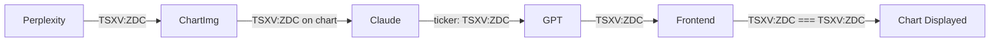

# Standardize Pipeline on TradingView Ticker Format

## Problem

Perplexity returns bare tickers (`ZDC`, `ENB`) with no exchange context.
Chart-Img resolves them to TradingView format on the chart (`TSXV:ZDC`). Claude
reads the TV-format ticker from the chart. The pipeline tickers no longer match,
breaking frontend chart display.

## Solution

Use TradingView format as the single ticker standard across the entire pipeline.
This is the natural choice because Chart-Img, Claude's chart images, and the
frontend TradingView widget all use it natively.



## Fix 1: Override ticker in Claude result (safety net)

In
`[src/backend/pipeline/stages/claude.py](src/backend/pipeline/stages/claude.py)`,
`_analyze_ticker()` lines 155-158 become:

```python
if result is not None:
    result.ticker = ticker
    result.chart_image_path = image_path
    metadata["status"] = "success"
```

Claude might still misread the ticker from the chart. This ensures it always
matches the pipeline's canonical ticker.

## Fix 2: Perplexity prompts return TradingView format

Add ticker format rules to both system prompts in:

- `[src/backend/pipeline/prompts/perplexity_discovery.py](src/backend/pipeline/prompts/perplexity_discovery.py)`
- `[src/backend/pipeline/prompts/perplexity_analysis.py](src/backend/pipeline/prompts/perplexity_analysis.py)`

Add after the crypto instructions:

```
Ticker format rules (CRITICAL -- use TradingView format):
- US stocks/ETFs: plain ticker (e.g. AAPL, SPY, TSLA)
- Canadian TSX: prefix TSX: (e.g. TSX:ENB, TSX:CNQ, TSX:SHOP)
- Canadian TSXV: prefix TSXV: (e.g. TSXV:ZDC)
- London LSE: prefix LSE: (e.g. LSE:SHEL)
- Australian ASX: prefix ASX: (e.g. ASX:BHP)
- German XETR: prefix XETR: (e.g. XETR:SAP)
- Other international: use EXCHANGE:SYMBOL format per TradingView conventions
- Crypto: plain symbol (e.g. BTC, ETH, SOL)
- NEVER return Yahoo Finance format with suffixes like .TO, .V, .L
```

Bump `PROMPT_VERSION` to `"v2"` in both files.

## Yahoo-to-TradingView converter (kept as fallback)

The `_to_tradingview_symbol()` function in
`[src/backend/services/chart_image.py](src/backend/services/chart_image.py)`
stays in place. If a Yahoo-format ticker (e.g. `ENB.TO`) reaches Chart-Img from
manual input or an LLM not following instructions, the converter catches it
automatically. No changes to this file.

## Branch

Already on `feature/fix-chart-ticker-mismatch` off `dev`.
