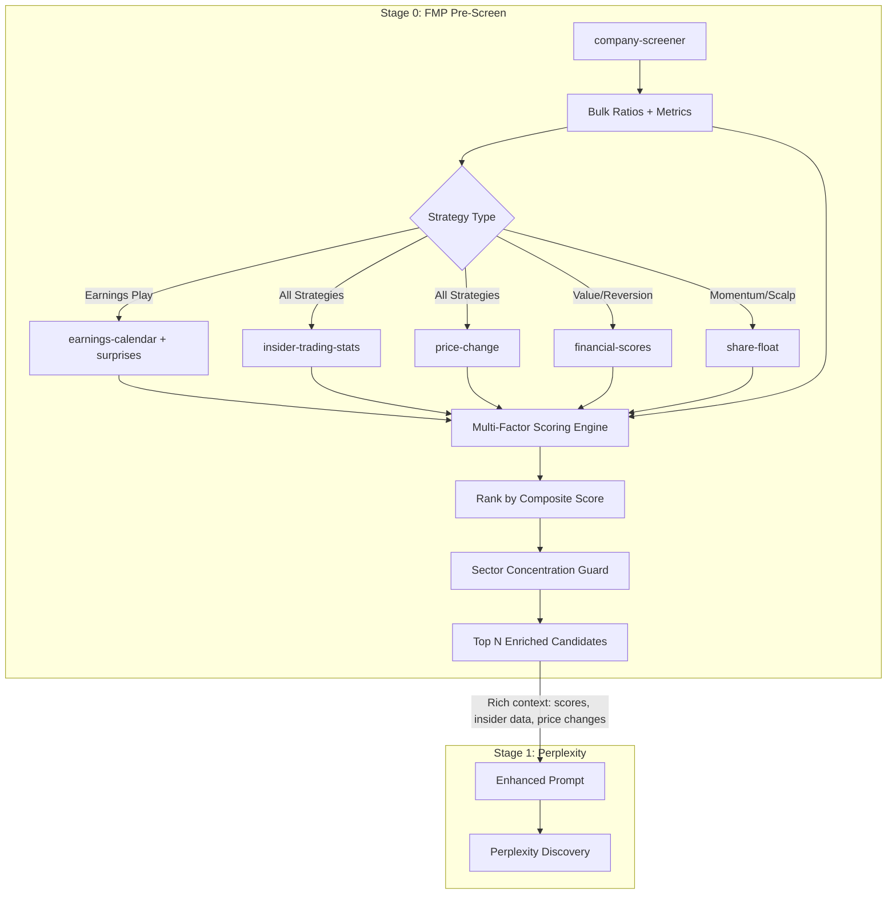

# FMP API Expansion, Multi-Factor Scoring, and Strategy Optimization

## Problem

The current FMP integration uses only 4 of ~150 available endpoints. Screening
relies on binary pass/fail filters that discard promising stocks for minor
threshold misses. High-alpha signals like insider trading, relative volume,
earnings beat history, and sector momentum are completely unused. The prompt
injection to Perplexity only shows price, market cap, volume, sector, and P/E --
missing the most predictive quantitative data FMP offers.

## Solution

Three-layer upgrade:

1. **Endpoint expansion** -- Add 12+ new FMP wrappers covering insider trading,
   earnings, analyst data, market movers, sector performance, and bulk
   endpoints.
2. **Multi-factor composite scoring** -- Replace binary filtering with a
   weighted scoring system that ranks stocks 0-100 across four dimensions
   (fundamental, momentum, sentiment, quality). Each strategy archetype gets
   custom weights.
3. **Richer prompt injection** -- Feed Perplexity hard numbers (insider
   activity, composite scores, price changes, analyst targets, sector momentum)
   so it can ground its analysis in facts rather than web-searching for them.



---

## Implementation Steps

### Step 1: new-fmp-endpoints

Add new endpoint wrappers to
`[src/backend/services/fmp_service.py](src/backend/services/fmp_service.py)`.
All follow the existing `_fmp_get()` pattern.

**New response models (add after existing models, before helpers):**

```python
class FmpEarningsCalendarItem(BaseModel):
    """Single item from the FMP earnings calendar endpoint."""
    symbol: str
    date: str
    eps: float | None = None
    epsEstimated: float | None = None
    revenue: float | None = None
    revenueEstimated: float | None = None
    fiscalDateEnding: str = ""

class FmpEarningsSurprise(BaseModel):
    """Earnings surprise data for a ticker from FMP."""
    symbol: str = ""
    date: str = ""
    actualEarningResult: float | None = None
    estimatedEarning: float | None = None
    surprisePercentage: float | None = None  # Named per FMP response

class FmpPriceChange(BaseModel):
    """Multi-period price change data from FMP."""
    symbol: str = ""
    oneDay: float | None = Field(default=None, alias="1D")
    fiveDay: float | None = Field(default=None, alias="5D")
    oneMonth: float | None = Field(default=None, alias="1M")
    threeMonth: float | None = Field(default=None, alias="3M")
    sixMonth: float | None = Field(default=None, alias="6M")
    ytd: float | None = Field(default=None, alias="ytd")
    oneYear: float | None = Field(default=None, alias="1Y")

class FmpFinancialScores(BaseModel):
    """Piotroski and Altman Z-Score from FMP."""
    symbol: str = ""
    altmanZScore: float | None = None
    piotroskiScore: int | None = None

class FmpAnalystGrade(BaseModel):
    """Single analyst grade action from FMP."""
    symbol: str = ""
    date: str = ""
    gradingCompany: str = ""
    previousGrade: str = ""
    newGrade: str = ""
    action: str = ""  # "upgrade", "downgrade", "init", etc.

class FmpGradesConsensus(BaseModel):
    """Analyst grades consensus from the bulk endpoint."""
    symbol: str = ""
    strongBuy: int = 0
    buy: int = 0
    hold: int = 0
    sell: int = 0
    strongSell: int = 0
    consensus: str = ""

class FmpPriceTargetConsensus(BaseModel):
    """Analyst price target consensus from FMP."""
    symbol: str = ""
    targetHigh: float | None = None
    targetLow: float | None = None
    targetConsensus: float | None = None
    targetMedian: float | None = None

class FmpInsiderStats(BaseModel):
    """Insider trading statistics for a symbol from FMP."""
    symbol: str = ""
    totalBought: int = 0
    totalSold: int = 0
    totalTransactions: int = 0
    # Derived: net_buy_ratio computed client-side

class FmpShareFloat(BaseModel):
    """Share float data from FMP."""
    symbol: str = ""
    freeFloat: float | None = None
    floatShares: float | None = None
    outstandingShares: float | None = None

class FmpMarketMover(BaseModel):
    """Market mover entry (gainers, losers, most active)."""
    symbol: str
    name: str = ""
    price: float | None = None
    change: float | None = None
    changesPercentage: float | None = None

class FmpSectorPerformance(BaseModel):
    """Sector performance snapshot from FMP."""
    sector: str = ""
    changesPercentage: float | None = None
```

**New endpoint wrappers:**

```python
# --- Earnings ---
async def fetch_earnings_calendar(
    from_date: str, to_date: str
) -> list[FmpEarningsCalendarItem]:
    data = await _fmp_get("earnings-calendar", {"from": from_date, "to": to_date})
    ...

async def fetch_earnings_surprises(symbol: str) -> list[FmpEarningsSurprise]:
    data = await _fmp_get("earnings", {"symbol": symbol})
    ...

# --- Price Change ---
async def fetch_price_change(symbol: str) -> FmpPriceChange | None:
    data = await _fmp_get("stock-price-change", {"symbol": symbol})
    ...

# --- Scores ---
async def fetch_financial_scores(symbol: str) -> FmpFinancialScores | None:
    data = await _fmp_get("financial-scores", {"symbol": symbol})
    ...

# --- Analyst ---
async def fetch_analyst_grades(symbol: str) -> list[FmpAnalystGrade]:
    data = await _fmp_get("grades", {"symbol": symbol})
    ...

async def fetch_price_target_consensus(symbol: str) -> FmpPriceTargetConsensus | None:
    data = await _fmp_get("price-target-consensus", {"symbol": symbol})
    ...

# --- Insider Trading ---
async def fetch_insider_stats(symbol: str) -> FmpInsiderStats | None:
    data = await _fmp_get("insider-trading/statistics", {"symbol": symbol})
    ...

# --- Share Float ---
async def fetch_share_float(symbol: str) -> FmpShareFloat | None:
    data = await _fmp_get("shares-float", {"symbol": symbol})
    ...

# --- Market Context ---
async def fetch_market_movers(
    kind: Literal["biggest-gainers", "biggest-losers", "most-actives"] = "biggest-gainers",
) -> list[FmpMarketMover]:
    data = await _fmp_get(kind)
    ...

async def fetch_sector_performance() -> list[FmpSectorPerformance]:
    data = await _fmp_get("sector-performance-snapshot")
    ...

# --- Bulk (efficiency) ---
async def fetch_bulk_ratios_ttm() -> dict[str, FmpRatiosTTM]:
    data = await _fmp_get("ratios-ttm-bulk")
    ...

async def fetch_bulk_key_metrics_ttm() -> dict[str, FmpKeyMetrics]:
    data = await _fmp_get("key-metrics-ttm-bulk")
    ...

async def fetch_bulk_scores() -> dict[str, FmpFinancialScores]:
    data = await _fmp_get("scores-bulk")
    ...

async def fetch_bulk_grades_consensus() -> dict[str, FmpGradesConsensus]:
    data = await _fmp_get("upgrades-downgrades-consensus-bulk")
    ...

async def fetch_bulk_price_targets() -> dict[str, FmpPriceTargetConsensus]:
    data = await _fmp_get("price-target-summary-bulk")
    ...
```

**Files touched:**
`[src/backend/services/fmp_service.py](src/backend/services/fmp_service.py)`

---

### Step 2: schema-extensions

Extend `[src/backend/pipeline/schemas.py](src/backend/pipeline/schemas.py)`:

**FmpScreenerConfig additions** (add after existing `enrich_with_ratios` field):

```python
# --- Additional ratio filters ---
pb_max: float | None = None
pb_min: float | None = None
ps_max: float | None = None
ps_min: float | None = None
peg_max: float | None = None
net_profit_margin_min: float | None = None
dividend_yield_min: float | None = None

# --- Quality score filters ---
piotroski_min: int | None = None
altman_z_min: float | None = None

# --- Price change filters ---
price_change_1d_min: float | None = None  # % (e.g. 1.5 = moving today)
price_change_1m_min: float | None = None  # % (momentum)
price_change_1m_max: float | None = None  # % (reversion ceiling)
price_change_3m_min: float | None = None  # % (longer momentum)

# --- Insider activity filter ---
require_insider_buying: bool = False  # net purchases > net sales

# --- Relative volume filter ---
rvol_min: float | None = None  # e.g. 1.5 = 1.5x average volume

# --- Earnings calendar ---
earnings_within_days: int | None = None  # pre-fetch calendar and filter
min_earnings_beat_pct: float | None = None  # min historical beat rate (0-100)

# --- Portfolio construction ---
max_sector_concentration: int | None = None  # max picks from same sector

# --- Multi-factor scoring weights (0-100, None = use strategy default) ---
weight_fundamental: float | None = None
weight_momentum: float | None = None
weight_sentiment: float | None = None
weight_quality: float | None = None
```

**FmpEnrichedStock additions** (add to the existing model):

```python
# Price momentum
peg_ratio: float | None = None
price_change_1d: float | None = None
price_change_1m: float | None = None
price_change_3m: float | None = None
price_change_6m: float | None = None
relative_volume: float | None = None
avg_volume: int | None = None

# Quality scores
piotroski_score: int | None = None
altman_z_score: float | None = None

# Insider activity
insider_net_buys: int | None = None    # totalBought - totalSold
insider_buy_ratio: float | None = None  # totalBought / totalTransactions

# Analyst consensus
analyst_consensus: str | None = None   # "Buy", "Hold", "Sell"
analyst_buy_count: int | None = None
analyst_target_upside: float | None = None  # % upside to consensus target

# Earnings
earnings_date: str | None = None
earnings_beat_rate: float | None = None  # last 8 quarters

# Share float
free_float_pct: float | None = None
float_shares: int | None = None

# Composite score (0-100)
composite_score: float | None = None
score_fundamental: float | None = None
score_momentum: float | None = None
score_sentiment: float | None = None
score_quality: float | None = None
```

**Files touched:**
`[src/backend/pipeline/schemas.py](src/backend/pipeline/schemas.py)`

---

### Step 3: multi-factor-scoring

Build the composite scoring engine in
`[src/backend/services/fmp_service.py](src/backend/services/fmp_service.py)` (or
a new `src/backend/services/scoring.py` if the file gets too large).

**Scoring dimensions:**

1. **Fundamental (0-100):** P/E percentile rank (lower = better for value;
   mid-range for momentum), ROE percentile, profit margin percentile, FCF yield,
   PEG ratio, EV/EBITDA. Strategy-dependent weighting.
2. **Momentum (0-100):** Price change 1M/3M/6M (direction matters per strategy
   -- positive for momentum, negative for reversion), relative volume (higher =
   better), proximity to 52-week high/low.
3. **Sentiment (0-100):** Insider net buy ratio (net buys / total transactions),
   analyst consensus grade (Strong Buy=100, Sell=0), analyst target upside %,
   recent upgrade count.
4. **Quality (0-100):** Piotroski Score (0-9 scaled to 0-100), Altman Z-Score
   (>3 safe=100, <1.8 distress=0), current ratio, debt/equity inverse.

**Composite formula:**

```python
composite = (
    score_fundamental * weight_fundamental +
    score_momentum * weight_momentum +
    score_sentiment * weight_sentiment +
    score_quality * weight_quality
) / (weight_fundamental + weight_momentum + weight_sentiment + weight_quality)
```

**Default weights per strategy archetype:**

- **Momentum Breakout:** fundamental=15, momentum=40, sentiment=25, quality=20
- **Value Accumulation:** fundamental=40, momentum=10, sentiment=20, quality=30
- **Mean Reversion:** fundamental=20, momentum=30 (inverted), sentiment=25,
  quality=25
- **Earnings Play:** fundamental=25, momentum=15, sentiment=35, quality=25
- **Crypto Swing/Scalp:** fundamental=0, momentum=50, sentiment=30, quality=20
- **Intraday Scalp:** fundamental=5, momentum=55, sentiment=20, quality=20

**Key design points:**

- Scores are percentile ranks within the candidate pool (not absolute) to handle
  different markets (TSX vs US) gracefully
- When data is missing for a dimension, that dimension's weight is redistributed
  proportionally
- Stocks are sorted by composite_score descending -- no binary cutoff
- The `FmpScreenerConfig` weight fields let users customize per strategy

**Files touched:**
`[src/backend/services/fmp_service.py](src/backend/services/fmp_service.py)` (or
new `src/backend/services/scoring.py`)

---

### Step 4: enrichment-pipeline

Refactor `screen_and_enrich()` in
`[src/backend/services/fmp_service.py](src/backend/services/fmp_service.py)`.

**Current flow (4 steps, 2N API calls):**

1. company-screener
2. Per-ticker: ratios-ttm + key-metrics-ttm (2 calls each)
3. Binary ratio filters
4. Return flat list

**New flow (8 steps, ~10 API calls regardless of N):**

```python
async def screen_and_enrich(config: FmpScreenerConfig) -> list[FmpEnrichedStock]:
    if config.is_crypto:
        return await screen_crypto(config)  # keep existing, add RVOL + changesPercentage

    # 1. Company screener (existing)
    screener_results = await screen_stocks(config)

    # 2. Bulk fetch ratios + metrics (2 calls instead of 2N)
    symbols = [s.symbol for s in screener_results]
    bulk_ratios, bulk_metrics = await asyncio.gather(
        fetch_bulk_ratios_ttm(),
        fetch_bulk_key_metrics_ttm(),
    )

    # 3. Merge base enrichment
    enriched = [
        _merge_enrichment(s, bulk_ratios.get(s.symbol), bulk_metrics.get(s.symbol))
        for s in screener_results
    ]

    # 4. Conditional enrichment (parallel, per-ticker where no bulk exists)
    enrichment_tasks = []
    if config.enrich_with_ratios:
        # Insider stats, price changes, scores -- parallel per symbol
        enrichment_tasks = [
            _enrich_extended(stock, config) for stock in enriched
        ]
        enriched = await asyncio.gather(*enrichment_tasks)

    # 5. Earnings calendar pre-fetch (if strategy needs it)
    if config.earnings_within_days:
        await _attach_earnings_data(enriched, config.earnings_within_days, config.min_earnings_beat_pct)

    # 6. Compute composite scores
    enriched = compute_composite_scores(enriched, config)

    # 7. Sort by composite score
    enriched.sort(key=lambda s: s.composite_score or 0, reverse=True)

    # 8. Sector concentration guard
    if config.max_sector_concentration:
        enriched = _apply_sector_cap(enriched, config.max_sector_concentration)

    return enriched[:config.limit]
```

**New helper `_enrich_extended()`:** Fetches per-ticker: insider stats, price
change, financial scores (for value/reversion), share float (for
momentum/scalp). Runs these in parallel via `asyncio.gather()`.

**New helper `_attach_earnings_data()`:** Calls `fetch_earnings_calendar()` once
for the date range, matches symbols, optionally fetches earnings surprise
history to compute beat rate.

**New helper `_apply_sector_cap()`:** Iterates the score-sorted list; once a
sector has `max_sector_concentration` picks, skip remaining from that sector.
Ensures diversified recommendations.

**Crypto screening enhancement:** Update `screen_crypto()` to compute
`relative_volume = volume / avgVolume` from quote data and
`price_change_1d = changesPercentage`. Add these to the crypto
`FmpEnrichedStock` objects.

**Files touched:**
`[src/backend/services/fmp_service.py](src/backend/services/fmp_service.py)`

---

### Step 5: strategy-templates

Update `[templates/strategies.json](templates/strategies.json)` with improved
configs.

**Momentum Breakout:**

```json
{
  "fmp_screener": {
    "enabled": true,
    "country": "CA",
    "volume_min": 500000,
    "price_min": 5.0,
    "market_cap_min": 500000000,
    "beta_min": 1.0,
    "is_actively_trading": true,
    "limit": 50,
    "enrich_with_ratios": true,
    "roe_min": 5.0,
    "price_change_3m_min": 10.0,
    "rvol_min": 1.5,
    "require_insider_buying": false,
    "max_sector_concentration": 3,
    "weight_fundamental": 15,
    "weight_momentum": 40,
    "weight_sentiment": 25,
    "weight_quality": 20
  },
  "screening_prompt": "Canadian TSX stocks strong price momentum analyst upgrades accelerating earnings growth high relative volume mid-to-large cap making new highs confirmed uptrend"
}
```

**Value Accumulation:**

```json
{
  "fmp_screener": {
    "enabled": true,
    "country": "CA",
    "market_cap_min": 300000000,
    "price_min": 3.0,
    "volume_min": 100000,
    "is_actively_trading": true,
    "limit": 80,
    "enrich_with_ratios": true,
    "pe_max": 18.0,
    "pe_min": 3.0,
    "pb_max": 3.0,
    "peg_max": 1.5,
    "roe_min": 8.0,
    "debt_equity_max": 2.0,
    "net_profit_margin_min": 5.0,
    "piotroski_min": 5,
    "require_insider_buying": true,
    "max_sector_concentration": 3,
    "weight_fundamental": 40,
    "weight_momentum": 10,
    "weight_sentiment": 20,
    "weight_quality": 30
  },
  "screening_prompt": "Canadian TSX stocks undervalued low P/E P/B discount to sector peers recent insider buying growing free cash flow strong balance sheet analyst buy ratings quality businesses at fair prices"
}
```

**Mean Reversion:**

```json
{
  "fmp_screener": {
    "enabled": true,
    "country": "CA",
    "market_cap_min": 500000000,
    "price_min": 5.0,
    "volume_min": 200000,
    "is_actively_trading": true,
    "limit": 60,
    "enrich_with_ratios": true,
    "roe_min": 5.0,
    "debt_equity_max": 3.0,
    "piotroski_min": 4,
    "price_change_1m_min": -30.0,
    "price_change_1m_max": -10.0,
    "require_insider_buying": true,
    "max_sector_concentration": 2,
    "weight_fundamental": 20,
    "weight_momentum": 30,
    "weight_sentiment": 25,
    "weight_quality": 25
  },
  "screening_prompt": "Canadian TSX stocks recently sold off 15-30% past month strong fundamentals analysts maintain buy ratings insider buying during decline oversold bounce candidates with solid financials and quality scores"
}
```

**Earnings Play:**

```json
{
  "fmp_screener": {
    "enabled": true,
    "country": "CA",
    "market_cap_min": 750000000,
    "volume_min": 200000,
    "price_min": 5.0,
    "is_actively_trading": true,
    "limit": 50,
    "enrich_with_ratios": true,
    "roe_min": 5.0,
    "earnings_within_days": 14,
    "min_earnings_beat_pct": 60.0,
    "max_sector_concentration": 2,
    "weight_fundamental": 25,
    "weight_momentum": 15,
    "weight_sentiment": 35,
    "weight_quality": 25
  },
  "screening_prompt": "Canadian TSX stocks reporting earnings next 2 weeks strong earnings beat history upward estimate revisions analyst attention meaningful catalyst potential confirmed reporting date"
}
```

**Crypto Swing:**

```json
{
  "fmp_screener": {
    "enabled": true,
    "is_crypto": true,
    "volume_min": 1000000,
    "market_cap_min": 100000000,
    "is_actively_trading": true,
    "limit": 80,
    "enrich_with_ratios": false,
    "price_change_1d_min": -5.0,
    "rvol_min": 1.2,
    "weight_fundamental": 0,
    "weight_momentum": 50,
    "weight_sentiment": 30,
    "weight_quality": 20
  }
}
```

**Crypto Intraday Scalp:**

```json
{
  "fmp_screener": {
    "enabled": true,
    "is_crypto": true,
    "volume_min": 5000000,
    "market_cap_min": 500000000,
    "is_actively_trading": true,
    "limit": 50,
    "enrich_with_ratios": false,
    "price_change_1d_min": 2.0,
    "rvol_min": 1.5,
    "weight_fundamental": 0,
    "weight_momentum": 60,
    "weight_sentiment": 20,
    "weight_quality": 20
  }
}
```

**Intraday Scalp (Stocks):**

```json
{
  "fmp_screener": {
    "enabled": true,
    "country": "CA",
    "volume_min": 750000,
    "price_min": 8.0,
    "market_cap_min": 1000000000,
    "beta_min": 1.2,
    "is_actively_trading": true,
    "limit": 40,
    "enrich_with_ratios": false,
    "price_change_1d_min": 1.5,
    "rvol_min": 2.0,
    "max_sector_concentration": 2,
    "weight_fundamental": 5,
    "weight_momentum": 55,
    "weight_sentiment": 20,
    "weight_quality": 20
  },
  "screening_prompt": "Canadian TSX stocks in play today breaking news earnings releases analyst upgrades sector catalysts liquid large-cap mid-cap high relative volume active day trading names with confirmed price movement"
}
```

**Files touched:** `[templates/strategies.json](templates/strategies.json)`

---

### Step 6: prompt-injection

Enhance two areas in the Perplexity stage:

**A) Update `_format_fmp_context()` in
`[src/backend/pipeline/stages/perplexity.py](src/backend/pipeline/stages/perplexity.py)`:**

Currently only shows: symbol, company, price, market cap, volume, sector, P/E.

Expand to show (when available): composite score, insider activity, price change
(1M/3M), analyst consensus + target upside, Piotroski score, relative volume,
earnings date + beat rate, sector momentum context.

```python
def _format_fmp_context(candidates: list[FmpEnrichedStock]) -> str:
    lines = ["Pre-screened candidates from FMP (ranked by composite score):"]
    for s in candidates[:30]:
        parts = [f"- {s.symbol}: {s.company_name}"]
        if s.composite_score is not None:
            parts.append(f"Score: {s.composite_score:.0f}/100")
        if s.price is not None:
            parts.append(f"${s.price:.2f}")
        # ... existing market cap, volume, sector ...
        if s.pe_ratio is not None:
            parts.append(f"P/E {s.pe_ratio:.1f}")
        if s.relative_volume is not None:
            parts.append(f"RVOL {s.relative_volume:.1f}x")
        if s.insider_net_buys is not None and s.insider_net_buys > 0:
            parts.append(f"Insider NET BUY ({s.insider_net_buys})")
        if s.analyst_consensus:
            parts.append(f"Analyst: {s.analyst_consensus}")
        if s.analyst_target_upside is not None:
            parts.append(f"Target upside: {s.analyst_target_upside:+.0f}%")
        if s.price_change_1m is not None:
            parts.append(f"1M: {s.price_change_1m:+.1f}%")
        if s.piotroski_score is not None:
            parts.append(f"Piotroski: {s.piotroski_score}/9")
        if s.earnings_date:
            parts.append(f"Earnings: {s.earnings_date}")
        if s.earnings_beat_rate is not None:
            parts.append(f"Beat rate: {s.earnings_beat_rate:.0f}%")
        lines.append(" | ".join(parts))
    # ... sector momentum context if available ...
    return "\n".join(lines)
```

**B) Bump `PROMPT_VERSION` in
`[src/backend/pipeline/prompts/perplexity_discovery.py](src/backend/pipeline/prompts/perplexity_discovery.py)`:**

Change from `"v12"` to `"v13"`. Update the system prompt section about FMP
candidates to mention composite scores and insider data so Perplexity knows to
weight these signals.

**Files touched:**

- `[src/backend/pipeline/stages/perplexity.py](src/backend/pipeline/stages/perplexity.py)`
- `[src/backend/pipeline/prompts/perplexity_discovery.py](src/backend/pipeline/prompts/perplexity_discovery.py)`

---

### Step 7: frontend-sync

Mirror all new `FmpScreenerConfig` fields to
`[src/frontend/src/types/index.ts](src/frontend/src/types/index.ts)`.

Add these fields to the `FmpScreenerConfig` interface:

```typescript
// Additional ratio filters
pb_max: number | null;
pb_min: number | null;
ps_max: number | null;
ps_min: number | null;
peg_max: number | null;
net_profit_margin_min: number | null;
dividend_yield_min: number | null;

// Quality score filters
piotroski_min: number | null;
altman_z_min: number | null;

// Price change filters
price_change_1d_min: number | null;
price_change_1m_min: number | null;
price_change_1m_max: number | null;
price_change_3m_min: number | null;

// Insider activity
require_insider_buying: boolean;

// Relative volume
rvol_min: number | null;

// Earnings
earnings_within_days: number | null;
min_earnings_beat_pct: number | null;

// Portfolio construction
max_sector_concentration: number | null;

// Scoring weights
weight_fundamental: number | null;
weight_momentum: number | null;
weight_sentiment: number | null;
weight_quality: number | null;
```

**Files touched:**
`[src/frontend/src/types/index.ts](src/frontend/src/types/index.ts)`

---

## Risks / Open Questions

- **API rate limits:** Adding bulk endpoints actually _reduces_ total calls (2
  bulk calls vs 2N per-ticker). New per-ticker calls (insider stats, price
  change, scores) are bounded by screener limit (40-80). With a 5-concurrency
  semaphore, this adds ~15-30 seconds at most.
- **Bulk endpoint tier requirements:** Bulk ratios/metrics/scores may require
  FMP Premium ($59/mo). Need to verify the current plan tier and fall back to
  per-ticker if bulk returns 403.
- **Over-filtering on TSX:** The Canadian market has fewer liquid names. The
  composite scoring approach mitigates this -- instead of binary cutoffs that
  might produce 0 results, scoring always ranks whatever passes the base
  screener. Hard filters (market cap, volume, price) stay loose; the scoring
  engine does the intelligent ranking.
- **Insider trading data lag:** SEC filings can be delayed 2-3 days. FMP's
  insider stats reflect filed data, not real-time. Still extremely valuable as a
  signal layer but not for intraday decisions.
- **TypeScript sync required:** Every field added to `FmpScreenerConfig` in
  Python must be mirrored in `src/frontend/src/types/index.ts`.
- **Prompt version bump:** Changing `_format_fmp_context()` and the system
  prompt requires bumping `PROMPT_VERSION` from `v12` to `v13` to maintain
  prompt-performance tracking integrity.
- **Scoring weight tuning:** Default weights are educated guesses based on
  academic literature and practitioner experience. The reflection system (future
  Phase 3) would eventually tune these based on actual outcome data. For now,
  users can override via `weight_` fields on their strategy.

## Branch

Work on `feature/fmp-expansion` off `dev`.
