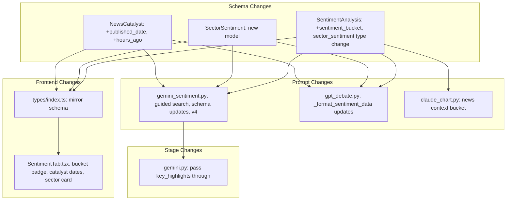

# Gemini Sentiment Stage Improvements

Four changes across 5 backend files, 2 frontend files. All changes are additive
(new fields) so backward-compatible with existing pipeline runs.

---

## 1. Guided Additional Search Query

**Problem:** Gemini's "do one additional search" instruction is vague, leading
to generic queries.

**Files:**

- [src/backend/pipeline/prompts/gemini_sentiment.py](src/backend/pipeline/prompts/gemini_sentiment.py)

**Changes:**

- In `SENTIMENT_SYSTEM_PROMPT`, replace the generic "do ONE additional Google
  Search" instruction with a structured directive that tells Gemini exactly what
  to search for:

```
After reading the provided URLs, perform ONE additional targeted search:
Suggested query: "{ticker} {recency_window}"
Prioritize discovering: regulatory decisions, earnings surprises, insider activity,
analyst upgrades/downgrades, and breaking developments not covered above.
```

- In `build_sentiment_prompt()`, inject a `suggested_search_query` line built
  from the ticker + the top keyword extracted from Perplexity's `key_highlights`
  (passed as a new optional param). The function signature becomes:

```python
def build_sentiment_prompt(
    ticker: str,
    config: StrategyConfig,
    news_urls: list[str] | None = None,
    fmp_context: str | None = None,
    key_highlights: list[str] | None = None,  # NEW
) -> str:
```

The prompt appends:

```
Suggested additional search: "{ticker} {highlights[0]} {today_date}"
```

- In
  [src/backend/pipeline/stages/gemini.py](src/backend/pipeline/stages/gemini.py)
  `run_sentiment()`, pass `key_highlights` from `screening.tickers` into
  `_analyze_ticker()` and through to `build_sentiment_prompt()`.
- Bump `PROMPT_VERSION` to `"v4"`.

---

## 2. Sentiment Bucket Field

**Problem:** `sentiment_score` is a raw float with no calibration anchor for
GPT. GPT thresholds on labels more consistently than interpolating floats.

**Files:**

- [src/backend/pipeline/schemas.py](src/backend/pipeline/schemas.py) —
  `SentimentAnalysis` model
- [src/backend/pipeline/prompts/gemini_sentiment.py](src/backend/pipeline/prompts/gemini_sentiment.py)
  — system prompt schema
- [src/backend/pipeline/prompts/gpt_debate.py](src/backend/pipeline/prompts/gpt_debate.py)
  — `_format_sentiment_data()`
- [src/backend/pipeline/prompts/claude_chart.py](src/backend/pipeline/prompts/claude_chart.py)
  — news context block
- [src/frontend/src/types/index.ts](src/frontend/src/types/index.ts) —
  `SentimentAnalysis` interface
- [src/frontend/src/components/recommendations/SentimentTab.tsx](src/frontend/src/components/recommendations/SentimentTab.tsx)
  — display

**Approach:** Compute `sentiment_bucket` server-side from `sentiment_score`
using a `@computed_field` or `model_validator` on `SentimentAnalysis`, rather
than asking Gemini to produce it (avoids score/bucket mismatch).

Add to `SentimentAnalysis` in `schemas.py`:

```python
sentiment_bucket: Literal[
    "strongly_bearish", "bearish", "mildly_bearish",
    "neutral",
    "mildly_bullish", "bullish", "strongly_bullish",
] = "neutral"

@model_validator(mode="after")
def _compute_bucket(self) -> SentimentAnalysis:
    s = self.sentiment_score
    if s <= -0.6:
        self.sentiment_bucket = "strongly_bearish"
    elif s <= -0.3:
        self.sentiment_bucket = "bearish"
    elif s <= -0.1:
        self.sentiment_bucket = "mildly_bearish"
    elif s <= 0.1:
        self.sentiment_bucket = "neutral"
    elif s <= 0.3:
        self.sentiment_bucket = "mildly_bullish"
    elif s <= 0.6:
        self.sentiment_bucket = "bullish"
    else:
        self.sentiment_bucket = "strongly_bullish"
    return self
```

- In `_format_sentiment_data()` (GPT prompt), change the line from:
  `f"Sentiment: {sa.sentiment_score:+.2f} ({sa.sentiment_label})"` to:
  `f"Sentiment: {sa.sentiment_score:+.2f} [{sa.sentiment_bucket}] ({sa.sentiment_label})"`
- In Claude's prompt (`claude_chart.py`), similarly inject the bucket.
- Frontend: Add `sentiment_bucket` to `SentimentAnalysis` interface and display
  it as a secondary badge in `SentimentTab` next to the existing label.

**Note:** The existing `sentiment_label` (5 values) stays as-is for backward
compatibility. The new `sentiment_bucket` (7 values, finer granularity) is the
calibrated version GPT should key on.

---

## 3. Catalyst Publication Date + Recency

**Problem:** No `published_date` or `hours_ago` on catalysts, so GPT can't
distinguish a 6-day-old headline (priced in) from a 4-hour-old one (alpha).

**Files:**

- [src/backend/pipeline/schemas.py](src/backend/pipeline/schemas.py) —
  `NewsCatalyst` model
- [src/backend/pipeline/prompts/gemini_sentiment.py](src/backend/pipeline/prompts/gemini_sentiment.py)
  — JSON schema in system prompt
- [src/backend/pipeline/prompts/gpt_debate.py](src/backend/pipeline/prompts/gpt_debate.py)
  — `_format_sentiment_data()` catalyst formatting
- [src/frontend/src/types/index.ts](src/frontend/src/types/index.ts) —
  `NewsCatalyst` interface
- [src/frontend/src/components/recommendations/SentimentTab.tsx](src/frontend/src/components/recommendations/SentimentTab.tsx)
  — `CatalystRow`

**Changes to `NewsCatalyst` in `schemas.py`:**

```python
class NewsCatalyst(BaseModel):
    headline: str
    source: str
    url: str = ""
    impact: Literal["positive", "negative", "neutral"]
    significance: Literal["high", "medium", "low"]
    published_date: str = ""    # NEW — ISO date or "unknown"
    hours_ago: int | None = None  # NEW — approximate hours since publication
```

Both fields default to empty/None so existing pipeline runs don't break on
deserialization.

**Changes to Gemini system prompt:** Add `published_date` and `hours_ago` to the
JSON schema example and add an instruction:

```
For each catalyst, estimate when it was published. Set "published_date" to the
article's publication date (YYYY-MM-DD format) and "hours_ago" to your best
estimate of hours since publication. If the date cannot be determined, use
"unknown" for published_date and null for hours_ago.
```

**Changes to GPT formatting:** In `_format_sentiment_data()`, change catalyst
line from:

```python
f"  [{c.impact.upper()}] {c.headline} ({c.significance})"
```

to:

```python
f"  [{c.impact.upper()}] {c.headline} ({c.significance}) — {c.hours_ago}h ago" if c.hours_ago else ...
```

**Frontend:** Add a relative time indicator (e.g., "18h ago" or "3d ago") to the
`CatalystRow` component next to the source name.

---

## 4. Structured Sector Sentiment

**Problem:** `sector_sentiment` is a free-text string, losing structure for
GPT's independent signal assessment.

**Files:**

- [src/backend/pipeline/schemas.py](src/backend/pipeline/schemas.py) — new
  `SectorSentiment` model + update `SentimentAnalysis`
- [src/backend/pipeline/prompts/gemini_sentiment.py](src/backend/pipeline/prompts/gemini_sentiment.py)
  — JSON schema in system prompt
- [src/backend/pipeline/prompts/gpt_debate.py](src/backend/pipeline/prompts/gpt_debate.py)
  — `_format_sentiment_data()`
- [src/frontend/src/types/index.ts](src/frontend/src/types/index.ts) — new
  `SectorSentiment` interface
- [src/frontend/src/components/recommendations/SentimentTab.tsx](src/frontend/src/components/recommendations/SentimentTab.tsx)

**New Pydantic model in `schemas.py`:**

```python
class SectorSentiment(BaseModel):
    label: Literal[
        "strongly_bearish", "bearish", "neutral", "bullish", "strongly_bullish"
    ]
    score: float = Field(ge=-1.0, le=1.0)
    key_driver: str = ""
```

**Change `SentimentAnalysis.sector_sentiment`** from `str` to
`SectorSentiment | str`:

- Use a `field_validator` to handle backward compatibility: if the incoming
  value is a plain string, wrap it into
  `SectorSentiment(label="neutral", score=0.0, key_driver=raw_string)`.

**Update Gemini system prompt** — replace the `sector_sentiment` string in the
JSON schema with the structured object.

**Update GPT formatting** — change from:

```python
f"Sector sentiment: {sa.sector_sentiment}"
```

to:

```python
f"Sector sentiment: {sa.sector_sentiment.score:+.2f} ({sa.sector_sentiment.label}) — {sa.sector_sentiment.key_driver}"
```

**Frontend:** Replace the plain text sector sentiment display with a mini score
card showing the label badge, score value, and key driver text.

---

## Cross-Cutting Concerns

- **Prompt version bump:** `PROMPT_VERSION` in `gemini_sentiment.py` bumps from
  `"v3"` to `"v4"`. Hash auto-updates.
- **Schema sync:** All Pydantic model changes must be mirrored in
  `types/index.ts` (schema-sync skill).
- **Backward compatibility:** All new fields have defaults, so existing
  `stage_outputs` rows deserialize without error.
- **Code quality:** Run `ruff format`, `ruff check --fix`, `ty check` on
  backend; `bunx tsc --noEmit` on frontend.

## Dependency Graph


