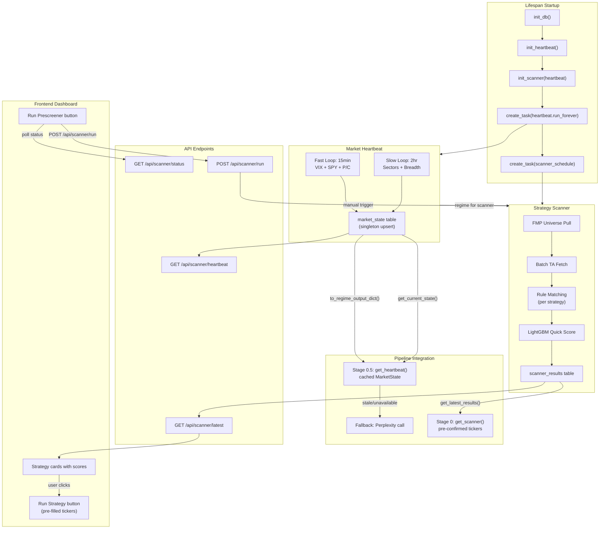

# Market Heartbeat + Strategy Scanner + Pipeline Integration

## Corrections From Codebase Audit

Six issues found in the draft plan that must be fixed during implementation:

### 1. Import paths — bare top-level, not prefixed

Every file in `src/backend/` uses bare imports. The plan's
`from backend.services.xxx` must become `from services.xxx`:

```python
# WRONG (plan draft)
from backend.database.connection import get_db
from backend.services.market_heartbeat import MarketHeartbeat

# CORRECT (matches codebase)
from database.connection import get_db
from services.market_heartbeat import MarketHeartbeat
```

### 2. Orchestrator has no access to `request` or `app.state`

`run_pipeline()` and `_run_pipeline_v2()` never receive a `Request` object. The
plan's `request.app.state.heartbeat` will not work inside the orchestrator.

**Fix:** Follow the same module-level singleton pattern as
`[database/connection.py](src/backend/database/connection.py)`. Create
`_heartbeat` and `_scanner` module-level variables in their respective service
files with `init_*()` / `get_*()` accessors. The lifespan calls
`init_heartbeat()`, and the orchestrator calls `get_heartbeat()`:

```python
# services/market_heartbeat.py (top-level)
_instance: MarketHeartbeat | None = None

async def init_heartbeat() -> MarketHeartbeat:
    global _instance
    _instance = MarketHeartbeat()
    return _instance

def get_heartbeat() -> MarketHeartbeat:
    if _instance is None:
        raise RuntimeError("Heartbeat not initialized")
    return _instance

# In orchestrator.py — no Request needed:
from services.market_heartbeat import get_heartbeat
state = await get_heartbeat().get_current_state()
```

Same pattern for the scanner: `init_scanner()` / `get_scanner()`.

### 3. `run_numerical_ta_single()` does not exist

The only function is
`run_numerical_ta(tickers: list[str], config: StrategyConfig)` which requires a
full `StrategyConfig`. There is no single-ticker variant.

**Fix:** Create a lightweight `run_ta_for_scanner()` helper in
`[pipeline/stages/numerical_ta.py](src/backend/pipeline/stages/numerical_ta.py)`
that wraps the existing `build_technical_snapshot()` (the internal per-ticker
function) with a minimal config. Alternatively, the scanner can batch tickers
through the existing function using a default `StrategyConfig`.

### 4. `quick_score()` does not exist in `ml/gate.py`

Only
`run_ml_gate(ticker, strategy_type, ta_features, fmp_features, regime_context) -> GateResult`
exists.

**Fix:** Either call `run_ml_gate()` directly (it already returns a `GateResult`
with `.probability`), or add a thin wrapper:

```python
# ml/gate.py
async def quick_score(ticker: str, strategy_type: str, ta_features: dict) -> float | None:
    result = await run_ml_gate(ticker, strategy_type, ta_features)
    return result.probability if result and not result.blocked else None
```

### 5. `FmpScreenerConfig`, not `ScreenerConfig`

The actual class is `FmpScreenerConfig` in
`[pipeline/schemas.py](src/backend/pipeline/schemas.py)` (line ~511). The
scanner must use this name.

### 6. `yfinance` is not installed — use FMP-first, yfinance only where needed

`yfinance` is not in `[pyproject.toml](src/backend/pyproject.toml)`. The backend
already has:

- `fetch_vix_quote()` — returns `(float | None, str)` for VIX spot + label
- `fetch_sector_performance()` — returns `list[FmpSectorPerformance]` with
  `sector` + `changesPercentage`
- `fetch_quotes(["SPY"])` — returns `dict[str, FmpQuote]` with price, change,
  volume
- `fetch_technical_indicator(symbol, timeframe, type, period)` — returns most
  recent value

**Fix:** Use FMP endpoints for VIX spot, SPY price, and sector performance. Add
`yfinance` **only** for data FMP cannot provide:

- **VIX3M** (term structure / contango detection) — FMP has no VIX3M endpoint
- **VIX 1-year percentile** — needs 252 days of history
- **SPY 50/200 MA** — FMP's
  `fetch_technical_indicator("SPY", "daily", "sma", 50)` could work but returns
  only one value per call; yfinance is more efficient for multiple calculations

If you want to avoid `yfinance` entirely, FMP can cover VIX spot + SPY MAs with
multiple `fetch_technical_indicator` calls. The only gap would be VIX3M for term
structure detection.

---

## Migration — `020_heartbeat_scanner.sql`

As specified in the draft, with one addition: **RLS must be enabled** on all new
tables following the existing pattern (RLS on, zero policies = full deny for
anon key, service key bypasses):

```sql
-- Add at the end of the migration:
ALTER TABLE market_state ENABLE ROW LEVEL SECURITY;
ALTER TABLE scanner_results ENABLE ROW LEVEL SECURITY;
ALTER TABLE scan_runs ENABLE ROW LEVEL SECURITY;
```

File:
`[src/backend/database/migrations/020_heartbeat_scanner.sql](src/backend/database/migrations/020_heartbeat_scanner.sql)`

---

## New Files

| File                                                        | Purpose                                                                             |
| ----------------------------------------------------------- | ----------------------------------------------------------------------------------- |
| `src/backend/services/market_heartbeat.py`                  | MarketHeartbeat class + module-level singleton (`init_heartbeat` / `get_heartbeat`) |
| `src/backend/services/strategy_scanner.py`                  | StrategyScanner class + module-level singleton + rule definitions                   |
| `src/backend/api/scanner.py`                                | FastAPI router: `POST /run`, `GET /latest`, `GET /status/{id}`, `GET /heartbeat`    |
| `src/backend/database/migrations/020_heartbeat_scanner.sql` | Three new tables + indexes + RLS                                                    |
| `src/frontend/src/hooks/useScanner.ts`                      | Scanner hook: trigger scan, poll status, fetch latest results                       |
| `src/frontend/src/components/search/PrescreenerPanel.tsx`   | "Run Prescreener" button + regime badge + last scan timestamp                       |
| `src/frontend/src/components/search/ScannerResultsGrid.tsx` | Strategy cards with tickers, scores, matched rules, "Run Strategy" action           |

## Modified Files

| File                                                                                                         | Change                                                                                                                                                                                               |
| ------------------------------------------------------------------------------------------------------------ | ---------------------------------------------------------------------------------------------------------------------------------------------------------------------------------------------------- |
| `[src/backend/main.py](src/backend/main.py)`                                                                 | Lifespan: add `init_heartbeat()`, `init_scanner()`, `create_task(heartbeat.run_forever())`, scanner schedule task, graceful cancellation. Add `include_router(scanner_router, prefix="/api")`        |
| `[src/backend/pipeline/orchestrator.py](src/backend/pipeline/orchestrator.py)`                               | Stage 0.5: import `get_heartbeat()`, use cached `MarketState.to_regime_output_dict()` with Perplexity fallback. Stage 0: optionally consume scanner results via `get_scanner().get_latest_results()` |
| `[src/backend/pipeline/stages/numerical_ta.py](src/backend/pipeline/stages/numerical_ta.py)`                 | Add `run_ta_for_scanner()` — lightweight wrapper over internal `build_technical_snapshot()`                                                                                                          |
| `[src/backend/ml/gate.py](src/backend/ml/gate.py)`                                                           | Add `quick_score()` thin wrapper over `run_ml_gate()`                                                                                                                                                |
| `[src/backend/services/fmp_service.py](src/backend/services/fmp_service.py)`                                 | Add `fetch_economic_calendar()` wrapper for FMP `/api/v3/economic_calendar` (Day 5)                                                                                                                  |
| `[src/backend/pyproject.toml](src/backend/pyproject.toml)`                                                   | Add `yfinance` dependency (only if VIX3M term structure is needed)                                                                                                                                   |
| `[src/frontend/src/api/client.ts](src/frontend/src/api/client.ts)`                                           | Add `runScan`, `getScanStatus`, `getScannerLatest`, `getHeartbeat` API methods                                                                                                                       |
| `[src/frontend/src/components/search/SearchScreen.tsx](src/frontend/src/components/search/SearchScreen.tsx)` | Import and render `PrescreenerPanel` above the existing search/run section                                                                                                                           |
| `[src/frontend/src/types/index.ts](src/frontend/src/types/index.ts)`                                         | Add `ScanResult`, `ScanReport`, `MarketState` TypeScript interfaces                                                                                                                                  |

---

## Architecture



---

## Scanner Schedule

The scanner runs **2-3x per day** on a market-aware schedule, plus manual
triggers:

- **Automatic:** ~8:30 AM ET (pre-market), ~12:00 PM ET (midday), ~3:00 PM ET
  (late session)
- **Manual:** "Run Prescreener" button on the dashboard — triggers
  `POST /api/scanner/run`
- **Market-aware:** Skip scheduled runs on weekends and market holidays
- Results cached in `scanner_results` table with 90-minute freshness window

The scanner schedule uses a simple asyncio loop that checks ET time and sleeps
until the next scheduled slot, rather than a full scheduler dependency.

---

## Frontend: Prescreener UI

The dashboard (`RecommendationsView` / `SearchScreen`) gets a prescreener
section above the existing "Run Analysis" flow:

**Components:**

- `PrescreenerPanel` — top-level container shown on `SearchScreen`
  - "Run Prescreener" button — calls `POST /api/scanner/run`, then polls
    `GET /api/scanner/status/{scan_run_id}` every 3s (same pattern as pipeline
    progress polling)
  - Shows last scan timestamp + regime badge (from `GET /api/scanner/heartbeat`)
  - `ScannerResultsGrid` — cards grouped by strategy type, each showing:
    - Strategy name + count of setups (e.g. "Swing — 4 setups")
    - Top tickers with combined score, RSI, volume ratio, matched rules
    - "Run Strategy" button per card — pre-fills `SearchScreen` with those
      tickers + strategy and triggers the full pipeline

**API additions for frontend:**

- `GET /api/scanner/status/{scan_run_id}` — returns scan progress
  (running/completed/failed, universe_size, setups_found so far). Needed for the
  polling UX after clicking "Run Prescreener".

**Hook:**

- `useScanner()` — manages scan trigger, polling, latest results fetch. Mirrors
  `usePipeline` pattern.

**Flow:**

1. User opens dashboard — `useScanner` fetches `GET /api/scanner/latest` to show
   cached results
2. User clicks "Run Prescreener" — `POST /api/scanner/run` returns `scan_run_id`
   immediately
3. Poll `GET /api/scanner/status/{scan_run_id}` every 3s — show progress spinner
4. On completion — re-fetch `GET /api/scanner/latest` — populate strategy cards
5. User clicks "Run Strategy" on a card — pre-fills tickers + strategy in
   `SearchScreen`, user clicks "Run Analysis" for the full LLM pipeline

---

## Build Order

**Day 1 — Foundation: Migration + Heartbeat fast loop**

- Write `020_heartbeat_scanner.sql` (3 tables + indexes + RLS)
- Implement `services/market_heartbeat.py` with fast loop only (VIX via FMP
  `fetch_vix_quote()` + SPY via `fetch_quotes()`)
- Add module-level singleton pattern (`init_heartbeat` / `get_heartbeat`)
- Wire into `main.py` lifespan with graceful cancellation
- Create `api/scanner.py` with `GET /heartbeat` endpoint only
- Verify `market_state` table populates

**Day 2 — Heartbeat slow loop + Pipeline Stage 0.5**

- Add slow loop (sector rotation via FMP `fetch_sector_performance()` + breadth
  calc)
- If VIX3M term structure needed: add `yfinance` dep +
  `_fetch_vix_term_structure()`
- Replace Stage 0.5 Perplexity call in orchestrator with
  `get_heartbeat().get_current_state()` + Perplexity fallback
- Test: pipeline reads cached regime, confirm identical downstream behavior

**Day 3 — Scanner: universe + rule matching**

- Add `run_ta_for_scanner()` to `numerical_ta.py`
- Implement `services/strategy_scanner.py` with rule engine + all strategy rules
- Add module-level singleton (`init_scanner` / `get_scanner`)
- Wire market-aware scanner schedule into lifespan (8:30 AM / 12:00 PM / 3:00 PM
  ET, skip weekends)
- Add `GET /latest`, `GET /status/{id}`, and `POST /run` to scanner router

**Day 4 — Scanner: ML scoring + full integration**

- Add `quick_score()` to `ml/gate.py`
- Wire LightGBM scoring into scanner pipeline
- Test full scan end-to-end: universe pull, TA fetch, rule match, ML score, DB
  persist

**Day 5 — Pipeline Stage 0 integration + Frontend prescreener**

- Add `use_scanner_results` flag to orchestrator config
- Orchestrator Stage 0: consume scanner results when available, skip FMP screen
- Add `fetch_economic_calendar()` to FMP service (for `next_macro_event`)
- Frontend: `useScanner` hook + `PrescreenerPanel` + `ScannerResultsGrid`
- "Run Prescreener" button with polling progress
- Strategy cards with "Run Strategy" action that pre-fills the pipeline
