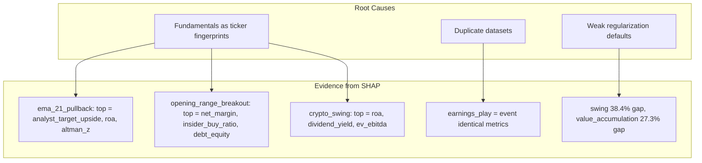

# Improve ML Model Quality — Post-Regression Fix

## Current State

After all regression fixes, 7/18 strategies are CONDITIONAL_PASS, 11/18 are
FAIL. Three root causes remain:



## Change 1: Expand fundamental feature mask (CRITICAL)

The SHAP data is unambiguous: fundamental features are the top 2-3 features for
nearly every failing strategy. These values are static per-ticker (changing
quarterly at best) and enable the model to memorize ticker identities rather
than learn directional patterns.

**Current mask** in
[training_loop.py](src/ml_training/ml_training/pipeline/training_loop.py):

- Only drops fundamentals for strategies containing "intraday" or "scalp"

**New mask** — drop fundamentals for ALL strategies EXCEPT those containing
"value":

```python
st = self._config.strategy_type or ""
if "value" not in st:
    drop = [c for c in FUNDAMENTAL_FEATURES if c in dataset.columns]
```

Only `value` and `value_accumulation` should keep fundamentals — these are the
only strategies where PE ratios, ROE, and balance sheet metrics are
theoretically relevant to the trading thesis.

**Expected impact:** Directly addresses the memorization that causes 11-38%
overfit gaps on swing/event/mean_reversion strategies.

## Change 2: Eliminate duplicate dataset training (HIGH)

`build_all` in
[dataset_builder.py](src/ml_training/ml_training/features/dataset_builder.py)
saves both `{strategy.id}_features` and `{strategy_type}_features`. When
`--per-strategy` training runs, `list_strategy_datasets()` in
[storage.py](src/ml_training/ml_training/data/storage.py) returns BOTH, causing
identical models to be trained under different names.

Affected duplicates:

- `earnings_play` = `event` (only one template with `strategy_type: "event"`)
- `value_accumulation` = potential partial overlap with `value` type aggregate
- Any `strategy_type` with exactly one template

**Fix:** In `list_strategy_datasets()`, add a parameter to filter out type-level
aggregates. When `--per-strategy` is passed, only return
`{strategy.id}_features` datasets, not `{strategy_type}_features`.

Alternatively, in `build_all`, skip saving `{strategy_type}_features` when there
is only one template of that type (since it would be identical to the id-level
file).

## Change 3: Tighter LightGBM regularization defaults (HIGH)

Current defaults in
[predictor.py](src/ml_training/ml_training/models/predictor.py) are permissive:

- `num_leaves=63`, no `max_depth`, no `reg_alpha`/`reg_lambda`

**New defaults:**

```python
CLASSIFIER_PARAMS = {
    ...
    "num_leaves": 31,        # was 63 — halved to reduce complexity
    "max_depth": 8,           # was unset (unlimited)
    "reg_alpha": 0.1,         # L1 regularization
    "reg_lambda": 1.0,        # L2 regularization
    "min_child_samples": 30,  # was 20
    ...
}
```

This constrains the model's capacity to memorize. Optuna can still explore the
full space, but the baseline model is more conservative.

**Also tighten the Optuna search space** in
[hyperparameter_tuning.py](src/ml_training/ml_training/pipeline/hyperparameter_tuning.py):

- `max_depth`: 5-15 to 3-10
- `num_leaves`: 15-127 to 15-63
- `min_child_samples`: 20-100 to 30-150
- `reg_lambda` lower bound: 1e-8 to 0.01

## Change 4: More aggressive default pruning (MEDIUM)

In [training_loop.py](src/ml_training/ml_training/pipeline/training_loop.py):

- Default `feature_prune_fraction`: 0.20 to 0.30
- Adaptive threshold: >15% gap triggers 0.35 to >12% gap triggers 0.40

Combined with the fundamental mask, this further reduces feature noise for
remaining features.

## Change 5: Default to binary classification (MEDIUM)

The 3-class direction target with ATR-adjusted FLAT band makes the
classification problem very hard (wide FLAT = many ambiguous labels). Binary
classification (profitable vs not) is a cleaner signal.

**Change in [cli.py](src/ml_training/ml_training/pipeline/cli.py):** Make
`--binary` the default for per-strategy training. Add `--three-class` flag to
opt into the original behavior.

This affects
[training_loop.py](src/ml_training/ml_training/pipeline/training_loop.py) and
[predictor.py](src/ml_training/ml_training/models/predictor.py) which already
support binary mode — just need to flip the default.

---

## Files Modified

- [training_loop.py](src/ml_training/ml_training/pipeline/training_loop.py) —
  expand fundamental mask, increase pruning defaults
- [predictor.py](src/ml_training/ml_training/models/predictor.py) — tighter
  CLASSIFIER_PARAMS, BINARY_CLASSIFIER_PARAMS
- [hyperparameter_tuning.py](src/ml_training/ml_training/pipeline/hyperparameter_tuning.py)
  — tighter Optuna search space
- [storage.py](src/ml_training/ml_training/data/storage.py) or
  [dataset_builder.py](src/ml_training/ml_training/features/dataset_builder.py)
  — eliminate duplicate datasets
- [cli.py](src/ml_training/ml_training/pipeline/cli.py) — binary as default

## Expected Outcome

| Category                  | Current                          | Expected                                               |
| ------------------------- | -------------------------------- | ------------------------------------------------------ |
| Intraday/scalp strategies | 74% / 54% COND_PASS              | Maintain or improve (fundamentals already dropped)     |
| Swing strategies          | 42-52% acc, 11-38% gap, all FAIL | Reduced gap, some move to COND_PASS                    |
| Event/earnings            | 40.5% identical, FAIL            | Single model (no duplicate), potentially improved      |
| Value strategies          | 36% FAIL                         | Keep fundamentals, may still struggle (genuinely hard) |
