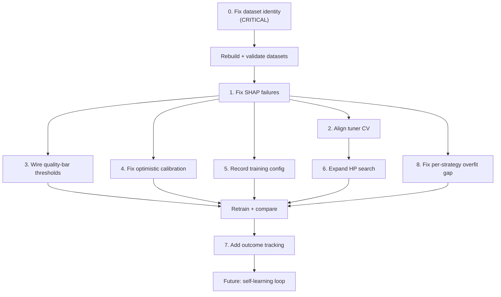

# Improve the ML Training Loop

The artifact analysis + code exploration revealed **10 concrete weaknesses**.
The most critical is a newly discovered root cause for why all per-strategy
models produce identical metrics: **the datasets themselves are nearly
identical**.

---

## 0. CRITICAL: Fix Per-Strategy Dataset Identity (Root Cause of Identical Models)

This is the #1 priority -- everything downstream is meaningless until datasets
are actually differentiated.

### Three bugs combine to make per-strategy datasets identical:

**Bug A: Screener filter is a complete no-op (key name mismatch)**

`_passes_screener_filters()` in
[dataset_builder.py](src/ml_training/ml_training/features/dataset_builder.py)
checks for FMP API keys (`volumeMoreThan`, `priceMoreThan`, `priceLowerThan`)
but `strategies.json` uses different keys (`volume_min`, `price_min`,
`price_max`). The filter **always returns True** -- every ticker passes every
strategy, so all strategies iterate over the same tickers.

The full screener config has rich filters (PE range, ROE min, beta range, market
cap, Piotroski min, Altman Z) that are completely ignored.

Fix: Map `strategies.json` keys to the filter checks:

- `volume_min` -> volume filter
- `price_min` / `price_max` -> price filter
- Add: `market_cap_min/max`, `pe_min/max`, `roe_min`, `beta_min/max`,
  `piotroski_min`, `altman_z_min` checks against fundamental features

**Bug B: Multiple strategies overwrite the same parquet file**

In `build_all()`, the dataset is saved as `{strategy.strategy_type}_features`.
But 4 strategies have `strategy_type: "swing"` and 4 have
`strategy_type: "intraday"`. Each one overwrites the previous. Only the last
strategy of each type survives.

Fix: Save per-strategy-ID datasets (e.g.
`swing_momentum_breakout_features.parquet`) AND per-strategy-TYPE aggregated
datasets. The per-type dataset is the union of all per-ID datasets for that
type.

**Bug C: Non-daily strategies share identical data**

Dataset file sizes confirm the problem:

- value, event, intraday, mean_reversion, crypto_intraday: all ~15.6 MB
  (identical)
- swing, crypto_swing: all ~48.4 MB (identical)

Strategies using `chart_timeframe: "4H"` (mean_reversion, value, event) all
iterate over the same 4H tickers with no screener differentiation. The
`strategy_type` column is the ONLY difference in their data -- and since the
model trains on each strategy's dataset independently, it sees the exact same
features and labels.

Additionally, 15m and 30m price data does not exist (0 files), so the 3 intraday
strategies requesting those timeframes generate zero samples of their own. They
get folded into the generic intraday result.

Fix: The screener fix (Bug A) is the primary solution -- once strategies
actually filter on their specific criteria (PE ranges, beta, etc.), datasets
will differ. Additionally, log a warning when a strategy's requested timeframe
has zero data files.

**Bug D: Single-timeframe features ignore `additional_timeframes`**

Each strategy in `strategies.json` specifies both a `chart_timeframe` AND
`additional_timeframes` (e.g., Momentum Breakout: Daily + 4H + Weekly). In the
live pipeline, Claude receives charts from all these timeframes. But
`build_for_strategy` only loads `strategy.chart_timeframe` -- the additional
timeframes are completely ignored.

This creates a train/inference mismatch AND misses a major differentiation
signal. A swing strategy analyzing Daily+4H+Weekly should see different patterns
than a mean-reversion strategy analyzing 4H+Daily+Weekly.

Fix: For each sample, also load price/indicator data from
`additional_timeframes` and compute summary features from each:

- `{tf}_rsi_14` -- RSI from each additional timeframe
- `{tf}_price_vs_ema_200` -- trend position on higher/lower timeframe
- `{tf}_ema_stack_score` -- EMA alignment on each timeframe
- `{tf}_momentum_score` -- momentum from each timeframe

This adds ~4-8 features per additional timeframe, but only for timeframes where
data exists. If a timeframe has no data, features default to NaN (LightGBM
handles missing values natively).

Example for Momentum Breakout (D + 4H + W):

- Primary features computed from Daily (existing)
- `tf_4H_rsi_14`, `tf_4H_price_vs_ema_200`, `tf_4H_ema_stack_score`,
  `tf_4H_momentum_score`
- `tf_W_rsi_14`, `tf_W_price_vs_ema_200`, `tf_W_ema_stack_score`,
  `tf_W_momentum_score`

### Evidence (file sizes confirm identical data)

```
crypto_intraday_features.parquet  15,668,579 bytes
event_features.parquet            15,668,416 bytes
intraday_features.parquet         15,668,452 bytes
mean_reversion_features.parquet   15,668,506 bytes
value_features.parquet            15,668,462 bytes
swing_features.parquet            48,403,243 bytes
crypto_swing_features.parquet     48,402,830 bytes
```

---

## 1. Fix SHAP Failures (Blocks Drift Detection)

**Problem:** SHAP analysis fails every run with
`TypeError: only 0-dimensional arrays can be converted to Python scalars`. When
SHAP fails, the drift detector skips importance drift entirely -- a critical
safety check goes blind.

**Root cause:** `shap.TreeExplainer.shap_values()` returns a list of 2D arrays
(one per class for multiclass).
`np.mean([np.abs(sv).mean(axis=0) for sv in shap_values], axis=0)` produces a 1D
array, but each element is still an ndarray when `mean_abs` has shape
`(n_features,)` containing arrays. The `float(v)` cast in the dict comprehension
fails on arrays with >1 element.

**Fix** in
[training_loop.py](src/ml_training/ml_training/pipeline/training_loop.py) lines
173-196:

- After computing `mean_abs`, ensure it is a flat 1D numpy array of scalars by
  calling `np.asarray(mean_abs).ravel()`
- Same fix for `mean_abs_train`
- This ensures `float(v)` works on scalar elements

---

## 2. Align Tuner CV with Training CV (Purge + Embargo)

**Problem:** The tuner uses bare `TimeSeriesSplit(n_splits=3)` with no
purge/embargo, while training uses `_purged_split` with
`purge_window=200, embargo_window=5`. Tuned hyperparameters are optimized for a
leaky validation scheme, so they may overfit when used in production training.

**Fix** in
[hyperparameter_tuning.py](src/ml_training/ml_training/pipeline/hyperparameter_tuning.py):

- Import `_purged_split` from `predictor.py`
- Replace `TimeSeriesSplit` with the same `_purged_split` logic used during
  training
- Match `n_splits=5` (or make configurable) to match predictor defaults
- Match early_stopping to 50 (currently 30 in tuner vs 50 in predictor)

---

## 3. Wire Dead Quality-Bar Thresholds

**Problem:** `DEFAULT_QUALITY_BAR` declares `max_overfit_gap`,
`min_samples_per_strategy`, `min_reliability_accuracy`, and
`min_dsr_probability`, but `determine_verdict()` never reads them. The only
overfit check is `report.overfit_risk == "high"`, which is a categorical string
set by `wfo_validator` at a fixed 15% gap threshold -- not the configurable
`max_overfit_gap: 0.10`.

**Fix** in [report.py](src/ml_training/ml_training/judge/report.py)
`determine_verdict()`:

- Replace `report.overfit_risk == "high"` with
  `report.insample_vs_oos_gap > bar["max_overfit_gap"]` (uses the actual numeric
  threshold)
- Add check:
  `report.reliability_model_accuracy < bar["min_reliability_accuracy"]` ->
  partial_failure
- Add check: `report.deflated_sharpe_probability < bar["min_dsr_probability"]`
  -> partial_failure (when DSR is actually computed)
- Keep the string `overfit_risk` for logging but don't gate on it

---

## 4. Fix Optimistic Calibration (Same-Set Fit + Eval)

**Problem:** In `training_loop._run_round()`, the calibrator is fit on
`(probabilities, y_test)` and then the judge evaluates ECE/Brier on that same
`(probabilities, y_test)`. This makes calibration metrics artificially good --
the calibrator has seen those exact labels.

**Fix** in
[training_loop.py](src/ml_training/ml_training/pipeline/training_loop.py):

- Split the test set into `test_judge` (first 70%) and `test_calibration` (last
  30%)
- Fit calibrator/conformal on `test_calibration`
- Pass `test_judge` predictions/labels to the judge for metrics
- This gives honest ECE/Brier numbers

---

## 5. Record Training Config in Metadata

**Problem:** All `*_meta.json` files have `"training_config": {}` -- empty. When
you compare models, you can't tell what hyperparameters or settings produced
them.

**Fix** in
[training_loop.py](src/ml_training/ml_training/pipeline/training_loop.py)
`_run_round()`:

- Populate `training_config` in `ModelMetadata` with:
  - `classifier_params` (the actual LightGBM params used)
  - `n_boost_rounds`
  - `target_col`, `return_col`
  - `n_folds` (from training result)
  - `purge_window`, `embargo_window`
  - `strategy_type`
  - `dataset_size` (len of input dataframe)

---

## 6. Expand Hyperparameter Search (Optuna or Larger Grid)

**Problem:** The current grid has only 8 configs. Several don't vary
regularization parameters (`reg_alpha`, `reg_lambda`) that directly control
overfitting -- the primary failure mode. No `max_depth` or `min_gain_to_split`
explored.

**Fix** in
[hyperparameter_tuning.py](src/ml_training/ml_training/pipeline/hyperparameter_tuning.py):

- Add `optuna` as an optional dependency
- If optuna is available, use `optuna.create_study()` with TPE sampler for
  Bayesian search over:
  - `num_leaves`: 15-127
  - `learning_rate`: 0.01-0.15
  - `min_child_samples`: 20-100
  - `feature_fraction`: 0.5-0.9
  - `bagging_fraction`: 0.5-0.9
  - `reg_alpha`: 0.0-1.0
  - `reg_lambda`: 0.0-1.0
  - `max_depth`: 5-15 (or -1)
  - `min_gain_to_split`: 0.0-0.5
- Fall back to the existing grid if optuna is not installed
- Add `--n-trials` CLI flag (default 30) for the tuner
- Optimize on a composite score: `accuracy - 2 * overfit_gap` to penalize
  overfitting

---

## 7. Add Outcome Tracking (Karpathy Data Engine - Foundation)

**Problem:** The pipeline predicts direction but never checks whether
predictions were correct. This blocks the entire self-learning loop.

**New file:** `src/ml_training/ml_training/pipeline/outcome_tracker.py`

- `OutcomeTracker` class that:
  - Logs predictions to a parquet file:
    `(timestamp, ticker, strategy_type, predicted_direction, confidence, feature_vector_hash, model_version)`
  - Resolves outcomes: reads price data N days later, labels as
    CORRECT/INCORRECT
  - Stores resolved outcomes in `data/outcomes/resolved_predictions.parquet`
  - Computes rolling accuracy per strategy, per regime, per confidence bucket
- New CLI command: `resolve-outcomes` that checks unresolved predictions and
  labels them
- New CLI command: `report-outcomes` that prints rolling accuracy dashboard

This is the **foundation** for future retraining on outcome data (month 2 of the
Karpathy roadmap).

---

## 8. Fix Per-Strategy Overfit Gap Calculation

**Problem:** For small-N strategies (58K samples), the 5-fold CPCV with
purge_window=200 removes a large fraction of data. The first fold trains on only
~10K samples, leading to extreme overfit gaps (25%+) that aren't meaningful --
they're an artifact of insufficient training data in early folds.

**Fix** in [predictor.py](src/ml_training/ml_training/models/predictor.py):

- For small datasets (< 100K rows), reduce `n_splits` from 5 to 3 and
  `purge_window` from 200 to 50
- Scale purge_window proportionally to dataset size: `min(200, len(df) // 500)`
- This gives early folds enough training data to produce meaningful accuracy
  estimates

---

## Execution Order



**Phase 1 (must do first):** Item 0 (dataset identity) + rebuild. Without this,
all other improvements are wasted on identical data.

**Phase 2 (parallel):** Items 1-5 + 8 are independent code changes.

**Phase 3:** Item 6 (expanded HP search) depends on item 2 (aligned CV).

**Phase 4:** Retrain all per-strategy models and compare.

**Phase 5 (future):** Item 7 (outcome tracking / Karpathy data engine).
