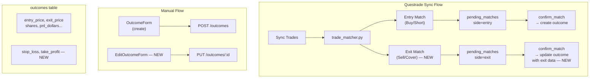

# Insights Journal: Manual + Questrade Trade Editing

## Problem

The Insights trade journal has three gaps:

1. **Questrade only records entries, never exits.** The `confirm_match` endpoint
   always writes `entry_price` -- sell/cover orders are matched but treated
   identically to buy/short entries, so `exit_price`, `exit_timestamp`,
   `pnl_dollars`, and `pnl_percent` never get populated from brokerage data.
2. **No edit capability.** Once an outcome exists (manual or Questrade), the UI
   shows a read-only "Trade Result" card with no way to modify fields.
   `api.updateOutcome()` exists but is never called.
3. **No SL/TP on outcomes.** The outcome table lacks `stop_loss` and
   `take_profit` columns. The expanded row shows the _recommendation's_
   suggested levels, not the user's actual trade management levels.

---

## Architecture



---

## Changes by Layer

### 1. Database Migration (014)

New file:
`[src/backend/database/migrations/014_outcome_trade_levels.sql](src/backend/database/migrations/014_outcome_trade_levels.sql)`

```sql
ALTER TABLE outcomes ADD COLUMN IF NOT EXISTS stop_loss REAL;
ALTER TABLE outcomes ADD COLUMN IF NOT EXISTS take_profit REAL;
```

### 2. Backend: Pydantic Models

File: `[src/backend/pipeline/schemas.py](src/backend/pipeline/schemas.py)`

- Add `stop_loss: float | None = None` and `take_profit: float | None = None` to
  both `OutcomeCreate` and `OutcomeResponse`
- Add `outcome_stop_loss: float | None = None` and
  `outcome_take_profit: float | None = None` to `RecommendationWithStatus`

### 3. Backend: Outcomes API

File: `[src/backend/api/outcomes.py](src/backend/api/outcomes.py)`

- Add `stop_loss` and `take_profit` to the `create_outcome` insert dict and
  `update_outcome` update dict
- Add them to `_build_outcome_response()`

### 4. Backend: Recommendations API

File: `[src/backend/api/recommendations.py](src/backend/api/recommendations.py)`

- Add `outcome_stop_loss` and `outcome_take_profit` to `_build_status()`
- Add `stop_loss, take_profit` to the outcomes SELECT query

### 5. Backend: Questrade Exit Matching

File:
`[src/backend/services/trade_matcher.py](src/backend/services/trade_matcher.py)`

The current `_load_open_recommendations` loads recs where the user is following
and the outcome has no `exit_price`. This correctly means exit orders can match.
But `confirm_match` always writes entry data.

Changes to `[src/backend/api/questrade.py](src/backend/api/questrade.py)`
`confirm_match`:

- Detect whether the pending match `side` is an exit (Sell/Cov) vs entry
  (Buy/Short)
- For **exit matches**: update the existing outcome with `exit_price`,
  `exit_timestamp`, compute `pnl_dollars` and `pnl_percent` from `entry_price`
  and `exit_price`, compute `holding_days` from timestamps
- For **entry matches**: keep current behavior (create/update with entry data)

Also fix: `trade_matcher.py` line 380 and `questrade_service.py` line 655 both
have Python 2-style `except ValueError, TypeError:` which will cause a
SyntaxError at runtime. Fix to `except (ValueError, TypeError):`.

### 6. Frontend: TypeScript Types

File: `[src/frontend/src/types/index.ts](src/frontend/src/types/index.ts)`

- Add `stop_loss` and `take_profit` to `OutcomeCreate` and `OutcomeResponse`
- Add `outcome_stop_loss` and `outcome_take_profit` to
  `RecommendationWithStatus`

### 7. Frontend: InsightsView Editable Outcomes

File:
`[src/frontend/src/views/InsightsView.tsx](src/frontend/src/views/InsightsView.tsx)`

**ExpandedRow changes:**

- "closed" status: add an **Edit** button that opens `EditOutcomeForm`
- Show user's actual SL/TP (from outcome) alongside or instead of
  recommendation's suggested levels when they differ
- "following" status: add `stop_loss` and `take_profit` inputs to `OutcomeForm`

**New `EditOutcomeForm` component** (inline in InsightsView or separate file):

- Pre-fills all fields from the existing outcome data (`rec.outcome_` fields)
- Includes entry_price, exit_price, shares, stop_loss, take_profit, pnl_dollars,
  pnl_percent, holding_days, exit_reason, notes
- Auto-calculates PnL when entry, exit, and shares are present (like existing
  OutcomeForm)
- Calls `api.updateOutcome(outcomeId, body)` on save
- Fires `notifyFeedbackChanged()` to sync with FeedbackTab

### 8. Frontend: useInsights Hook

File:
`[src/frontend/src/hooks/useInsights.ts](src/frontend/src/hooks/useInsights.ts)`

- Add `updateOutcome` callback that calls `api.updateOutcome()` then refreshes
  data
- Pass it through to InsightsView components

---

## Bug Fixes (included)

- `**trade_matcher.py:380` — `except ValueError, TypeError:` is Python 2 syntax;
  fix to `except (ValueError, TypeError):`
- `**questrade_service.py:655` — same issue, fix to
  `except (ValueError, TypeError):`

---

## Files Touched (summary)

| File                                               | Change                                                 |
| -------------------------------------------------- | ------------------------------------------------------ |
| `database/migrations/014_outcome_trade_levels.sql` | New migration: add stop_loss, take_profit              |
| `pipeline/schemas.py`                              | Add SL/TP to Outcome + RecommendationWithStatus models |
| `api/outcomes.py`                                  | Pass SL/TP through create/update/response              |
| `api/recommendations.py`                           | Include SL/TP in status response                       |
| `api/questrade.py`                                 | Handle exit matches in confirm_match                   |
| `services/trade_matcher.py`                        | Fix except syntax                                      |
| `services/questrade_service.py`                    | Fix except syntax                                      |
| `frontend/src/types/index.ts`                      | Add SL/TP to TS types                                  |
| `frontend/src/views/InsightsView.tsx`              | EditOutcomeForm + edit button + SL/TP inputs           |
| `frontend/src/hooks/useInsights.ts`                | Add updateOutcome callback                             |
