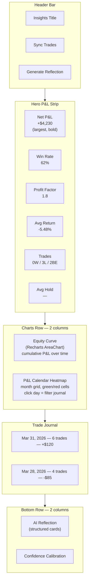

# Insights Page Redesign — World-Class Trade Journal

## The Problem

The current Insights page reads as a developer data dump. Every stat card looks
the same, the journal is a wall of identical rows, and the reflection panel
dumps raw prompt text. A trader opening the page can't answer "Am I up or down?"
in 3 seconds.

## Design Philosophy

Every gold-standard journal (TradeZella, Tradervue, TradesViz) follows the same
hierarchy:

```
1. Hero P&L number (THE answer to "am I up or down?")
2. KPI metric strip (win rate, profit factor, avg R:R, trade count)
3. Equity Curve (the "story" — always the largest widget)
4. Calendar Heatmap (pattern recognition at a glance)
5. Trade Journal (grouped by date, status-coded)
6. AI Reflection (structured cards, not raw text)
```

## New Page Layout



## Implementation Tasks

### 1. Add Recharts dependency

Install `recharts` via bun — the industry-standard React charting library,
tree-shakeable, dark-theme compatible. No other dependencies needed.

### 2. New backend endpoint: Trade history time-series

New `GET /api/insights/trade-history` endpoint in
[src/backend/api/insights.py](src/backend/api/insights.py) that returns closed
outcomes as a time-series sorted by `logged_at`:

```python
# Returns:
[{
    "date": "2026-03-28",
    "ticker": "TSX:IE",
    "pnl_dollars": -21.36,
    "pnl_percent": -11.8,
    "cumulative_pnl": -21.36,
    "action": "BUY",
    "confidence": 0.74
}, ...]
```

This feeds both the equity curve and the calendar heatmap. The backend computes
`cumulative_pnl` by sorting outcomes by date and running a prefix sum.

New Pydantic model `TradeHistoryEntry` in
[src/backend/pipeline/schemas.py](src/backend/pipeline/schemas.py). New
TypeScript interface `TradeHistoryEntry` in
[src/frontend/src/types/index.ts](src/frontend/src/types/index.ts).

### 3. Redesign Hero P&L Strip

Replace the current flat 6-card `StatsGrid` with a visually weighted strip:

- **Net P&L** gets 2x the space — large 32px bold number, green/red background
  glow, full-width accent border
- **Win Rate** gets a circular progress indicator (CSS only, no library)
- Other 4 stats rendered as compact label+value pairs with subtle trend context
- All cards get entrance animation stagger (already have this via motion)

In
[src/frontend/src/views/InsightsView.tsx](src/frontend/src/views/InsightsView.tsx),
replace the `StatsGrid` component (~lines 492-590).

### 4. Equity Curve Chart

New `EquityCurveChart` component using Recharts `AreaChart`:

- X-axis: date, Y-axis: cumulative P&L ($)
- Green gradient fill when positive, red when negative
- Tooltip showing date + P&L for that trade
- Responsive, 350px height
- Uses the `--color-accent-profit` and `--color-accent-loss` CSS tokens
- Grid lines use `--color-border-subtle`

Placed in the left column of a 2-column grid below the hero strip.

### 5. P&L Calendar Heatmap

New `PnLCalendar` component — a custom month grid (no external lib needed):

- CSS Grid of 7 columns (Mon-Sun), 5-6 rows per month
- Each cell colored by daily aggregate P&L: deep green (big win), light green
  (small win), gray (no trades), light red (small loss), deep red (big loss)
- Cell text shows dollar amount if trades occurred
- Click a day cell to filter the journal below to that date
- Month navigation arrows (prev/next month)

Placed in the right column next to the equity curve.

### 6. Date-Grouped Journal

Replace the flat list of `JournalRow` components with date-grouped sections:

- Group recommendations by `created_at` date
- Each group has a sticky date header: "Apr 1, 2026 — 3 trades — +$45"
- Date header shows aggregate P&L for that day (green/red colored)
- Within each group, rows remain as-is but get improved spacing
- Collapsed groups for dates older than 7 days (click to expand)

In `RecommendationJournal` component (~lines 596-846).

### 7. Improved Journal Row Visual Hierarchy

Update `JournalRow` to better differentiate states:

- **Pending** rows: subtle, muted — they haven't been acted on
- **Open** rows: left border glow (pulsing accent-signal), slightly elevated
  background
- **Closed win** rows: left border accent-profit, subtle green tint on hover
- **Closed loss** rows: left border accent-loss, subtle red tint on hover
- **Passed** rows: even more muted (lower opacity), pushed to bottom of group

This is mostly CSS changes to the existing `JournalRow` component.

### 8. Structured Reflection Panel

Replace the raw `<pre>` text dump with structured cards:

- **Performance Summary card**: wins/losses/P&L pulled from reflection metrics
  as clean typography, not raw text
- **Pattern Alerts card**: each pattern gets its own row with accuracy badge and
  colored indicator
- **Confidence Calibration inline**: mini bars for high/mid/low confidence win
  rates
- **AI Insight card**: only the GPT-generated strategic advice paragraph — no
  injection prompt
- Collapsible "Raw Injection Prompt" at the bottom for power users

In `ReflectionPanel` component (~lines 1897-1959). The `injection_prompt` and
`summary_text` fields from `ReflectionResponse` need parsing — the injection
prompt follows a known structure (SHORT-TERM MEMORY, LONG-TERM MEMORY, sections)
that can be split on headers.

### 9. Frontend data flow for charts

Update
[src/frontend/src/hooks/useInsights.ts](src/frontend/src/hooks/useInsights.ts)
to also fetch trade history:

- Add `tradeHistory: TradeHistoryEntry[]` state
- Fetch from new endpoint in `fetchAll`
- Expose to InsightsView

Update [src/frontend/src/api/client.ts](src/frontend/src/api/client.ts) with new
`getTradeHistory()` method.

### 10. Minor polish touches

- **Animated counters**: P&L numbers count up on load (motion `animate` with
  spring)
- **Empty states**: when there are no trades, show an inviting illustration-free
  message with clear CTA ("Run your first pipeline to start tracking")
- **Toast auto-dismiss**: the Questrade auto-confirm toast should slide out
  automatically (already implemented at 5s)

## Files Changed

- `src/frontend/package.json` — add recharts dependency
- `src/frontend/src/types/index.ts` — add `TradeHistoryEntry` interface
- `src/frontend/src/api/client.ts` — add `getTradeHistory()`
- `src/frontend/src/hooks/useInsights.ts` — fetch trade history
- `src/frontend/src/views/InsightsView.tsx` — major restructure of all visual
  components
- `src/backend/api/insights.py` — new trade-history endpoint
- `src/backend/pipeline/schemas.py` — new `TradeHistoryEntry` model

## What This Does NOT Change

- No changes to the trade tracking logic (PnL engine, Questrade sync,
  auto-confirm)
- No changes to the FeedbackTab in recommendations view
- No changes to other views (Dashboard, History, Strategies, Settings)
- No changes to backend pipeline or prompts
