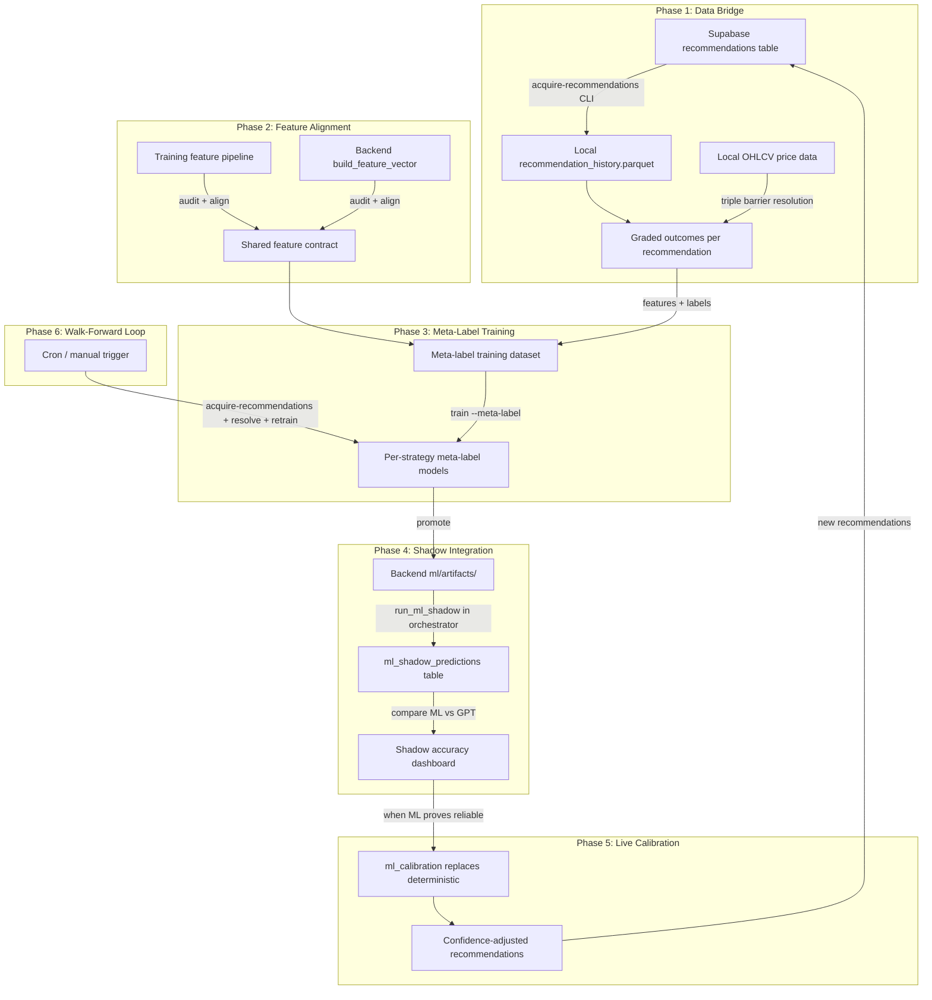

# ML Meta-Labeling Pipeline: Closing the Loop

## Problem Statement

The ML training pipeline and the live LLM pipeline are currently disconnected
islands:

- The LLM pipeline (Perplexity -> Gemini -> Claude -> GPT) produces
  recommendations stored in Supabase, but nobody grades them systematically
  against actual price outcomes.
- The ML models train on synthetic labels (triple barrier on historical data)
  rather than learning what makes a _GPT recommendation_ succeed or fail.
- The backend has a complete but **dormant** ML inference layer
  (`ml/inference.py`, `ml/shadow_runner.py`, `ml/schemas.py`,
  `services/ml_calibration.py`) that is never called from the orchestrator.
- The `outcomes` table is sparsely populated (user manually journals trades).

The goal is to make the ML model the **final executor** -- it validates GPT
recommendations before they reach the user, trained on what actually happened
when GPT said "BUY AAPL with 0.85 confidence."

## Architecture Overview



---

## Phase 1: Data Bridge (New CLI Commands)

### 1.1 New command: `acquire-recommendations`

Pull historical recommendations from Supabase into a local parquet file.

**File:** [cli.py](src/ml_training/ml_training/pipeline/cli.py) -- add new
subcommand **New file:**
[supabase_provider.py](src/ml_training/ml_training/data/supabase_provider.py) --
Supabase client for ML pipeline

**What it pulls from `recommendations` table:**

- `id`, `ticker`, `action`, `confidence`, `entry_price`, `stop_loss`,
  `take_profit`
- `risk_reward_ratio`, `holding_period`, `judge_reasoning`, `key_factors`
- `created_at`, `signal_generated_at`, `price_at_signal`
- From `pipeline_runs` (joined via `run_id`): `strategy_template` (to map to
  strategy_type)

**What it pulls from `decisions` table (joined):**

- `decision` (following/passing), `decided_at`

**What it pulls from `outcomes` table (joined, where available):**

- `pnl_percent`, `exit_reason`, `holding_days`, `failure_mode`

**Storage:** `data/raw/recommendation_history.parquet`

**Key implementation detail:** The Supabase client needs to use the service role
key (not user JWT) since this runs offline. Add `SUPABASE_URL` and
`SUPABASE_SERVICE_KEY` to the `.env` file the ML pipeline already loads.

### 1.2 New command: `grade-recommendations`

For each recommendation that lacks an outcome, resolve the actual result using
local price data and the triple barrier method.

**File:**
[outcome_grader.py](src/ml_training/ml_training/pipeline/outcome_grader.py)
(new)

**Logic per recommendation:**

1. Load the ticker's OHLCV price data from local parquet store (already acquired
   via `acquire`)
2. Find the bar at `signal_generated_at` (or `created_at` fallback)
3. Use the recommendation's own `stop_loss` and `take_profit` as barrier levels
   (when provided by GPT)
4. If GPT didn't provide SL/TP, fall back to ATR-based barriers (same as
   `compute_triple_barrier_label` in
   [engineering.py](src/ml_training/ml_training/features/engineering.py))
5. Walk forward through subsequent bars to determine which barrier was hit first
6. Produce a graded label: `TP_HIT`, `SL_HIT`, `TIME_EXIT`, `NO_TRADE_CORRECT`,
   `NO_TRADE_MISSED`
7. Also compute: `actual_return`, `bars_held`, `max_favorable_excursion`,
   `max_adverse_excursion`

**Output columns added to `recommendation_history.parquet`:**

- `graded_label` (the ground truth)
- `graded_profitable` (binary: 1 if TP_HIT or positive TIME_EXIT)
- `actual_return_pct`
- `bars_to_resolution`
- `mfe_pct`, `mae_pct`
- `graded_at` (timestamp)

**Why GPT's own SL/TP is critical:** This is the key insight -- we're not asking
"did the price go up?" We're asking "given GPT said BUY at $150 with SL $145 and
TP $160, what actually happened?" This is exactly the pattern recognition task
the model needs to learn.

### 1.3 Handling edge cases

- **Recommendations with `action=NO_TRADE` or `HOLD`:** Grade as
  `NO_TRADE_CORRECT` if price dropped >2% in the holding period,
  `NO_TRADE_MISSED` if price rose >5%
- **Missing price data:** Skip and log warning. The `acquire` command must have
  already downloaded data for the ticker/timeframe
- **Recommendations older than price data:** Skip with warning
- **Multiple recommendations for same ticker on same day:** Grade each
  independently (different strategies may have different SL/TP)

---

## Phase 2: Feature Alignment

### 2.1 The feature mismatch problem

The training pipeline computes ~50+ features from full OHLCV history (RSI, MACD,
EMA stack, FFD, TSFresh, etc.). The backend's `build_feature_vector()` in
[inference.py](src/backend/ml/inference.py) builds features from a flat dict of
TA snapshot values. These **must produce identical feature values** for the same
ticker/date or the model will see different distributions at inference time than
it saw during training.

### 2.2 Solution: Compute training features at recommendation date

When building the meta-label training dataset (Phase 3), compute features using
the **exact same code path** as regular `build-dataset`, but anchored at the
recommendation's date rather than iterating over all dates.

**Modification to**
[dataset_builder.py](src/ml_training/ml_training/features/dataset_builder.py):
Add a method `build_for_recommendations(recs_df)` that:

1. Takes the graded recommendations DataFrame
2. For each `(ticker, date)`, loads prices and indicators
3. Calls the same `compute_technical_features()`, `compute_context_features()`,
   etc.
4. Adds **LLM-derived features** unique to meta-labeling:

- `llm_action_encoded` (BUY=1, SHORT=-1, HOLD/NO_TRADE/WATCH=0)
- `llm_confidence` (GPT's confidence score)
- `llm_rr_ratio` (GPT's risk/reward ratio)
- `llm_sl_distance_pct` (distance from entry to SL as %)
- `llm_tp_distance_pct` (distance from entry to TP as %)
- `llm_key_factor_count` (number of key factors cited)
- `llm_warning_count` (number of warnings)

1. Sets `primary_signal = llm_action_encoded` (this is the "signal" the
   meta-labeler filters)
2. Sets `profitable = graded_profitable` (the ground truth label)

### 2.3 Backend feature alignment

**Modification to** [inference.py](src/backend/ml/inference.py)
`build_feature_vector()`: Add the same LLM-derived features so inference-time
features match training. The recommendation data is already available in the
orchestrator when `run_ml_shadow()` is called.

---

## Phase 3: Meta-Label Training

### 3.1 New command: `build-meta-dataset`

Combines Phase 1 output (graded recommendations) with Phase 2 feature
computation to produce a training-ready dataset.

**CLI args:**

- `--min-confidence 0.0` -- filter recommendations below this confidence
- `--actions BUY,SHORT` -- which actions to include (default: BUY, SHORT -- skip
  HOLD/NO_TRADE for training)
- `--min-samples 200` -- minimum samples per strategy for viable training

**Output:** `data/datasets/meta_{strategy_type}_features.parquet` per strategy
type

### 3.2 Training with `--meta-label`

The existing `train --per-strategy --meta-label` command already activates the
[MetaLabeler](src/ml_training/ml_training/models/meta_labeler.py). It needs
minor modifications:

**Current:** `MetaLabeler.train()` filters to rows where `primary_signal != 0`
**Needed:** When using meta-label datasets, the `primary_signal` IS the LLM
action (always != 0 for BUY/SHORT recs), so all rows are used. This is correct
behavior -- every row in the meta-label dataset represents a GPT recommendation
that needs validation.

### 3.3 What the model learns

The meta-labeler learns: "Given these technicals AND the fact that GPT
recommended BUY with 0.82 confidence and a 2.5:1 R/R ratio, is this
recommendation likely to be profitable?"

The model's output is a **conviction score** (probability of profitability),
which directly maps to:

- Position sizing (higher conviction = larger position)
- Go/no-go filtering (below threshold = skip the trade)
- Confidence calibration (blend with GPT's confidence)

---

## Phase 4: Shadow Integration

### 4.1 Wire `run_ml_shadow()` into the orchestrator

**File:** [orchestrator.py](src/backend/pipeline/orchestrator.py)

The `run_ml_shadow()` function in
[shadow_runner.py](src/backend/ml/shadow_runner.py) is fully built but never
called. Wire it into both `_run_pipeline_v1()` and `_run_pipeline_v2()`
**after** recommendations are saved but before the response is returned.

```python
# After _save_recommendations() in both v1 and v2 pipelines:
if ml_model_available(config.strategy_type):
    rec_dicts = [r.model_dump() for r in result.recommendations]
    await run_ml_shadow(
        run_id=run_id,
        recommendations=rec_dicts,
        ta_snapshots=ta_snapshots,
        fmp_data=fmp_data,
        regime_context=regime_context,
        strategy_type=config.strategy_type,
        user_id=user_id,
    )
```

### 4.2 Create `ml_shadow_predictions` table

**New migration:**
`src/backend/database/migrations/019_ml_shadow_predictions.sql`

```sql
CREATE TABLE IF NOT EXISTS ml_shadow_predictions (
    id TEXT PRIMARY KEY,
    user_id TEXT NOT NULL,
    run_id TEXT REFERENCES pipeline_runs(id),
    ticker TEXT NOT NULL,
    strategy_type TEXT NOT NULL,
    prediction_date TIMESTAMPTZ DEFAULT NOW(),
    ml_prediction JSONB,
    ml_direction TEXT,
    ml_confidence REAL,
    ml_reliability REAL,
    gpt_action TEXT,
    gpt_confidence REAL,
    model_version TEXT,
    actual_direction TEXT,
    actual_return REAL,
    ml_correct BOOLEAN,
    gpt_correct BOOLEAN,
    resolved_at TIMESTAMPTZ
);
ALTER TABLE ml_shadow_predictions ENABLE ROW LEVEL SECURITY;
```

### 4.3 Shadow stats API

The endpoints in [ml_predictions.py](src/backend/api/ml_predictions.py)
(`/ml/status`, `/ml/shadow/stats`) are already built. Just need the table to
exist and shadow runner to be called.

---

## Phase 5: ML-Powered Confidence Calibration

### 5.1 Wire `ml_calibration` into orchestrator

**File:** [ml_calibration.py](src/backend/services/ml_calibration.py) -- already
built, needs two fixes:

1. **Type mismatch:** Currently takes `list[dict]`, but orchestrator works with
   `list[Recommendation]`. Add an adapter.
2. **Integration point:** In v2 pipeline Phase 7, check if ML model is
   available. If yes, use `ml_calibration.calibrate_with_ml()` instead of
   `confidence_calibration.calibrate_recommendations()`.

### 5.2 Confidence blending logic (already implemented)

```
When GPT and ML agree:  final = 0.6 * gpt_confidence + 0.4 * ml_probability
When they disagree:     final = 0.7 * gpt_confidence  (penalized)
```

### 5.3 Activation criteria

Only activate ML calibration when shadow stats show:

- At least 50 resolved shadow predictions
- ML accuracy >= GPT accuracy on resolved predictions
- ML reliability_score > 0.5 on average

Add a guard check in the orchestrator that reads shadow stats before enabling ML
calibration.

---

## Phase 6: Walk-Forward Automation

### 6.1 Unified retraining command: `retrain-meta`

Combines all steps into one idempotent command:

```bash
uv run --python 3.14t python -X gil=0 -m ml_training.pipeline.cli retrain-meta \
    --lookback-days 90 \
    --min-samples 200
```

Steps executed:

1. `acquire-recommendations` (pull latest from Supabase)
2. `grade-recommendations` (resolve outcomes against price data)
3. `build-meta-dataset` (compute features at recommendation dates)
4. `train --per-strategy --meta-label` (retrain meta-labeling models)
5. `verify` (run judge system on new models)
6. `promote` (copy passing models to backend artifacts)

### 6.2 Outcome resolution for shadow predictions

**New command: `resolve-shadow`**

Pulls shadow predictions from Supabase (`ml_shadow_predictions` table where
`actual_direction IS NULL`), resolves them against price data, and updates the
rows with `actual_direction`, `actual_return`, `ml_correct`, `gpt_correct`,
`resolved_at`.

This closes the feedback loop for the shadow mode comparison dashboard.

---

## File Change Summary

| File                                                                                           | Change Type | Description                                                                                                                |
| ---------------------------------------------------------------------------------------------- | ----------- | -------------------------------------------------------------------------------------------------------------------------- |
| [cli.py](src/ml_training/ml_training/pipeline/cli.py)                                          | Modify      | Add `acquire-recommendations`, `grade-recommendations`, `build-meta-dataset`, `retrain-meta`, `resolve-shadow` subcommands |
| [supabase_provider.py](src/ml_training/ml_training/data/supabase_provider.py)                  | **New**     | Supabase client for pulling recommendations, decisions, outcomes, shadow predictions                                       |
| [outcome_grader.py](src/ml_training/ml_training/pipeline/outcome_grader.py)                    | **New**     | Grade recommendations against price data using triple barrier method with GPT's SL/TP                                      |
| [dataset_builder.py](src/ml_training/ml_training/features/dataset_builder.py)                  | Modify      | Add `build_for_recommendations()` method for meta-label feature computation                                                |
| [engineering.py](src/ml_training/ml_training/features/engineering.py)                          | Modify      | Add `compute_llm_features()` for LLM-derived features                                                                      |
| [orchestrator.py](src/backend/pipeline/orchestrator.py)                                        | Modify      | Wire `run_ml_shadow()` after recommendation save; conditionally use `ml_calibration`                                       |
| [shadow_runner.py](src/backend/ml/shadow_runner.py)                                            | Modify      | Add LLM-derived features to `build_feature_vector()` call                                                                  |
| [inference.py](src/backend/ml/inference.py)                                                    | Modify      | Extend `build_feature_vector()` with LLM feature inputs                                                                    |
| [ml_calibration.py](src/backend/services/ml_calibration.py)                                    | Modify      | Add Pydantic `Recommendation` adapter, activation guard                                                                    |
| [019_ml_shadow_predictions.sql](src/backend/database/migrations/019_ml_shadow_predictions.sql) | **New**     | Create shadow predictions table                                                                                            |
| [pyproject.toml](src/ml_training/pyproject.toml)                                               | Modify      | Ensure `supabase` dependency is present                                                                                    |

---

## Implementation Order

Phases 1-3 are the ML training side (offline). Phase 4-5 are the backend side
(live pipeline). Phase 6 ties them together.

**Recommended sequence:**

1. Phase 1.1 (acquire-recommendations) -- enables everything else
2. Phase 1.2 (grade-recommendations) -- produces training labels
3. Phase 2.2 (build_for_recommendations) -- produces training features
4. Phase 3.1 (build-meta-dataset CLI) -- combines into dataset
5. Phase 3.2 (train with meta-label) -- produces models (already works, may need
   minor fixes)
6. Phase 4.2 (migration) -- create DB table
7. Phase 4.1 (wire shadow mode) -- start collecting ML vs GPT comparisons
8. Phase 5 (ML calibration) -- activate once shadow data proves ML is reliable
9. Phase 6 (automation) -- convenience commands for the full loop

---

## Risk Mitigation

- **Insufficient recommendation volume:** If < 200 recommendations exist per
  strategy, the meta-labeler will refuse to train (existing guard). Fall back to
  the current synthetic-label model.
- **Feature drift between training and inference:** Phase 2 alignment is
  critical. Add a feature-name validation check in `run_prediction()` that warns
  if >10% of expected features are missing.
- **ML model worse than GPT alone:** Shadow mode prevents any harm. ML never
  touches user-facing output until stats prove it adds value.
- **Supabase rate limits:** Batch fetches with pagination (1000 rows per page).
  Cache locally in parquet after first pull.
