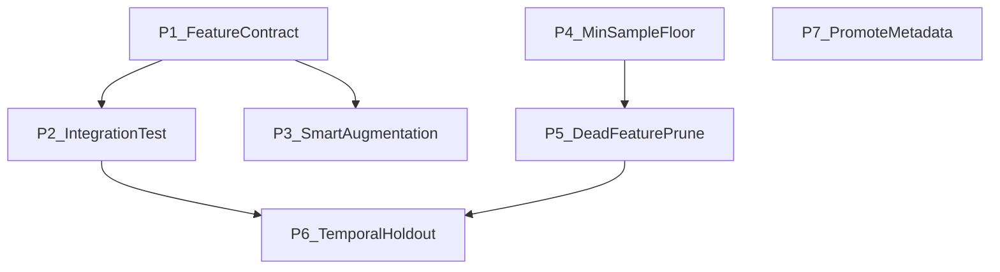

# ML Training Pipeline Improvements

## Priority 1: Shared Feature Contract

**PhD version:** Create a canonical feature registry that serves as the single
source of truth for feature names, types, domains, and availability. Both the
training pipeline (`engineering.py`) and the inference mapper
(`feature_mapper.py`) import from it, making train/serve skew a compile-time
error rather than a silent runtime bug.

**Plain English:** Right now, the training code and the live prediction code
each have their own list of feature names. They were written separately and
happen to use similar names, but nobody checks they match. It's like two cooks
following different copies of the same recipe -- eventually one writes "salt"
where the other writes "sugar." We need one master recipe that both kitchens
share.

**What to build:**

- A `feature_spec.py` module in a shared location defining every feature name,
  its type (numeric/categorical), its valid range (e.g., RSI: 0-100), and
  whether it's available at inference
- `engineering.py` imports this spec when building datasets
- `feature_mapper.py` imports it when mapping live data
- `build_feature_vector()` in `inference.py` validates that all features in the
  model's `feature_names` are present (warn on missing, not silently NaN)

**Files involved:**

- NEW: `src/ml_training/ml_training/features/feature_spec.py`
- EDIT:
  [src/ml_training/ml_training/features/engineering.py](src/ml_training/ml_training/features/engineering.py)
  -- import spec
- EDIT: [src/backend/ml/feature_mapper.py](src/backend/ml/feature_mapper.py) --
  import spec
- EDIT: [src/backend/ml/inference.py](src/backend/ml/inference.py) -- add
  validation in `build_feature_vector()`

---

## Priority 2: Train-to-Inference Integration Test

**PhD version:** An end-to-end round-trip test that fits a minimal LightGBM on
synthetic data, serializes it to `.joblib`, loads it via the backend's
`inference.py` path, runs `build_feature_vector()` + `run_prediction()`, and
asserts non-degenerate output. This catches pickle path issues, feature name
drift, and the exact NaN-collapse bug we just diagnosed.

**Plain English:** We need a test that does the full journey: build a tiny
model, save it, load it the way production does, and make sure predictions
actually work. If we'd had this test from day one, we would have caught the "all
predictions are identical" bug immediately instead of debugging it for days.

**What to build:**

- A pytest file that creates a 500-row synthetic dataset, trains a tiny LightGBM
  (1 round, 3 features), saves it to a temp `.joblib`, loads it via
  `inference.py`'s `_get_model()`, runs `run_prediction()` with two different
  feature dicts, and asserts the probabilities differ
- Run in CI alongside ruff/ty checks

**Files involved:**

- NEW: `src/ml_training/tests/test_train_to_inference.py`
- EDIT: [.github/workflows/ci.yml](.github/workflows/ci.yml) -- add ML test step

---

## Priority 3: Feature-Aware Augmentation

**PhD version:** The current `TimeSeriesAugmenter` applies unconstrained
Gaussian jitter to all numeric columns, including bounded indicators (RSI, zone
encodings) and integer-coded categoricals. SMOTE interpolation in feature space
creates convex combinations that may not exist in the real data manifold. The KS
validation is univariate and doesn't catch joint distribution violations.

**Plain English:** When we don't have enough real training data, we create fake
data by adding random noise. But the noise doesn't know that RSI can only go
from 0 to 100, or that `rsi_zone` is supposed to be a category (1, 2, or 3), not
1.7. We also mix features from different rows in ways that could never happen in
real markets -- like a stock showing extreme bullish momentum but with zero
trading volume. The quality check only looks at one feature at a time, so it
misses these impossible combinations.

**What to build:**

- Clip bounded features after jitter using the feature spec from Priority 1
  (e.g., RSI clipped to [0, 100])
- Exclude categorical columns from jitter entirely (use the
  `CATEGORICAL_FEATURES` set already defined in `engineering.py`)
- Add a joint-distribution check: compute pairwise Pearson correlation
  before/after augmentation and reject batches where correlation structure
  shifts by more than a threshold

**Files involved:**

- EDIT:
  [src/ml_training/ml_training/data/augmentation.py](src/ml_training/ml_training/data/augmentation.py)

---

## Priority 4: Minimum Sample Floor

**PhD version:** Strategies with fewer than ~15-20K samples after augmentation
are training on insufficient data for a 30+ feature LightGBM to learn
generalizable patterns. CPCV with 5 folds on 10K samples gives ~7K training rows
per fold -- marginal for tree-based models. The model memorizes noise rather
than learning signal, producing high training accuracy but poor OOS performance.

**Plain English:** Some strategies barely have 10,000 examples to learn from.
That's like trying to learn to drive by watching 10 YouTube videos -- you'll
pick up some patterns but miss most of what matters. When a strategy doesn't
have enough data, instead of training a bad model specifically for it, we should
use the bigger combined model that learned from all 200K+ examples across every
strategy.

**What to build:**

- Add `MIN_STRATEGY_SAMPLES = 15_000` constant in `training_loop.py`
- Before training a per-strategy model, check sample count. If below floor, log
  a warning and skip (fall back to the combined model at inference time -- this
  already works via `_get_model()` fallback logic)
- Track which strategies were skipped in the artifact tracker

**Files involved:**

- EDIT:
  [src/ml_training/ml_training/pipeline/training_loop.py](src/ml_training/ml_training/pipeline/training_loop.py)
- EDIT:
  [src/ml_training/ml_training/pipeline/cli.py](src/ml_training/ml_training/pipeline/cli.py)
  -- `_train_single()` skip logic

---

## Priority 5: Dead Feature Pruning

**PhD version:** The SHAP analysis from April 7 identified 10+ features with
zero importance across nearly all strategies (`ffd_return_1d` 14/14,
`hmm_regime` 12/14, `ema_stack_score` 10/14). These features add dimensionality
without signal, increase tree depth wastefully, and can create spurious splits
that don't generalize. The `--inference-only` flag removes FFD and HMM but not
the other consistently dead features.

**Plain English:** Our own analysis showed that certain features are completely
ignored by every model -- they never help make a prediction. Keeping them around
is like keeping empty shelves in a kitchen: they take up space and slow you down
looking for what you actually need. We already remove some of them with
`--inference-only`, but others (like `ema_stack_score`, `rsi_zone`, `gap_pct`)
are still hanging around despite being useless.

**What to build:**

- Add a `DEAD_FEATURES` set to `engineering.py` based on the April 7 SHAP
  analysis
- In `_identify_feature_columns()`, optionally drop features that have been
  confirmed dead across 8+ strategies (controlled by a `prune_dead=True`
  default)
- After each training round, auto-update a `dead_features.json` file with any
  feature that has zero SHAP across all strategies in that run

**Files involved:**

- EDIT:
  [src/ml_training/ml_training/features/engineering.py](src/ml_training/ml_training/features/engineering.py)
- EDIT:
  [src/ml_training/ml_training/models/predictor.py](src/ml_training/ml_training/models/predictor.py)
- NEW: `src/ml_training/data/raw/dead_features.json` (auto-generated)

---

## Priority 6: Temporal Holdout Validation

**PhD version:** The current judge system uses a single chronological 80/20
split for post-training evaluation, but this is separate from the CPCV folds
used during training. There's no true out-of-time holdout that simulates "train
on history, predict the future." Walk-forward validation exists in
`wfo_validator.py` but is applied as a judge layer after training, not as the
primary validation signal.

**Plain English:** Right now, we check if the model is good by splitting data
80/20 in time order. But this split is different from the one used during
training, so results can disagree. More importantly, we never do the most
realistic test: "train on everything up to 2024, then see how it does on
2025-2026 data it's never seen." That's the closest we can get to simulating
real trading.

**What to build:**

- Reserve the final 15% of data (by date) as a strict temporal holdout before
  training begins
- Train and tune on the first 85% only
- After the judge passes, run the model on the holdout and report accuracy,
  Brier score, and calibration
- Add holdout metrics to the artifact metadata and tracker table

**Files involved:**

- EDIT:
  [src/ml_training/ml_training/pipeline/training_loop.py](src/ml_training/ml_training/pipeline/training_loop.py)
  -- split before `run()`
- EDIT:
  [src/ml_training/ml_training/models/registry.py](src/ml_training/ml_training/models/registry.py)
  -- `ModelMetadata` add `holdout_metrics`

---

## Priority 7: Promote Metadata Alongside Artifacts

**PhD version:** `promote_to_shadow()` copies only the `.joblib` file to the
backend. The companion `_meta.json` (containing SHAP importance, training
config, feature names, judge verdict) is not promoted. Any backend code that
wants metadata must unpickle the entire joblib. This also means there's no
lightweight way to inspect what model is active without loading it.

**Plain English:** When we promote a model to production, we copy the model file
but forget to copy the "report card" that goes with it. That report card has
useful info: which features matter most, what accuracy it got, what settings
were used. Without it, the only way to check what's running in production is to
load the entire model file, which is slow.

**What to build:**

- In `promote_to_shadow()`, also copy `{artifact_path.stem}_meta.json` to
  `{dest_stem}_meta.json`
- Add a `promote_all_strategies()` method that does this for all strategies in
  one call
- Add a CLI command `inspect` that reads `_meta.json` files from backend
  artifacts and prints a summary table

**Files involved:**

- EDIT:
  [src/ml_training/ml_training/models/registry.py](src/ml_training/ml_training/models/registry.py)
- EDIT:
  [src/ml_training/ml_training/pipeline/cli.py](src/ml_training/ml_training/pipeline/cli.py)
  -- add `inspect` command

---

## Implementation Order

P1 (Feature Contract) is the foundation -- P2 and P3 depend on it. P4 and P5 are
independent of each other but feed into P6. P7 is standalone and can be done
anytime.
