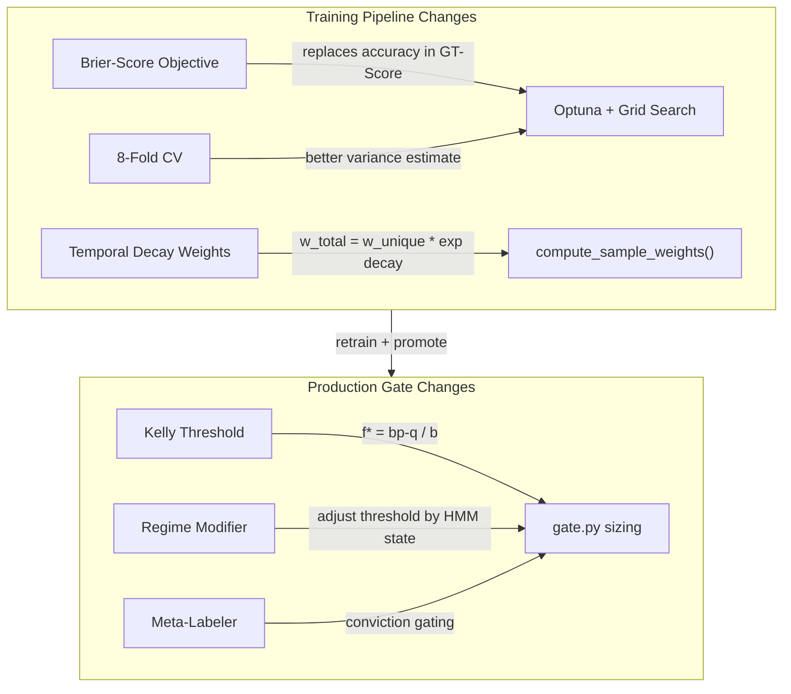
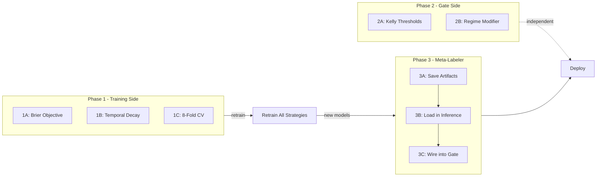

# ML Pipeline Optimization Plan

## Diagnosis Summary

The pipeline has six systemic issues capping model performance:

1. **Tuning objective optimizes accuracy but gate uses probability magnitudes**
   -- calibration mismatch
2. **Meta-labeler is fully built but not wired into production** -- unused
   precision filter
3. **No temporal decay in sample weights** -- stale regime memory with 15-year
   data
4. **Gate thresholds are arbitrary** -- not derived from R:R economics
5. **HMM regime is a feature (zero SHAP) instead of a gate modifier** -- wasted
   signal
6. **Only 3-5 sequential CV folds** -- noisy variance estimates for GT-Score

---

## Architecture After All Changes



---

## Phase 1: Training Pipeline Improvements

These changes affect how models are **trained and selected**. A full retrain
cycle is needed afterward.

### 1A. Switch GT-Score from accuracy to Brier score

**Why:** The gate makes sizing decisions at probability thresholds (0.52, 0.58,
0.65). Accuracy only cares about the 0.50 boundary. Brier score rewards both
discrimination AND calibration, directly improving the probability values the
gate relies on.

**Files:**

- [src/ml_training/ml_training/pipeline/hyperparameter_tuning.py](src/ml_training/ml_training/pipeline/hyperparameter_tuning.py)

**Grid search objective** (line ~217-226): Replace accuracy computation with
Brier score.

Current code:

```python
fold_scores.append(float(np.mean(clf.predict(X_test) == y_test)))
fold_train_scores.append(float(np.mean(clf.predict(X_train) == y_train)))
# ...
composite = mean_score - 2.0 * overfit_gap - consistency_penalty
```

Change to:

```python
from sklearn.metrics import brier_score_loss
test_probs = clf.predict_proba(X_test)[:, 1]
train_probs = clf.predict_proba(X_train)[:, 1]
fold_scores.append(1.0 - float(brier_score_loss(y_test, test_probs)))
fold_train_scores.append(1.0 - float(brier_score_loss(y_train, train_probs)))
# composite formula stays the same — now it's (1 - brier) penalized by gap + variance
```

Using `1.0 - brier` so higher is still better (compatible with maximize
direction).

**Optuna objective** (line ~383-391): Same transformation — replace
`np.mean(clf.predict(X_te) == y_te)` with
`1.0 - brier_score_loss(y_te, clf.predict_proba(X_te)[:, 1])`.

**Also update**: Logging strings from "accuracy" to "brier" in the info
messages, and rename dict keys in the result from `mean_accuracy` /
`std_accuracy` to `mean_brier_skill` / `std_brier_skill` (or keep
backward-compat keys and add new ones).

**Note:** Brier score is only defined for binary classification. The code
already gates on `self._binary_mode`. For multiclass mode, use `log_loss` as the
proper scoring rule instead.

---

### 1B. Add temporal decay to sample weights

**Why:** With 15 years of data, over half the training signal comes from regimes
that may no longer be relevant. Exponential decay biases toward recent market
structure without discarding old data (still valuable for rare events like
2008).

**File:**

- [src/ml_training/ml_training/models/predictor.py](src/ml_training/ml_training/models/predictor.py)
  -- `compute_sample_weights()` at line 261

Current code only computes uniqueness weights. Add a `decay_lambda` parameter:

```python
def compute_sample_weights(
    n_samples: int,
    horizon: int,
    decay_lambda: float = 0.0,
) -> np.ndarray:
    weights = np.empty(n_samples, dtype=np.float64)
    for i in range(n_samples):
        lo = max(0, i - horizon)
        hi = min(n_samples, i + horizon + 1)
        weights[i] = 1.0 / (hi - lo)

    if decay_lambda > 0.0:
        # Exponential decay: most recent sample = 1.0, oldest decays
        age = np.linspace(1.0, 0.0, n_samples)  # 1.0 = oldest, 0.0 = newest
        decay = np.exp(-decay_lambda * age * n_samples / 252)  # normalize to years
        weights *= decay

    weights /= weights.mean()
    return weights
```

- Default `decay_lambda=0.0` preserves backward compatibility
- Add `decay_lambda` to `CPCVConfig` dataclass (line ~89) with default `0.05`
- Thread it through `PredictionModel.train()` where `compute_sample_weights` is
  called
- Also add `"decay_lambda"` to Optuna search space:
  `trial.suggest_float("decay_lambda", 0.0, 0.15)` -- let Optuna decide the
  optimal decay rate per strategy

---

### 1C. Increase CV folds from 3-5 to 8

**Why:** The GT-Score includes `fold_variance * 5.0` as a penalty. With only 3
folds, variance estimation is dominated by noise. 8 folds produces a 2.5x better
variance estimate (variance of variance scales as ~1/n).

**Files:**

- [src/ml_training/ml_training/models/predictor.py](src/ml_training/ml_training/models/predictor.py)
  -- `CPCVConfig` at line 89 and the small-dataset cap at line ~337

Changes:

- `CPCVConfig.n_splits` default: `5` -> `8`
- Small-dataset cap (line ~341):
  `effective_splits = min(self._cpcv.n_splits, 3)` -- raise floor to
  `min(self._cpcv.n_splits, 5)` for datasets with 5000+ samples, keep 3 for
  datasets under 5000
- [hyperparameter_tuning.py](src/ml_training/ml_training/pipeline/hyperparameter_tuning.py)
  line ~328: Update `TimeSeriesSplit(n_splits=self._n_splits)` -- this already
  reads from config, just ensure the tuner's default `n_splits` also increases
  to 8

**Purge/embargo adjustment:** With more folds, each test set is smaller. Ensure
`purge_window` doesn't eat too large a fraction of training data. Add a guard:

```python
max_purge = n_samples // (effective_splits * 4)
effective_purge = min(effective_purge, max_purge)
```

---

## Phase 2: Production Gate Improvements

These can be deployed **immediately** with existing models. No retraining
needed.

### 2A. Kelly-optimal gate thresholds

**Why:** At 2:1 R:R, breakeven is 33.3% accuracy. The current 0.52 block
threshold throws away all trades between 33-52% predicted probability -- these
are positive expected value trades being discarded. Kelly sizing produces
mathematically optimal position sizes given the R:R ratio.

**File:**

- [src/backend/ml/gate.py](src/backend/ml/gate.py) -- lines 19-26

Replace fixed tiers with Kelly fraction computation:

```python
_RR_RATIO = 2.0  # reward-to-risk ratio (from strategy barrier config)
_MIN_KELLY = 0.05  # minimum Kelly fraction to take a trade
_MAX_SIZE = 1.0

def _kelly_size(prob: float, rr: float = _RR_RATIO) -> float:
    """Kelly criterion position sizing: f* = (b*p - q) / b."""
    q = 1.0 - prob
    f_star = (rr * prob - q) / rr
    return max(0.0, min(f_star, _MAX_SIZE))
```

Gate logic becomes:

```python
kelly = _kelly_size(prob)
blocked = kelly < _MIN_KELLY
size_mult = kelly if not blocked else 0.0
```

**Important:** The R:R ratio should be looked up per-strategy from
`STRATEGY_BARRIER_CONFIG` (e.g., mean_reversion is 1:1.5 = 0.67 R:R,
momentum_breakout is 3:1). This means `run_ml_gate` needs to import or receive
the strategy's `profit_mult / stop_mult` ratio.

Add `_STRATEGY_RR` dict to `gate.py` mirroring the training barrier configs, or
import `get_barrier_config` from the ml_training package.

### 2B. Regime-conditional gate modifier

**Why:** HMM regime has zero SHAP as a feature but captures real information
about market conditions. Using it to adjust the gate threshold adapts risk
tolerance to market state -- more conservative in bear markets, more aggressive
in bull.

**File:**

- [src/backend/ml/gate.py](src/backend/ml/gate.py) -- `run_ml_gate()` function

The `regime_context` parameter already passes `regime_type` into the gate.
Currently it's only forwarded to the feature vector. Add a regime modifier:

```python
_REGIME_KELLY_MULT: dict[str, float] = {
    "bear": 0.5,      # halve Kelly sizing in bear markets
    "neutral": 1.0,
    "bull": 1.25,      # 25% more aggressive in bull markets
    "unknown": 0.8,    # slightly conservative when regime unknown
}

# In run_ml_gate(), after computing kelly:
regime = regime_context.get("regime_type", "unknown") if regime_context else "unknown"
regime_mult = _REGIME_KELLY_MULT.get(regime, 0.8)
adjusted_kelly = kelly * regime_mult
```

This is a multiplier on position size, not a threshold change -- so it naturally
makes positions smaller in bear markets without blocking them entirely (Kelly
already handles the block threshold).

---

## Phase 3: Meta-Labeler Integration

This requires both training-side changes (to produce meta-labeler artifacts) and
inference-side changes (to load and use them).

### 3A. Ensure meta-labeler artifacts are saved during training

**File:**

- [src/ml_training/ml_training/pipeline/training_loop.py](src/ml_training/ml_training/pipeline/training_loop.py)
  -- `_run_round()` at line ~266

The training loop already supports `meta_label=True` (line 278) and trains the
MetaLabeler. But the saved `ModelArtifact` (line 448) stores the classifier from
`training_result.classifier` -- which for meta-label mode comes from the
MetaLabeler's internal PredictionModel.

**Verify:** That when `meta_label=True`, the saved `.joblib` contains the
MetaLabeler's trained model with the correct feature names (signal-filtered
subset). If not, add explicit meta-labeler serialization:

```python
if self._config.meta_label:
    artifact.meta_labeler = model  # the MetaLabeler instance
```

Add `meta_labeler` field to `ModelArtifact` dataclass in
[registry.py](src/ml_training/ml_training/models/registry.py).

### 3B. Add meta-labeler loading to inference

**File:**

- [src/backend/ml/inference.py](src/backend/ml/inference.py) -- model loading
  (~line 49-51)

Add a parallel dict for meta-labeler models:

```python
_meta_labeler_models: dict[str, Any] = {}
```

In `_load_models()`, look for `model_{strategy}_meta_active.joblib` files and
load them into `_meta_labeler_models`.

### 3C. Wire meta-labeler conviction into gate

**File:**

- [src/backend/ml/gate.py](src/backend/ml/gate.py) -- `run_ml_gate()`

After getting the primary model's probability, check if a meta-labeler exists
for this strategy. If so, get its conviction score and use it as a secondary
filter:

```python
meta_conviction = run_meta_prediction(ticker, strategy_type, features)
if meta_conviction is not None:
    # Blend: use meta-labeler conviction to adjust Kelly sizing
    # Meta-labeler answers "should I take THIS signal?" vs primary model's "is this profitable?"
    combined_prob = 0.6 * prob + 0.4 * meta_conviction
    kelly = _kelly_size(combined_prob, rr=strategy_rr)
```

The 60/40 blend weights are a starting point; these should be tuned based on
shadow-mode comparison data.

**New schema field** in [schemas.py](src/backend/ml/schemas.py) `GateResult`:

```python
meta_conviction: float | None = None
```

---

## Execution Order and Dependencies



- **Phase 1** tasks (1A, 1B, 1C) are independent of each other -- can be
  implemented in parallel
- **Phase 2** tasks (2A, 2B) are independent of Phase 1 -- can deploy
  immediately with current models
- **Phase 3** depends on Phase 1 being complete and models retrained
  (meta-labeler needs the new artifacts)
- After Phase 1 implementation: run
  `acquire -> build-dataset -> train --rounds 3` to produce new artifacts
- After Phase 3 implementation: run `train --meta-label` to produce meta-labeler
  artifacts, then `promote`

## Files Modified Summary

| File                                                            | Phase      | Change                                                                 |
| --------------------------------------------------------------- | ---------- | ---------------------------------------------------------------------- |
| `src/ml_training/ml_training/pipeline/hyperparameter_tuning.py` | 1A         | Brier score in both grid search and Optuna objectives                  |
| `src/ml_training/ml_training/models/predictor.py`               | 1B, 1C     | Temporal decay in `compute_sample_weights()`, increase `n_splits` to 8 |
| `src/backend/ml/gate.py`                                        | 2A, 2B, 3C | Kelly sizing, regime modifier, meta-labeler conviction                 |
| `src/backend/ml/inference.py`                                   | 3B         | Meta-labeler model loading                                             |
| `src/backend/ml/schemas.py`                                     | 3C         | Add `meta_conviction` field to `GateResult`                            |
| `src/ml_training/ml_training/models/registry.py`                | 3A         | Add `meta_labeler` field to `ModelArtifact`                            |
| `src/ml_training/ml_training/pipeline/training_loop.py`         | 3A         | Serialize meta-labeler in artifact                                     |
