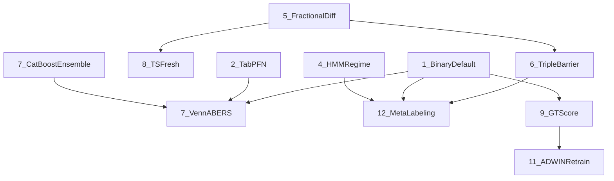

# ML Pipeline Research-Backed Upgrades

## Dependency Graph



---

## Phase 1 — Labels, Features, and Tuning Objective

### 1. Binary Target as Default (Priority 1)

**Files:** [cli.py](src/ml_training/ml_training/pipeline/cli.py),
[training_loop.py](src/ml_training/ml_training/pipeline/training_loop.py)

The binary `profitable` label already exists. The change is making binary mode
the **unconditional default** (currently only default for `--per-strategy`).

- In `cli.py` `_train_single()` (line 221-223): change `binary_mode` resolution
  so `binary_mode = True` unless `--three-class` is explicitly passed. Remove
  the condition that binary is only default for per-strategy.
- In `cli.py` `cmd_tune()` / `_tune_single()`: same change — binary mode
  default.
- In `training_loop.py` `TrainingLoopConfig`: change `binary_mode` default from
  `False` to `True`.
- In `_resolve_strategy_target()` (cli.py line 158-182): when
  `binary_mode=True`, set `target_col = "profitable"` and `return_col` to the
  matching return column.
- Update CLI help text for `--binary` to note it's now the default, and
  `--three-class` is the opt-in override.

### 5. Fractional Differentiation (Priority 5)

**Files:**
[engineering.py](src/ml_training/ml_training/features/engineering.py),
[pyproject.toml](src/ml_training/pyproject.toml)

Add a `fractional_differentiation()` function implementing Fixed-Width Window
Fractional Differencing (FFD) from Lopez de Prado Ch. 5.

- New function
  `compute_ffd_features(prices: pd.DataFrame, d: float = 0.4, threshold: float = 1e-5) -> pd.DataFrame`
  in `engineering.py`:
  - Takes the `close` series
  - Computes FFD weights using the binomial series truncated at `threshold`
  - Applies convolution to produce a fractionally differenced price series
  - Returns DataFrame with columns `ffd_close`, `ffd_return_1d` (% change of FFD
    series)
- Call `compute_ffd_features()` inside `compute_technical_features()` and append
  the new columns
- The `d` parameter (fractional order) defaults to 0.4 — the typical minimum for
  stationarity while preserving memory. Can be tuned later with ADF tests.
- No new dependencies needed — pure numpy/pandas convolution.

### 6. Triple Barrier Labeling (Priority 6)

**Files:**
[engineering.py](src/ml_training/ml_training/features/engineering.py),
[dataset_builder.py](src/ml_training/ml_training/features/dataset_builder.py)

Add a `compute_triple_barrier_label()` function alongside the existing
`compute_outcome_labels()`.

- New function in `engineering.py`:

```python
  def compute_triple_barrier_label(
      prices: pd.DataFrame,
      idx: int,
      atr_pct: float,
      profit_mult: float = 2.0,
      stop_mult: float = 1.0,
      max_horizon: int = 20,
  ) -> dict[str, Any]:


```

- Upper barrier: `close * (1 + profit_mult * atr_pct / 100)`
- Lower barrier: `close * (1 - stop_mult * atr_pct / 100)`
- Vertical barrier: `max_horizon` bars
- Walks forward bar-by-bar checking highs against upper barrier, lows against
  lower barrier
- Returns: `triple_barrier_label` (1=profit hit first, 0=stop or timeout),
  `barrier_type` ("profit"/"stop"/"timeout"), `bars_to_barrier`,
  `risk_reward_ratio`
- In `dataset_builder.py` `build_for_strategy()`: call
  `compute_triple_barrier_label()` alongside `compute_outcome_labels()` and add
  the new columns to each row dict.
- Add `triple_barrier_label` and related columns to `_NEUTRALIZE_EXCLUDE` so
  they aren't Z-scored.

### 8. TSFresh Feature Extraction (Priority 8)

**Files:**
[engineering.py](src/ml_training/ml_training/features/engineering.py),
[dataset_builder.py](src/ml_training/ml_training/features/dataset_builder.py),
[pyproject.toml](src/ml_training/pyproject.toml)

- Add `tsfresh` to dependencies in `pyproject.toml`
- New function in `engineering.py`:

```python
  def compute_tsfresh_features(
      prices: pd.DataFrame,
      idx: int,
      window: int = 20,
  ) -> dict[str, float]:


```

- Extracts a rolling window of OHLCV data ending at `idx`
- Uses `tsfresh.extract_features()` with `MinimalFCParameters` (fast subset ~30
  features) on the close/volume series
- Returns dict of prefixed features: `tsf_close_mean`, `tsf_close_kurtosis`,
  `tsf_volume_abs_energy`, etc.
- Wrap in try/except to gracefully degrade if tsfresh is slow or fails
- In `dataset_builder.py`: call `compute_tsfresh_features()` for intraday
  strategies only (where pattern complexity is highest) based on
  `strategy.strategy_type in ("intraday", "crypto_intraday")`

### 9. GT-Score Composite Objective (Priority 9)

**Files:**
[hyperparameter_tuning.py](src/ml_training/ml_training/pipeline/hyperparameter_tuning.py)

Replace the current composite formula `mean_accuracy - 2 * overfit_gap` with a
richer GT-Score-inspired objective.

- In `HyperparameterTuner.search()` (grid search scoring, line ~224):

```python
  fold_variance = np.var(test_accs)
  consistency_penalty = fold_variance * 5.0
  composite = mean_score - 2.0 * overfit_gap - consistency_penalty


```

- Same change in `search_optuna()` objective (line ~386).
- The `fold_variance * 5.0` penalty rewards configs that perform consistently
  across folds, not just well on average. The 5.0 multiplier is tunable.

---

## Phase 2 — Model Alternatives and Calibration

### 2. TabPFN v2 Model (Priority 2)

**Files:** new
[models/tabpfn_model.py](src/ml_training/ml_training/models/tabpfn_model.py),
[predictor.py](src/ml_training/ml_training/models/predictor.py),
[training_loop.py](src/ml_training/ml_training/pipeline/training_loop.py),
[cli.py](src/ml_training/ml_training/pipeline/cli.py),
[pyproject.toml](src/ml_training/pyproject.toml)

- Add `tabpfn` to dependencies in `pyproject.toml`
- New file `models/tabpfn_model.py` with class `TabPFNModel`:
  - Same interface as `PredictionModel`: `.train(df, ...)` returns
    `TrainingResult`, `.predict(X)` returns `(preds, probs, returns)`
  - Internally uses `TabPFNClassifier` from the `tabpfn` package
  - Uses the same `_identify_feature_columns()` and `_prepare_features()`
    helpers from `predictor.py`
  - No hyperparameter tuning needed — TabPFN runs in a single forward pass
  - For CPCV validation: still uses the same purged time-series splits, but fits
    TabPFN on each fold's training data and evaluates on test. Trains an sklearn
    regressor (Ridge) for return prediction since TabPFN is classification-only.
  - Reports the same metrics (accuracy, overfit_gap, brier_score, fold_results)
    for judge compatibility
- In `cli.py`: add `--model` argument to `train` subcommand accepting `lgbm`
  (default) or `tabpfn`
- In `training_loop.py` `_run_round()`: select model class based on config. Add
  `model_type: str = "lgbm"` to `TrainingLoopConfig`.

### 7a. CatBoost + Stacked Ensemble (Priority 7)

**Files:** new
[models/ensemble.py](src/ml_training/ml_training/models/ensemble.py),
[predictor.py](src/ml_training/ml_training/models/predictor.py),
[training_loop.py](src/ml_training/ml_training/pipeline/training_loop.py),
[cli.py](src/ml_training/ml_training/pipeline/cli.py),
[pyproject.toml](src/ml_training/pyproject.toml)

- Add `catboost` and `xgboost` to dependencies in `pyproject.toml`
- New file `models/ensemble.py` with class `StackedEnsembleModel`:
  - Same `.train()` / `.predict()` interface as `PredictionModel`
  - **Level 0 (base models):** LightGBM (existing params), CatBoost (ordered
    boosting, symmetric trees), XGBoost (histogram-based)
  - Each base model trained on slightly different feature subsets (random 80% of
    features per model) for diversity
  - **Level 1 (meta-learner):** `LogisticRegression` stacked on out-of-fold
    predictions from all 3 base models
  - Uses the same CPCV splitting as LightGBM for generating OOF predictions
  - Returns averaged probabilities from all base models weighted by meta-learner
    coefficients
- In `cli.py`: extend `--model` to accept `ensemble` in addition to `lgbm` and
  `tabpfn`
- In `training_loop.py`: route to `StackedEnsembleModel` when
  `model_type == "ensemble"`

### 3. Venn-ABERS and Isotonic Calibration (Priority 3)

**Files:** [calibration.py](src/ml_training/ml_training/models/calibration.py),
[training_loop.py](src/ml_training/ml_training/pipeline/training_loop.py),
[registry.py](src/ml_training/ml_training/models/registry.py),
[pyproject.toml](src/ml_training/pyproject.toml)

- Add `venn-abers` to dependencies (or use the existing `crepes` optional
  dependency which supports Venn-ABERS)
- Extend `ProbabilityCalibrator` to support 3 methods: `"sigmoid"` (Platt,
  existing), `"isotonic"`, `"venn_abers"`
  - `"isotonic"`: use `sklearn.isotonic.IsotonicRegression` — nonparametric,
    zero-bias calibration
  - `"venn_abers"`: use `crepes` or `venn_abers` package — produces `(p0, p1)`
    probability intervals per prediction
- Add new dataclass fields to `CalibrationResult`:
  - `calibration_interval_width: float | None = None` (mean Venn-ABERS interval
    width — measures epistemic uncertainty)
  - `method: str` already exists, update to reflect chosen method
- In `training_loop.py`: change the `ProbabilityCalibrator()` constructor call
  to `ProbabilityCalibrator(method="venn_abers")` as the new default
- Update `ConformalPredictor` to use **Mondrian conformal** when
  `strategy_labels` are available:
  - Fit separate conformal thresholds per strategy type, providing per-strategy
    conditional coverage instead of global marginal coverage

---

## Phase 3 — Regime Detection and Meta-Labeling

### 4. HMM Regime Detection (Priority 4)

**Files:** new
[features/regime.py](src/ml_training/ml_training/features/regime.py),
[dataset_builder.py](src/ml_training/ml_training/features/dataset_builder.py),
[training_loop.py](src/ml_training/ml_training/pipeline/training_loop.py),
[pyproject.toml](src/ml_training/pyproject.toml)

- Add `hmmlearn` to dependencies in `pyproject.toml`
- New file `features/regime.py`:

```python
  class RegimeDetector:
      def __init__(self, n_regimes: int = 3)
      def fit(self, vix_returns: np.ndarray, breadth: np.ndarray, momentum: np.ndarray) -> RegimeDetector
      def predict(self, features: np.ndarray) -> np.ndarray  # regime labels
      def predict_proba(self, features: np.ndarray) -> np.ndarray  # soft regime probabilities
      def save(self, path: Path) -> None
      def load(cls, path: Path) -> RegimeDetector


```

- Uses `GaussianHMM` from `hmmlearn` with 3 states (bull/bear/neutral)
- Input features: VIX daily returns, market breadth, SPY 20d momentum
- Returns both hard regime labels and soft probability vectors
- In `dataset_builder.py`:
  - Fit `RegimeDetector` on the VIX/SPY data during `build_all()`
  - Replace the simple VIX-threshold `market_regime` with HMM-derived
    `hmm_regime` (integer) + `hmm_regime_prob_bull`, `hmm_regime_prob_bear`,
    `hmm_regime_prob_neutral` (soft probabilities)
- In `training_loop.py`:
  - Two regime-aware training modes:
    1. **Simple (default):** Add HMM regime probabilities as features (replacing
       the categorical `market_regime`)
    2. **Sub-model (opt-in via CLI `--regime-split`):** Train separate models
       per regime and route predictions at inference time
  - Add regime-based sample weighting: upweight samples from the current regime,
    downweight distant regime samples (via `sample_weight` parameter in
    LightGBM)

### 12. Meta-Labeling Architecture (Priority 12)

**Files:** new
[models/meta_labeler.py](src/ml_training/ml_training/models/meta_labeler.py),
[engineering.py](src/ml_training/ml_training/features/engineering.py),
[dataset_builder.py](src/ml_training/ml_training/features/dataset_builder.py),
[cli.py](src/ml_training/ml_training/pipeline/cli.py)

- New function in `engineering.py`:

```python
  def compute_primary_signal(
      prices: pd.DataFrame,
      indicators: pd.DataFrame,
      strategy_type: str,
  ) -> dict[str, Any]:


```

- Generates a rule-based primary trade signal per strategy type:
  - `swing` strategies: EMA crossover (9/21 or 50/200)
  - `mean_reversion`: RSI oversold + bounce
  - `value`: composite score threshold
  - `event`: earnings date proximity
  - `intraday`: opening range break / VWAP cross
- Returns: `primary_signal` (1=long, -1=short, 0=no signal), `signal_strength`
  (0-1)
- New file `models/meta_labeler.py` with class `MetaLabeler`:
  - Same interface as `PredictionModel`
  - Only trains on rows where `primary_signal != 0` (the strategy already fired)
  - Target: `profitable` (binary) — "should we take this signal?"
  - Features: all standard features + `primary_signal` + `signal_strength`
  - Outputs a probability score representing conviction, used for position
    sizing
- In `dataset_builder.py`: call `compute_primary_signal()` and add to row dict
- In `cli.py`: add `--meta-label` flag to train subcommand

---

## Phase 4 — Infrastructure

### 10. Synthetic Data Augmentation (Priority 10)

**Files:** new
[data/augmentation.py](src/ml_training/ml_training/data/augmentation.py),
[dataset_builder.py](src/ml_training/ml_training/features/dataset_builder.py),
[cli.py](src/ml_training/ml_training/pipeline/cli.py),
[pyproject.toml](src/ml_training/pyproject.toml)

- Add `torch` dependency note: **Do NOT pip install torch with CUDA** per user
  rules. Use `uv add` only.
- New file `data/augmentation.py`:
  - Class `TimeSeriesAugmenter`:
    - **Method 1 — Jitter augmentation** (no extra deps): add small Gaussian
      noise to feature values (`noise_std = 0.01 * feature_std`), preserving
      labels. Simple but effective for tabular data.
    - **Method 2 — Window slicing**: create sub-windows of the lookback period
      with shifted anchor points (data augmentation via temporal jittering).
    - **Method 3 — SMOTE-like oversampling**: for minority classes, interpolate
      between nearest-neighbor feature vectors using `sklearn.neighbors`.
      Respects temporal ordering by only interpolating within the same time
      window.
  - Target: augment strategies with <15K samples up to ~25K
  - Quality gate: KS test on augmented vs. real feature distributions — reject
    augmented samples where KS p-value < 0.01
- In `dataset_builder.py` `build_for_strategy()`: optionally call augmenter
  after building the raw dataset, before neutralization
- In `cli.py`: add `--augment` flag to `build-dataset` subcommand

**Note:** Full GAN-based augmentation (TTS-GAN, QuantGAN) is deferred — the
simpler jitter/SMOTE approach provides most of the benefit at a fraction of the
complexity. GAN augmentation can be added later as a drop-in replacement in the
same `augmentation.py` module.

### 11. ADWIN-Triggered Retraining (Priority 11)

**Files:** [retrain.py](src/ml_training/ml_training/pipeline/retrain.py),
[drift_detector.py](src/ml_training/ml_training/judge/drift_detector.py),
[pyproject.toml](src/ml_training/pyproject.toml)

- Add `river` to dependencies in `pyproject.toml` (currently a lazy import that
  silently skips)
- In `retrain.py` `RetrainManager.should_retrain()`:
  - Add a new trigger condition: if the latest `DriftReport` shows
    `adwin_triggered == True`, return `True` regardless of outcome count or time
    gap
  - Add a `drift_report: DriftReport | None = None` parameter to
    `should_retrain()`
  - Also trigger on `drift_status == "quarantine"` (PSI > 0.4 or SHAP NDCG <
    0.90)
- In `RetrainManager.retrain()`:
  - When retraining is triggered by drift (not new outcomes), use `init_model`
    continuation in LightGBM to warm-start from the existing model rather than
    training from scratch
  - Apply time-dependent exponential sample weights:
    `weight = exp(-decay * age_in_days)` where `decay = 0.01` (half-life ~70
    days), passed via `sample_weight` to LightGBM
- In `retrain.py` `RetrainConfig`:
  - Add `drift_retrain_enabled: bool = True`
  - Add `sample_decay_rate: float = 0.01`

---

## New Dependencies Summary

Add to `[project.dependencies]` in
[pyproject.toml](src/ml_training/pyproject.toml):

- `tabpfn>=2.0` — TabPFN v2 model
- `catboost>=1.2` — CatBoost for stacked ensemble
- `xgboost>=2.1` — XGBoost for stacked ensemble
- `hmmlearn>=0.3` — Gaussian HMM for regime detection
- `tsfresh>=0.20` — Automated feature extraction
- `river>=0.21` — Online ML / ADWIN drift detection (move from lazy import to
  required)

Move `crepes` from optional `[dependency-groups.judge]` to main dependencies for
Venn-ABERS calibration.

---

## Files Changed Summary

| File                             | Changes                                                                                                                  |
| -------------------------------- | ------------------------------------------------------------------------------------------------------------------------ |
| `pyproject.toml`                 | +6 dependencies, move crepes to main                                                                                     |
| `engineering.py`                 | +`compute_ffd_features()`, +`compute_triple_barrier_label()`, +`compute_primary_signal()`, +`compute_tsfresh_features()` |
| `dataset_builder.py`             | Call new label/feature functions, integrate HMM regime, optional augmentation                                            |
| `predictor.py`                   | No direct changes (interface preserved)                                                                                  |
| `calibration.py`                 | Add isotonic + Venn-ABERS methods, Mondrian conformal                                                                    |
| `training_loop.py`               | Model type routing (lgbm/tabpfn/ensemble), regime-aware training, default binary                                         |
| `hyperparameter_tuning.py`       | GT-Score composite with fold variance penalty                                                                            |
| `cli.py`                         | Binary default, `--model`, `--meta-label`, `--regime-split`, `--augment` flags                                           |
| `retrain.py`                     | ADWIN trigger, warm-start, exponential sample weights                                                                    |
| `drift_detector.py`              | No changes (ADWIN already implemented)                                                                                   |
| **NEW** `models/tabpfn_model.py` | TabPFN wrapper with PredictionModel interface                                                                            |
| **NEW** `models/ensemble.py`     | CatBoost+XGBoost+LightGBM stacked ensemble                                                                               |
| **NEW** `features/regime.py`     | HMM regime detection + soft probability output                                                                           |
| **NEW** `models/meta_labeler.py` | Meta-labeling binary filter model                                                                                        |
| **NEW** `data/augmentation.py`   | Jitter, window slicing, SMOTE-like augmentation                                                                          |
