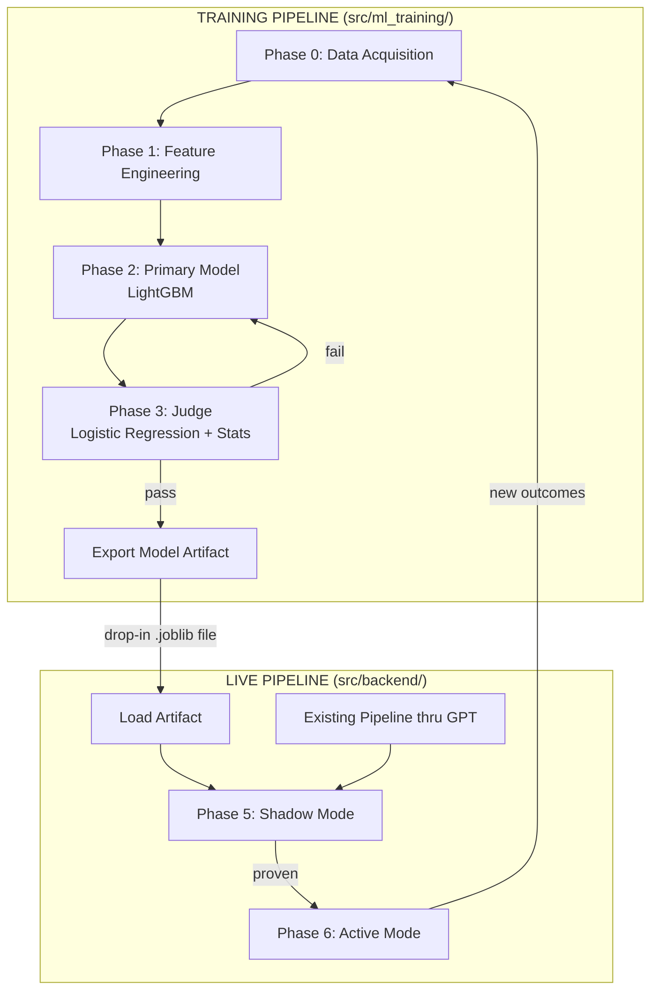
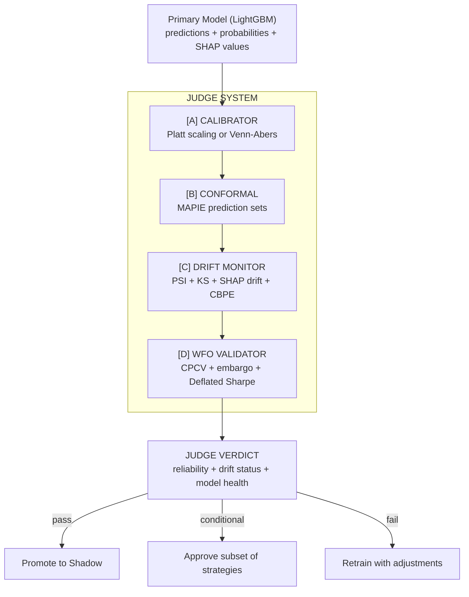

# SignalForge ML Training Pipeline -- Phased Implementation Plan

## System Overview

Two independent pipelines in **separate codebases** that feed each other:

- **Training pipeline** (`src/ml_training/`) -- Standalone Python project. Pulls
  historical data, builds datasets, trains and validates models. Imports shared
  code from backend (schemas, FMP service) but never clutters backend with
  training logic. Produces a trained model artifact file.
- **Live inference** (`src/backend/ml/`) -- Thin inference-only layer in the
  backend. Loads the trained model artifact, runs predictions after GPT, logs
  results. No training code here.



## Separation of Concerns

| Concern                                                 | Location                               | Why                                                                        |
| ------------------------------------------------------- | -------------------------------------- | -------------------------------------------------------------------------- |
| Data acquisition, feature engineering, dataset building | `src/ml_training/`                     | Heavy, exploratory, iterative -- doesn't belong in a production API server |
| Model training, WFO, hyperparameter tuning              | `src/ml_training/`                     | CPU-intensive, runs offline, produces artifacts                            |
| Judge model, validation, drift detection                | `src/ml_training/`                     | Quality gate before deployment -- only training pipeline needs this        |
| Model inference (load artifact, predict)                | `src/backend/ml/`                      | Thin, fast, production-ready -- just loads a file and runs `.predict()`    |
| Shadow logging, ML vs GPT comparison                    | `src/backend/ml/` + `src/backend/api/` | Part of the live pipeline's observation layer                              |
| ML dashboard (Insights view)                            | `src/frontend/`                        | Display shadow/active ML results                                           |

The training pipeline can `import` from backend (e.g.,
`from services.fmp_service import ...`, `from pipeline.schemas import ...`) via
Python path configuration, but backend never imports from `ml_training/`.

## Model Choices

**Primary prediction model: LightGBM (gradient boosting)**

- Best-in-class for tabular financial data (outperforms neural nets at this data
  scale per NeurIPS 2022 benchmarks)
- Native categorical feature support (handles `strategy_type` without one-hot
  encoding)
- 5-10x faster training than XGBoost (critical for iterative training loop in
  Phase 4)
- Built-in feature importance (interpretable -- tells you WHY it predicted)
- Handles missing values natively (important: crypto has no PE ratio, intraday
  has no fundamentals)
- Small artifacts (~2-5 MB), millisecond inference, CPU-only

**Judge system: Multi-layered, deliberately simple tools**

The judge is NOT one model. It is 6 independent validation layers, each using
the simplest tool that solves its specific problem:

- **Calibrator:** Platt scaling (start), Venn-Abers (upgrade) -- probability
  calibration
- **Conformal predictor:** MAPIE -- prediction sets with coverage guarantees
- **Drift monitor:** PSI + KS tests + SHAP importance drift + NannyML CBPE +
  ADWIN -- 5 independent drift signals
- **WFO validator:** CPCV purge/embargo checks + Deflated Sharpe Ratio -- pure
  code logic + statistics
- **Strategy auditor:** Per-strategy accuracy with minimum sample thresholds
- **Reliability meta-learner:** Logistic Regression -- deliberately simpler than
  LightGBM, fully interpretable

Design principle: **every judge component is simpler than what it judges.** No
component can overfit worse than the primary model.

**FMP API limits: 750 requests/minute, 50 GB/month data cap**

---

## Phase 0: Data Acquisition Pipeline

**Goal:** Pull and store raw historical market data from FMP for training. This
is the raw material -- no ML yet, just data collection.

**Why first:** Everything downstream depends on having clean, complete
historical data. Without this, nothing else can start.

### What to pull (per ticker, per timeframe)

- **OHLCV price history** -- 2 years daily, 6 months intraday (4H, 1H). This is
  the ground truth for outcomes.
- **Technical indicators** -- EMA (9, 21, 50, 200), RSI (14), MACD, ADX (14) via
  FMP v3 `/technical_indicator/` endpoint. Same indicators
  [technical_analysis.py](src/backend/services/technical_analysis.py) already
  fetches live.
- **Fundamental data** -- TTM ratios, key metrics, Piotroski, Altman Z, float,
  insider activity. Same data
  [fmp_service.py](src/backend/services/fmp_service.py) fetches for screening.
- **Market context** -- VIX history, sector performance snapshots, broad market
  index data (SPY/TSX composite).

### Universe (broad, matching user request)

- **TSX:** Top 200 by market cap that meet any strategy's minimum filters
  (actively trading, volume > 100K)
- **NYSE/NASDAQ:** S&P 500 components (provides the most liquid, well-covered
  stocks)
- **Crypto:** Top 50 by market cap from FMP crypto list
- **Total:** ~750 symbols, 2 years daily = ~375K daily snapshots

### Rate limit strategy (Fundamental tier: 750 req/min, 50 GB/month)

- Each ticker needs ~8 API calls per timeframe (4 EMA periods + RSI + MACD +
  ADX + OHLCV)
- 750 tickers x 8 calls = 6,000 calls for one timeframe pass
- At 750/min, that's ~8 minutes per timeframe sweep
- Full data pull (daily + 4H + 1H + fundamentals): ~1-2 hours total
- **Data volume estimate:** ~375K daily snapshots with indicators, well under 50
  GB
- Build with checkpointing so it can resume if interrupted
- Store locally first (Parquet files), then optionally push to Supabase for
  persistence

### New files

- `src/ml_training/data/acquisition.py` -- FMP historical data puller with rate
  limiting, checkpointing, progress logging
- `src/ml_training/data/storage.py` -- Local Parquet storage + optional Supabase
  push
- `src/backend/database/migrations/018_ml_training_tables.sql` -- DB tables for
  feature snapshots and model registry (used by both training and live
  inference)

### Storage

- `raw_price_history` table -- OHLCV candles per ticker/timeframe/date
- `raw_indicator_history` table -- indicator values per
  ticker/timeframe/date/indicator_type
- `raw_fundamentals_history` table -- quarterly fundamental snapshots per ticker
- Indexed by (ticker, timeframe, date) for fast lookups during feature
  engineering

### Verification at this phase

- Count checks: do we have 500+ trading days per ticker?
- Gap checks: any missing dates? Weekends/holidays excluded correctly?
- Sanity checks: are prices reasonable? Any zero/negative values? Corporate
  action adjustments needed?

---

## Phase 1: Feature Engineering and Dataset Builder

**Goal:** Transform raw data into ML-ready feature snapshots labeled with actual
outcomes, organized by strategy type.

**Depends on:** Phase 0 (raw data exists)

### Strategy-aware simulation

For each of the 12 strategy templates in
[strategies.json](templates/strategies.json):

1. **Replay the FMP screener historically.** At each historical date, apply the
   strategy's `fmp_screener` config (market cap range, volume minimums, beta
   range, sector caps, etc.) against the raw data to find which tickers would
   have been screened. We don't call FMP's screener API historically -- we apply
   the filters ourselves against stored data.
2. **Compute TechnicalSnapshot.** For each screened ticker at each date, compute
   the exact same features that
   [technical_analysis.py](src/backend/services/technical_analysis.py) computes
   live: EMA positions, crosses, MACD snapshot, RSI snapshot, ADX, ATR, volume
   ratio, momentum score, trend alignment.
3. **Label with outcomes.** Look forward from each date by the strategy's
   holding period and record:

- Return at 5, 10, 20 trading days
- Max favorable excursion (best price reached during hold)
- Max adverse excursion (worst price reached during hold)
- Whether a 2x ATR stop would have been hit
- Direction classification: UP (> +2%), DOWN (< -2%), FLAT (in between)

### Feature vector (per snapshot)

**Technical features (float, ~25 features):**

- `price_vs_ema_9/21/50/200` (% distance from each EMA)
- `ema_stack_score` (bullish/bearish alignment, -1 to 1)
- `ema_cross_age` (candles since last cross, -1 if none)
- `ema_spread_pct` (distance between fastest and slowest EMA)
- `rsi_14`, `rsi_zone` (overbought/neutral/oversold encoded)
- `macd_histogram`, `macd_slope` (expanding/contracting encoded)
- `adx`, `atr_pct`, `volume_ratio`, `volume_trend`
- `momentum_score` (existing composite from technical_analysis.py)
- `bollinger_width` (if available from price data)
- `price_change_1d/5d/20d` (recent momentum)

**Fundamental features (float, ~15 features, null for crypto/intraday):**

- `pe_ratio`, `pb_ratio`, `ev_ebitda`, `debt_equity`
- `roe`, `net_margin`, `revenue_growth`
- `piotroski_score`, `altman_z`
- `analyst_target_upside`, `insider_buy_ratio`
- `composite_score` (from FMP enrichment)

**Context features (categorical/float, ~8 features):**

- `strategy_type` (categorical: swing, momentum, mean_reversion, value, event,
  intraday, crypto_swing, crypto_intraday)
- `market_regime` (encoded from VIX level + trend)
- `sector` (categorical)
- `day_of_week`, `month`
- `vix_level`, `sector_relative_strength`
- `market_breadth_proxy` (% of universe above 200 EMA)

**Labels (target variables):**

- `return_5d`, `return_10d`, `return_20d` (float)
- `direction_5d`, `direction_10d`, `direction_20d` (UP/DOWN/FLAT)
- `max_favorable_excursion`, `max_adverse_excursion`
- `stop_hit` (bool -- would ATR-based stop have triggered?)

### New files

- `src/ml_training/features/engineering.py` -- Feature extraction from raw data
- `src/ml_training/features/dataset_builder.py` -- Strategy-aware historical
  simulation and labeling
- `src/ml_training/features/validator.py` -- Dataset quality checks

### Dataset validation (before any model touches it)

- **No future leakage:** Features at date T use only data available at or before
  T
- **Label correctness:** Spot-check 50 random samples by hand against
  TradingView
- **Distribution checks:** Are features reasonably distributed? Any extreme
  outliers?
- **Class balance:** How many UP vs DOWN vs FLAT per strategy type?
- **Sufficient samples:** Minimum 200 samples per strategy type, ideally 500+

### Storage

- `feature_snapshots` table (migration 018) -- one row per (ticker, date,
  strategy_type, timeframe)
- `features` JSONB column for the full feature vector
- Outcome columns: `return_5d`, `return_10d`, `return_20d`, `direction_5d`, etc.
- Export utility to dump to Parquet/CSV for model training

---

## Phase 2: Primary Prediction Model

**Goal:** Train a LightGBM gradient boosting model that predicts direction and
return magnitude, aware of strategy type.

**Depends on:** Phase 1 (labeled dataset exists with 1000+ samples)

### Model architecture

- **LightGBM classifier** for direction (UP/DOWN/FLAT)
- **LightGBM regressor** for expected return (%)
- Both models receive the same feature vector including `strategy_type`
- Strategy type as a categorical feature means the model learns different
  indicator-to-outcome relationships per strategy

### Walk-forward optimization: CPCV (Combinatorial Purged Cross-Validation)

Instead of naive walk-forward (which produces a single performance estimate per
fold), we use **CPCV** from Marcos Lopez de Prado's "Advances in Financial
Machine Learning." This is the gold standard for financial model validation.

Standard walk-forward is the baseline concept:

```
Training Window 1:  [Month 1 ────── Month 12]  Test: [Month 13]
Training Window 2:  [Month 1 ────── Month 13]  Test: [Month 14]
...
Training Window N:  [Month 1 ────── Month 22]  Test: [Month 23-24]
```

CPCV hardens this with three critical additions:

- **Purging:** Removes training samples within `max(indicator_lookback)` of the
  test boundary. EMA-200 uses 200 candles of history -- samples near the
  train/test split leak future information through the indicator computation.
  Purging removes these contaminated samples.
- **Embargo:** Adds a mandatory buffer (e.g., 5 trading days) between the last
  training sample and the first test sample. Even after purging, serial
  autocorrelation in returns can leak information. The embargo breaks this.
- **Combinatorial partitions:** Generates multiple chronologically-valid
  train/test splits, producing a _distribution_ of out-of-sample results, not a
  single number. This lets us measure the variance of model performance, not
  just its mean.

The key philosophy: **find plateaus, not peaks** -- parameter regions that work
consistently across many historical scenarios, not configurations that are
optimal in one specific backtest.

Library: `mlfinpy` (free, open-source reimplementation of `mlfinlab` CPCV
algorithms).

### Probability calibration: Platt scaling + Venn-Abers upgrade path

Raw LightGBM probabilities are often miscalibrated (model says 70% but is right
55%).

**Starting approach: Platt scaling** (Logistic Regression on predicted
probabilities)

- `scikit-learn.calibration.CalibratedClassifierCV(method='sigmoid')`
- Works well with 200+ calibration samples, low overfitting risk

**Phase 4 upgrade: Venn-Abers calibration** (2025 ICML research showed this
outperforms Platt for strong models like LightGBM)

- Produces probability _intervals_ not point estimates (e.g., "0.58-0.67"
  instead of "0.63") -- more honest about uncertainty
- Fewer cases of calibration actually making predictions worse
- Library: `crepes` (v0.9.0, scikit-learn compatible)

### Conformal prediction: per-prediction reliability sets

In addition to calibrated probabilities, use **MAPIE conformal prediction** to
produce prediction _sets_ with guaranteed coverage:

```
Prediction set = {UP}               → reliability = HIGH  (model is confident)
Prediction set = {UP, FLAT}         → reliability = MEDIUM (two possibilities)
Prediction set = {UP, FLAT, DOWN}   → reliability = LOW   (model is uncertain)
```

The set size is a theory-grounded reliability signal: when the model has no
idea, the set expands to include everything. This is fundamentally different
from probability calibration -- it's a safety net.

Library: `MAPIE` (scikit-learn-contrib, works with any sklearn-API model
including LightGBM).

### Output per prediction

```python
class MLPrediction(BaseModel):
    ticker: str
    strategy_type: str
    predicted_direction: Literal["UP", "DOWN", "FLAT"]
    probability_up: float          # calibrated 0.0-1.0 (Platt or Venn-Abers)
    probability_down: float        # calibrated 0.0-1.0
    probability_interval: tuple[float, float]  # Venn-Abers interval (if available)
    predicted_return_pct: float    # from regression model
    prediction_set: list[str]      # conformal set, e.g. ["UP"] or ["UP", "FLAT"]
    reliability_score: float       # 1.0 / len(prediction_set) -- simple reliability
    top_features: list[dict]       # top 5 SHAP feature importances for this prediction
    model_version: str
    wfo_fold_accuracy: float       # accuracy of the CPCV fold this would fall in
```

### New files

- `src/ml_training/models/predictor.py` -- LightGBM training, CPCV, calibration
- `src/ml_training/models/calibration.py` -- Platt scaling + Venn-Abers +
  conformal (MAPIE)
- `src/ml_training/models/registry.py` -- Model versioning, artifact export
- `src/ml_training/models/artifacts/` -- Directory for exported .joblib model
  files (gitignored)

### Metrics to track per CPCV fold

**Tier 1: Calibration (is the model honest about its confidence?)**

- Brier Score -- mean squared error of predicted probabilities (lower is better)
- Expected Calibration Error (ECE) -- gap between predicted confidence and
  actual accuracy (target: < 0.05)
- Log Loss -- penalizes confident wrong predictions heavily
- Reliability diagram -- visual check of calibration curve

**Tier 2: Financial performance (is the model profitable?)**

- Direction accuracy (% correct UP/DOWN calls)
- Profit factor (gross wins / gross losses if following all signals)
- Information Coefficient (IC) -- Spearman rank correlation between signal and
  forward returns (target: > 0.05)
- IC Information Ratio (ICIR) -- consistency of IC: mean(IC)/std(IC) (target: >
  0.5)
- Deflated Sharpe Ratio -- Sharpe corrected for non-normal returns and multiple
  testing bias

**Tier 3: Stability (does it work consistently?)**

- Accuracy by strategy type
- Accuracy by regime (bull vs bear vs ranging)
- WFO fold variance (are results stable or wildly different across folds?)
- Prediction set coverage (do conformal sets achieve target coverage?)

---

## Phase 3: Judge Model (Meta-Validator)

**Goal:** A multi-layered validation system that evaluates the primary model's
predictions, validates the CPCV process, detects market regime drift, and
decides whether the model is trustworthy enough to deploy.

**Depends on:** Phase 2 (primary model trained, predictions on test sets
recorded)

**This is NOT just accuracy metrics.** The judge is an active adversarial
checker with four independent layers, each using deliberately simple tools.

### Judge architecture (4 layers)



### Layer A: Calibrator (covered in Phase 2)

Platt scaling or Venn-Abers -- already described in Phase 2. The judge verifies
calibration quality using ECE (Expected Calibration Error) and reliability
diagrams.

### Layer B: Conformal Prediction (covered in Phase 2)

MAPIE prediction sets -- already described in Phase 2. The judge verifies that
conformal sets achieve target coverage (e.g., 90% sets contain the true label at
least 90% of the time).

### Layer C: Drift Monitor (5 detection methods)

**C1. Population Stability Index (PSI) -- overall distribution shift**

- Compares feature distributions between training data and new/test data
- Alert thresholds: PSI 0.1-0.2 = warning, PSI 0.2-0.4 = caution, PSI > 0.4 =
  quarantine
- Library: manual computation or `evidently`

**C2. Kolmogorov-Smirnov test -- per-feature drift**

- Tests each individual feature for distribution shift
- If any critical feature (RSI, ADX, VIX, volume_ratio) has KS p-value < 0.05,
  flag it
- Library: `scipy.stats.ks_2samp`

**C3. SHAP feature importance drift -- concept drift (highest-value addition)**

- PSI/KS detect when feature _values_ change. SHAP drift detects when _which
  features matter_ changes.
- Compute SHAP values on recent predictions, compare feature importance ranking
  vs training time ranking
- Use NDCG (Normalized Discounted Cumulative Gain) to measure ranking similarity
- Alert if NDCG < 0.90 (feature importance order has shifted significantly)
- This catches the dangerous case where RSI values look the same but RSI's
  relationship to outcomes has changed
- Library: `shap` (has native fast path for LightGBM trees)

**C4. NannyML CBPE -- performance estimation without ground truth**

- Solves the fundamental problem: you don't know if predictions are right until
  the holding period expires (5-20 days)
- CBPE (Confidence-Based Performance Estimation) estimates model accuracy from
  the model's own confidence distribution, without waiting for outcomes
- If estimated accuracy drops > 10% from training baseline, flag for review
- Library: `nannyml`

**C5. ADWIN -- online structural break detection**

- Monitors the stream of prediction errors for abrupt changes (regime shifts)
- Adaptive windowing: automatically adjusts detection sensitivity
- Library: `river.drift.ADWIN`

**Operational response framework:**

```
PSI < 0.1, NDCG > 0.95, CBPE stable    → HEALTHY: continue as normal
PSI 0.1-0.2, or NDCG 0.90-0.95         → WARNING: log, monitor closely
PSI 0.2-0.4, or CBPE >10% drop         → CAUTION: reduce confidence on predictions
PSI > 0.4, or ADWIN trigger, NDCG <0.90 → QUARANTINE: stop predictions, retrain
```

### Layer D: WFO/CPCV Validator

**D1. Data leakage verification (pure code logic)**

- For every test prediction, assert that the training window ended before the
  prediction date
- Verify purge window: no training sample within `max(indicator_lookback)`
  candles of test boundary
- Verify embargo: buffer of >= 5 trading days between train and test
- Zero tolerance: any leakage = immediate FAIL

**D2. Overfit detection**

- Compare in-sample vs out-of-sample accuracy gap
- Gap > 15% = high overfit risk, gap > 10% = medium, gap < 10% = low
- Check that accuracy is consistent across CPCV folds (low variance = robust)

**D3. Regime coverage**

- Verify that CPCV folds span different market regimes (bull, bear, ranging,
  high-vol, low-vol)
- If all test folds fall in a bull market, the model is untested in bear
  conditions -- flag as gap

**D4. Deflated Sharpe Ratio (DSR)**

- When you run multiple training rounds with different hyperparameters, you
  implicitly do multiple statistical tests
- DSR corrects for this selection bias: "what's the probability this performance
  is real, not a lucky pick from many tries?"
- Accounts for non-normal returns (skewness, kurtosis) which are common in
  financial data
- Target: DSR probability > 0.95 (95% chance the Sharpe ratio is genuine)
- Library: manual implementation (formula from Lopez de Prado)

### Layer E: Strategy-Level Performance Audit

- Compute all metrics separately per strategy_type
- If model accuracy < 52% for any strategy type with 50+ test samples, suppress
  that strategy
- If a strategy type has < 50 test samples, mark as "insufficient data -- not
  approved"
- Produce per-strategy approval flags

### Layer F: Reliability Meta-Learner (Logistic Regression)

Trained on the CPCV test predictions + actuals:

- **Input:** Primary model's predicted class + probability + conformal set
  size + strategy_type + ADX + volume_ratio + regime
- **Target:** Was the primary model correct? (binary)
- **Output:** Reliability score (0.0-1.0) for each prediction

Why Logistic Regression:

- Fully interpretable: exact coefficients visible (e.g., "coefficient for
  conformal set size is -0.4" means larger sets = less reliable, which makes
  intuitive sense)
- Near-zero overfitting risk: deliberate simplicity constraint
- Provides the final "how much should we trust this specific prediction?" score

### Judge report output

```python
class JudgeReport(BaseModel):
    model_version: str
    judge_verdict: Literal["PASS", "CONDITIONAL_PASS", "FAIL"]

    # WFO integrity
    wfo_integrity: Literal["clean", "leakage_detected", "insufficient_folds"]
    purge_verified: bool
    embargo_verified: bool
    overfit_risk: Literal["low", "medium", "high"]
    insample_vs_oos_gap: float      # % difference

    # Performance
    overall_accuracy: float
    accuracy_by_strategy: dict[str, float]
    brier_score: float
    ece: float                       # Expected Calibration Error
    information_coefficient: float   # IC
    deflated_sharpe_probability: float  # DSR: probability performance is real

    # Drift status
    psi_overall: float
    ks_flagged_features: list[str]
    shap_ndcg: float                 # feature importance ranking stability
    cbpe_estimated_accuracy: float   # NannyML performance estimate
    drift_status: Literal["healthy", "warning", "caution", "quarantine"]

    # Approvals
    regime_coverage: list[str]
    regime_gaps: list[str]
    strategy_approvals: dict[str, bool]
    reliability_model_accuracy: float

    # Actionable
    recommendations: list[str]      # "add more mean_reversion data", etc.
    conformal_coverage_achieved: float  # does 90% target hold?
```

### New files

- `src/ml_training/judge/judge.py` -- Logistic Regression meta-learner +
  orchestration of all layers
- `src/ml_training/judge/wfo_validator.py` -- CPCV integrity checks,
  purge/embargo verification, DSR
- `src/ml_training/judge/drift_detector.py` -- PSI + KS + SHAP importance
  drift + ADWIN + CBPE
- `src/ml_training/judge/report.py` -- JudgeReport generation, formatting, and
  recommendation engine

---

## Phase 4: Iterative Training Loop

**Goal:** Run the train-judge cycle multiple times until quality bar is met.
This is the "gym" where the model gets fit before going anywhere near live data.

**Depends on:** Phases 2 and 3 (primary model + judge both implemented)

### The loop

```
Round 1: Train primary model → Judge evaluates
         Judge says: "FAIL -- overfit on swing,
         only 35 mean_reversion samples,
         calibration error 12%"

         Action: Add more mean_reversion data,
         tune hyperparameters, fix calibration

Round 2: Retrain → Judge evaluates
         Judge says: "CONDITIONAL_PASS --
         swing/momentum approved,
         mean_reversion still weak (52% accuracy),
         crypto insufficient samples"

         Action: Accept partial deployment
         (approved strategies only),
         continue collecting crypto data

Round 3: Retrain with more data → Judge evaluates
         Judge says: "PASS -- all strategy types
         above 55% accuracy, calibration error < 5%,
         no regime gaps"

         Action: Promote to shadow mode
```

### Quality bar for promotion (starting thresholds, adjustable)

- Overall direction accuracy > 55% (out-of-sample)
- Per-strategy accuracy > 52% for every approved strategy type
- Calibration error < 8% (predicted vs actual probability)
- Overfit risk rated "low" (in-sample vs out-of-sample gap < 10%)
- Minimum 50 test samples per approved strategy type
- WFO integrity "clean" (zero leakage)
- Judge reliability model accuracy > 60%

### Automated vs manual

- Hyperparameter tuning: automated (LightGBM has built-in CV)
- Feature selection: semi-automated (feature importance analysis + human review)
- Quality bar decisions: manual (you review judge report and decide)
- Data acquisition for weak areas: automated (pull more data for underperforming
  strategy types)

### New files

- `src/ml_training/pipeline/training_loop.py` -- Orchestrates train-judge cycles
- `src/ml_training/pipeline/hyperparameter_tuning.py` -- Automated
  hyperparameter search
- `src/ml_training/pipeline/cli.py` -- Command-line interface to run training
  (e.g., `uv run python -m ml_training.pipeline.cli train --rounds 3`)

---

## Phase 5: Shadow Pipeline Integration

**Goal:** Wire the trained, judge-approved model into the live SignalForge
pipeline. It runs after GPT but does NOT change any output the user sees. It
logs predictions for later comparison.

**Depends on:** Phase 4 (model passed judge evaluation)

### Integration point

In [orchestrator.py](src/backend/pipeline/orchestrator.py), after GPT produces
recommendations and before returning the result:

```python
# After GPT recommendations are produced (both v1 and v2 paths):
if ml_model_available():
    ml_predictions = run_ml_predictions(
        recommendations=result.recommendations,
        ta_snapshots=ta_snapshots,
        fmp_data=fmp_data,
        sentiments=sentiments,
        regime_context=regime_context,
        config=config,
    )
    # Log but don't modify recommendations
    await store_shadow_predictions(run_id, ml_predictions)
```

### What the ML model receives from the live pipeline

- All numerical features (same as training)
- GPT's recommendation: action, confidence, track_agreement (encoded as numbers)
- Gemini's sentiment_score
- Claude's direction + confidence
- Strategy config (strategy_type, risk_params)

Note: GPT features are NOT in the historical training data (GPT didn't analyze
those historical stocks). So initially the model runs on numerical features
only. GPT features get added to training data as shadow predictions accumulate
over weeks.

### Shadow logging

- `ml_shadow_predictions` table: stores ML prediction alongside GPT
  recommendation per ticker per run
- After outcome is known, compare: was ML right? Was GPT right? When they
  disagreed, who won?
- Dashboard in Insights view showing ML vs GPT comparison

### Promotion criteria (shadow to active)

- 30+ shadow predictions with known outcomes
- ML direction accuracy >= GPT direction accuracy on same predictions
- ML confidence is better calibrated than GPT confidence
- Judge model re-evaluated on live data, still passes

### New files

- `src/backend/ml/inference.py` -- Load model artifact, run predictions
  (inference only, no training code)
- `src/backend/ml/shadow_runner.py` -- Shadow mode orchestration and logging
- `src/backend/api/ml_predictions.py` -- API endpoints for ML dashboard

---

## Phase 6: Active Mode and Continuous Learning

**Goal:** ML model's calibrated confidence replaces the hand-tuned confidence
calibration. Continuous retraining as new outcomes arrive.

**Depends on:** Phase 5 (shadow mode proven ML adds value)

### What changes in the live pipeline

- [confidence_calibration.py](src/backend/services/confidence_calibration.py)
  gets replaced by ML model inference
- GPT's recommendation text (reasoning, bull/bear cases, warnings) stays
  unchanged
- The `confidence` field on `Recommendation` becomes ML-calibrated
- `signal_strength` comes from ML model instead of hand-tuned thresholds
- `confidence_breakdown` shows ML feature importances instead of fixed
  sub-scores

### Continuous learning loop

```
New outcome logged (manual or Questrade sync)
    |
    v
Feature snapshot + GPT features + outcome stored
    |
    v  (every 15 new outcomes, or weekly)
Retrain primary model on full dataset (historical + live)
    |
    v
Judge evaluates new model vs current model
    |
    v
If new model is better AND passes quality bar:
    Promote new model, archive old model
If not:
    Keep current model, log why new model was worse
```

### Retraining trigger

- `POST /ml/retrain` endpoint for manual trigger
- Automatic trigger: after every 15 new outcomes
- Minimum gap: no more than one retrain per 24 hours (prevent thrashing)

### New files

- `src/ml_training/pipeline/retrain.py` -- Retraining logic (exports new
  artifact when judge approves)
- `src/backend/ml/inference.py` -- Updated to hot-reload new model artifacts
- `src/backend/services/ml_calibration.py` -- Replaces deterministic
  confidence_calibration.py

---

## Directory Structure

### Training Pipeline (standalone, never deployed to production)

```
src/ml_training/                      # Separate Python project for offline training
  __init__.py
  pyproject.toml                      # Own dependencies (lightgbm, scikit-learn, pandas)
  data/
    __init__.py
    acquisition.py                    # Phase 0: FMP historical data puller
    storage.py                       # Local Parquet storage + optional DB push
  features/
    __init__.py
    engineering.py                    # Phase 1: Feature extraction from raw data
    dataset_builder.py               # Phase 1: Strategy-aware historical simulation
    validator.py                     # Phase 1: Dataset quality checks
  models/
    __init__.py
    predictor.py                     # Phase 2: LightGBM training + CPCV
    calibration.py                   # Phase 2: Platt scaling + Venn-Abers + MAPIE conformal
    registry.py                      # Phase 2: Model versioning + artifact export
    artifacts/                       # Trained model files (.joblib) -- gitignored
      README.md                      # Documents artifact format and versioning
  judge/
    __init__.py
    judge.py                         # Phase 3: Orchestrates all judge layers + LogReg meta-learner
    wfo_validator.py                 # Phase 3: CPCV integrity, purge/embargo checks, DSR
    drift_detector.py                # Phase 3: PSI + KS + SHAP drift + NannyML CBPE + ADWIN
    report.py                        # Phase 3: JudgeReport generation + recommendations
  pipeline/
    __init__.py
    training_loop.py                 # Phase 4: Train-judge orchestration
    hyperparameter_tuning.py         # Phase 4: Automated tuning
    retrain.py                       # Phase 6: Retraining from new outcome data
    cli.py                           # CLI entry point for all training operations
```

### Backend Inference (thin, production-ready, no training code)

```
src/backend/ml/                      # Inference-only ML layer in existing backend
  __init__.py
  inference.py                       # Load .joblib artifact, run .predict()
  shadow_runner.py                   # Shadow mode orchestration + logging
  schemas.py                         # MLPrediction, JudgeReport Pydantic models
src/backend/api/ml_predictions.py    # API endpoints for ML dashboard
src/backend/services/ml_calibration.py  # Phase 6: Replaces confidence_calibration.py
```

### How artifacts flow between the two

```
src/ml_training/models/artifacts/model_v1.joblib
                    |
                    |  (manual copy, or Supabase Storage upload/download)
                    v
src/backend/ml/artifacts/model_active.joblib
                    |
                    |  (inference.py loads this on startup)
                    v
              Live predictions
```

The training pipeline exports a `.joblib` file. You copy it to the backend's
artifacts directory (or upload to Supabase Storage and the backend downloads
it). The backend never runs training -- it only loads and predicts. Swapping
models is as simple as replacing one file.

---

## Python Dependencies

### Training pipeline (`src/ml_training/pyproject.toml` -- own dependency set)

**Core:**

- `lightgbm` -- Primary prediction model (gradient boosting, CPU-only)
- `scikit-learn` -- Logistic Regression (judge meta-learner), Platt scaling,
  metrics, preprocessing
- `joblib` -- Model serialization to .joblib artifacts
- `pandas` -- Dataset manipulation, feature engineering, Parquet I/O
- `numpy` -- Numerical computation
- `pyarrow` -- Parquet file support for local data storage
- `httpx` -- FMP API calls (already used in backend, reuse pattern)

**Judge system:**

- `shap` -- SHAP feature importance values + importance drift tracking (native
  LightGBM fast path)
- `mapie` -- Conformal prediction sets with coverage guarantees
  (scikit-learn-contrib)
- `nannyml` -- CBPE performance estimation without ground truth
- `river` -- ADWIN online drift detection
- `ruptures` -- Change-point detection for regime shifts (PELT algorithm)
- `scipy` -- KS test (`ks_2samp`), statistical tests (already a dependency of
  scikit-learn)
- `crepes` -- Venn-Abers calibration (Phase 4 upgrade path, scikit-learn
  compatible)
- `mlfinpy` -- CPCV, purging, embargo (free reimplementation of mlfinlab)

**Python 3.14 compatibility note:** `mapie`, `crepes`, and `nannyml` target
Python 3.9-3.12. Test with `uv add --prerelease=allow`. If any break, fall back
to scikit-learn's built-in calibration and manual PSI/CBPE implementations.

### Backend inference (`src/backend/pyproject.toml` -- add to existing)

- `lightgbm` -- Inference only (loads trained model, runs `.predict()`)
- `joblib` -- Deserialize .joblib artifacts
- `numpy` -- Feature vector construction

Note: `scikit-learn` and `pandas` are NOT needed in the backend for inference.
The trained model artifact contains everything needed for prediction. This keeps
the production backend lean.

All pure Python wheels, CPU-only, install via `uv add`.

---

## Data Storage Strategy

### Local storage (training pipeline -- Parquet files, fast, no DB dependency)

Raw historical data and feature datasets are stored as **Parquet files** on disk
during training. This is faster than DB for bulk reads/writes and doesn't
pollute Supabase with training data:

```
src/ml_training/data/
  raw/                              # Raw FMP data (gitignored)
    prices/AAPL_D.parquet           # OHLCV per ticker per timeframe
    indicators/AAPL_D_ema9.parquet  # Indicator series
    fundamentals/AAPL.parquet       # Quarterly fundamentals
  datasets/                         # Processed feature datasets (gitignored)
    swing_features.parquet          # Strategy-specific feature snapshots
    momentum_features.parquet
    all_features.parquet            # Combined training dataset
```

### Database (Supabase -- shared between training and live pipeline)

Migration `**018_ml_training_tables.sql**` adds tables used by BOTH training and
live inference:

- `feature_snapshots` -- ML feature vectors from live pipeline runs (ticker,
  date, strategy_type, features JSONB, outcome columns). Training pipeline reads
  these for retraining; live pipeline writes them at signal time.
- `ml_models` -- Model registry (version, training_date, metrics JSONB,
  judge_verdict, artifact_path). Both pipelines reference this.
- `ml_judge_reports` -- Judge evaluation results (model_version, report JSONB,
  verdict). Written by training, read by dashboard.
- `ml_shadow_predictions` -- Shadow mode logs (run_id, ticker, ml_prediction
  JSONB, gpt_prediction JSONB, outcome columns). Written by live pipeline in
  shadow mode.

Raw historical data (prices, indicators, fundamentals) stays in **local Parquet
files only** -- it's too large for Supabase and only the training pipeline needs
it.

---

## Estimated Timeline

- **Phase 0 (Data Acquisition):** 2-3 days -- FMP API integration, rate
  limiting, checkpointing, Parquet storage
- **Phase 1 (Features + Dataset):** 3-4 days -- strategy-aware historical
  simulation, feature engineering, labeling
- **Phase 2 (Primary Model):** 3-4 days -- LightGBM training, CPCV with
  purge/embargo, Platt calibration, MAPIE conformal, SHAP integration
- **Phase 3 (Judge System):** 4-5 days -- 6 validation layers (drift monitor
  with PSI/KS/SHAP/CBPE/ADWIN, WFO validator with DSR, LogReg meta-learner,
  strategy audit, JudgeReport)
- **Phase 4 (Training Loop):** 1-2 days -- orchestration of Phases 2+3,
  hyperparameter tuning, CLI
- **Phase 5 (Shadow Pipeline):** 2-3 days -- integration with existing
  orchestrator, shadow logging, ML vs GPT dashboard
- **Phase 6 (Active Mode):** 2-3 days -- replaces confidence calibration,
  continuous retraining, model hot-reload

**Total: ~18-24 days of implementation**, done incrementally. Each phase is
independently testable and produces visible results before moving on.

---

## Key References

- Lopez de Prado, M. -- _Advances in Financial Machine Learning_ (2018) -- CPCV,
  triple barrier, purging, embargo, deflated Sharpe ratio
- Lopez de Prado & Bailey -- _The Deflated Sharpe Ratio_ (SSRN 2465675) --
  Statistical correction for backtest overfitting
- van der Laan et al. (2025) -- _Generalized Venn and Venn-Abers Calibration_
  (ICML 2025) -- Extended Venn-Abers beyond binary classification
- Large-scale calibration study (2026) -- _Classifier Calibration at Scale_
  (arXiv 2601.19944) -- Empirical comparison of 5 calibration methods across 21
  classifiers
- Kaya et al. (2025) -- _Conformal Prediction for Reliable Stock Selections_
  (ICML Workshop) -- Empirical validation on equities
