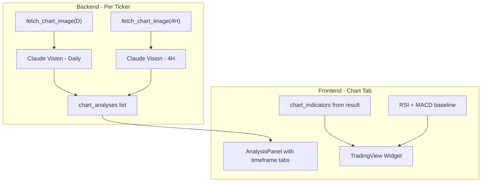

# Multi-Timeframe Chart Analysis, v2 API Migration, and Dynamic Indicators

## Problem

1. Chart-Img uses the **v1 GET API** with delayed data and 800x600 resolution.
   The v2 POST API offers real-time data, full JSON body control, and higher
   resolution (1920x1080 on PRO plan).
2. Claude only analyzes one timeframe (daily). A secondary timeframe (e.g. 4H)
   would give better entry/exit timing context.
3. The TradingView live widget hardcodes RSI + MACD, ignoring whatever
   indicators the strategy actually configured.

## Solution

Migrate `chart_image.py` from v1 GET to v2 POST API. Have Claude analyze both
the primary and a secondary timeframe chart per ticker (two independent calls
per ticker). Make the TradingView widget dynamically load strategy indicators
plus always keep RSI + MACD as baseline. PRO plan allows 5 indicators per chart
and 500 charts/day at 1920x1080.

## Architecture



## Backend Changes

### 0. Chart-Img v2 Migration

File: [src/backend/services/chart_image.py](src/backend/services/chart_image.py)

Rewrite `fetch_chart_image()` to use the v2 POST API:

- **Endpoint:** `POST https://api.chart-img.com/v2/tradingview/advanced-chart`
- **Auth:** `Authorization: Bearer {api_key}` header (unchanged)
- **JSON body** instead of query params. Key fields:
  - `symbol`, `interval`, `theme: "dark"`, `width: 1920`, `height: 1080`
  - `studies` as array of objects with `name` and optional `forceOverlay`
  - `session: "regular"` (or `"extended"` for pre/post market, future option)
- **Resolution upgrade:** 800x600 -> 1920x1080 (PRO plan max). Better detail for
  Claude Vision.
- **Indicator limit:** 5 per chart on PRO. Strategy indicators are capped at 5
  (RSI + MACD + Volume are typical defaults = 3, leaving room for 2 more).
- Keep `_to_tradingview_symbol()` fallback converter.
- Keep `INDICATOR_MAP` and `TIMEFRAME_MAP`, update for v2 study object format.
- The Supabase upload logic stays identical.

### 1. Schema: Add secondary timeframe and surface indicators

File: [src/backend/pipeline/schemas.py](src/backend/pipeline/schemas.py)

- Add `secondary_timeframe: str = "4H"` to `StrategyConfig` (empty string =
  disabled)
- Add
  `chart_indicators: list[str] = Field(default_factory=lambda: ["RSI", "MACD", "Volume"])`
  to `PipelineResult` so the frontend knows which indicators were used

### 2. Claude stage: Dual-timeframe calls

File:
[src/backend/pipeline/stages/claude.py](src/backend/pipeline/stages/claude.py)

- Add `timeframe_override: str | None = None` parameter to `_analyze_ticker()`.
  When set, use it instead of `config.chart_timeframe` for both
  `fetch_chart_image()` and `build_chart_prompt()`
- In `run_chart_analysis()`, for each ticker create TWO tasks when
  `config.secondary_timeframe` is non-empty:

```python
tasks = []
for ticker in tickers:
    sentiment = sentiment_map.get(ticker)
    tasks.append(_analyze_ticker(ticker, config, sentiment, run_id, user_id))
    if config.secondary_timeframe:
        tasks.append(_analyze_ticker(
            ticker, config, sentiment, run_id, user_id,
            timeframe_override=config.secondary_timeframe,
        ))
```

Both calls return independent `ChartAnalysis` objects (each with its own
`timeframe` field). They run concurrently via the existing semaphore.

### 3. Claude prompt: Accept timeframe override

File:
[src/backend/pipeline/prompts/claude_chart.py](src/backend/pipeline/prompts/claude_chart.py)

- Add `timeframe_override: str | None = None` to `build_chart_prompt()`. Use it
  in the prompt text when provided instead of `config.chart_timeframe`. Bump
  version.

### 4. Orchestrator: Surface chart indicators

File:
[src/backend/pipeline/orchestrator.py](src/backend/pipeline/orchestrator.py)

- After building `effective_config`, set
  `result.chart_indicators = effective_config.chart_indicators`

## Frontend Changes

### 5. TypeScript types

File: [src/frontend/src/types/index.ts](src/frontend/src/types/index.ts)

- Add `secondary_timeframe: string` to `StrategyConfig`
- Add `chart_indicators: string[]` to `PipelineResult`

### 6. TradingView widget: Dynamic indicators

File:
[src/frontend/src/components/shared/TradingViewWidget.tsx](src/frontend/src/components/shared/TradingViewWidget.tsx)

- Accept new props: `indicators?: string[]` and `interval?: string`
- Map indicator names to TradingView study IDs (e.g. `"RSI"` ->
  `"RSI@tv-basicstudies"`, `"Bollinger Bands"` -> `"BB@tv-basicstudies"`)
- Merge strategy indicators with baseline `["RSI", "MACD"]`, deduplicate
- Use `interval` prop (default `"D"`)

### 7. DetailView: Pass all chart analyses

File:
[src/frontend/src/components/recommendations/DetailView.tsx](src/frontend/src/components/recommendations/DetailView.tsx)

- Change from `.find()` (single) to `.filter()` (all matching) for chart
  analyses
- Pass array + `chart_indicators` from `fullResult` to `ChartTab`

### 8. ChartTab: Tabbed multi-timeframe analysis

File:
[src/frontend/src/components/recommendations/ChartTab.tsx](src/frontend/src/components/recommendations/ChartTab.tsx)

- Accept `chartAnalyses: ChartAnalysis[]` (array, not single) and
  `chartIndicators: string[]`
- When 2+ analyses exist, add timeframe tabs (e.g. "Daily | 4H") above the
  AnalysisPanel
- Each tab shows that timeframe's chart image + analysis
- Pass `chartIndicators` to `TradingViewWidget`
- AnalysisPanel component stays unchanged internally

## Backward Compatibility

- Chart-Img v2 migration is transparent -- same inputs/outputs from
  `fetch_chart_image()`, just better data and resolution
- `secondary_timeframe` defaults to `"4H"` so new runs automatically get dual
  analysis
- Existing pipeline results with 1 chart analysis per ticker still render fine
  (no secondary tab shown)
- `chart_indicators` on `PipelineResult` defaults to `["RSI", "MACD", "Volume"]`
  matching existing behavior
- TradingView widget falls back to RSI + MACD if no indicators prop is passed

## PRO Plan Constraints

- **5 indicators max per chart image** -- strategy default (RSI, MACD, Volume)
  uses 3, leaving room for 2 more configurable ones
- **500 charts/day** -- with dual timeframe (~14 charts per run), supports ~35
  runs/day comfortably
- **1920x1080 max resolution** -- significant upgrade from 800x600 for Claude
  Vision accuracy
