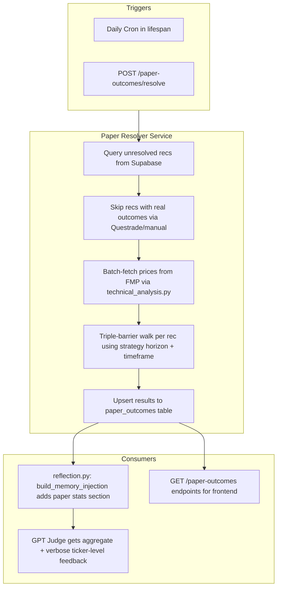

# Automated Paper Outcome Resolver

## Architecture



## 1. Database Migration — `paper_outcomes` table

New migration file:
`[src/backend/database/migrations/019_paper_outcomes.sql](src/backend/database/migrations/019_paper_outcomes.sql)`

```sql
CREATE TABLE IF NOT EXISTS paper_outcomes (
    id UUID DEFAULT gen_random_uuid() PRIMARY KEY,
    user_id UUID NOT NULL REFERENCES auth.users(id),
    recommendation_id UUID NOT NULL,
    run_id UUID,
    ticker TEXT NOT NULL,
    action TEXT NOT NULL,           -- BUY, SHORT, WATCH, NO_TRADE, HOLD
    strategy_type TEXT,
    chart_timeframe TEXT,           -- D, 4H, 15m, etc.
    entry_price DOUBLE PRECISION,
    stop_loss DOUBLE PRECISION,
    take_profit DOUBLE PRECISION,
    exit_price DOUBLE PRECISION,
    confidence DOUBLE PRECISION,
    graded_label TEXT,              -- TP_HIT, SL_HIT, TIME_EXIT, NO_TRADE_CORRECT, NO_TRADE_MISSED
    graded_profitable BOOLEAN,
    actual_return_pct DOUBLE PRECISION,
    bars_to_resolution INTEGER,
    mfe_pct DOUBLE PRECISION,      -- max favorable excursion
    mae_pct DOUBLE PRECISION,      -- max adverse excursion
    horizon_bars INTEGER,          -- strategy target_horizon_bars used
    signal_generated_at TIMESTAMPTZ,
    resolved_at TIMESTAMPTZ DEFAULT now(),
    created_at TIMESTAMPTZ DEFAULT now(),
    UNIQUE(recommendation_id)      -- one paper outcome per rec
);
ALTER TABLE paper_outcomes ENABLE ROW LEVEL SECURITY;
CREATE POLICY "users_own_paper_outcomes" ON paper_outcomes
    FOR ALL USING (auth.uid() = user_id);
```

Key: `UNIQUE(recommendation_id)` prevents double-grading. The `graded_label`
values match the ML grader vocabulary so we can reuse them downstream.

## 2. Core Service — `services/paper_resolver.py`

New file:
`[src/backend/services/paper_resolver.py](src/backend/services/paper_resolver.py)`

Responsibilities:

- `**resolve_all_pending(user_id) -> PaperResolveResult**` — main entry point
- Query `recommendations` joined with `pipeline_runs` (for `strategy_id`) and
  `strategies` (for `chart_timeframe`, `strategy_type`) where no
  `paper_outcomes` row exists AND `signal_generated_at` is old enough that the
  horizon has elapsed
- Exclude recs that already have a real `outcomes` row (Questrade/manual take
  priority)
- Group tickers, batch-fetch prices via existing
  `[technical_analysis.py](src/backend/services/technical_analysis.py)`
  functions:
  - Daily strategies: `fetch_ohlcv_stable(symbol, limit=300)`
  - Intraday strategies: `fetch_intraday_ohlcv(symbol, timeframe, limit=200)`
- Run triple-barrier walk per recommendation (logic ported from
  `[outcome_grader.py](src/ml_training/ml_training/pipeline/outcome_grader.py)`
  but async and using FMP dicts instead of pandas):
  - BUY/SHORT: use rec's `stop_loss`/`take_profit` if present, else ATR%
    fallback (2x TP, 1x SL)
  - WATCH/NO_TRADE/HOLD: forward return check (same as `_grade_no_trade` —
    missed opportunity detection)
- Insert results into `paper_outcomes`
- Return summary stats

**Strategy horizon mapping** — port the `_HORIZON_MAP` from
`[dataset_builder.py](src/ml_training/ml_training/features/dataset_builder.py)`
into a lightweight lookup dict in the resolver:

```python
HORIZON_MAP: dict[tuple[str, str], int] = {
    ("swing", "D"): 5,
    ("mean_reversion", "4H"): 10,
    ("value", "4H"): 20,
    ("event", "4H"): 10,
    ("intraday", "4H"): 3,
    ("intraday", "15m"): 10,
    ("intraday", "30m"): 8,
    ("crypto_swing", "D"): 5,
    ("crypto_intraday", "4H"): 6,
}
```

## 3. Pydantic Schemas

Add to `[src/backend/pipeline/schemas.py](src/backend/pipeline/schemas.py)`:

- `PaperOutcome` — response model matching the DB columns
- `PaperResolveResult` — summary (total_resolved, wins, losses, by_action
  breakdown)
- `PaperResolveRequest` — optional filters (strategy_id, ticker,
  force_re_resolve)

## 4. API Router — `api/paper_outcomes.py`

New file:
`[src/backend/api/paper_outcomes.py](src/backend/api/paper_outcomes.py)`

| Endpoint                  | Method | Purpose                                                                  |
| ------------------------- | ------ | ------------------------------------------------------------------------ |
| `/paper-outcomes/resolve` | POST   | Manual trigger — runs resolver for authenticated user                    |
| `/paper-outcomes`         | GET    | List paper outcomes (with filters: ticker, action, strategy, date range) |
| `/paper-outcomes/summary` | GET    | Aggregate stats (win rate by action, by strategy, by timeframe)          |

Wire into `[main.py](src/backend/main.py)` with
`app.include_router(paper_outcomes_router, prefix="/paper-outcomes", tags=["paper-outcomes"])`.

## 5. Daily Cron — in `main.py` lifespan

Follow the existing `_scanner_schedule` pattern — a long-running async loop:

```python
async def _paper_resolver_schedule() -> None:
    """Resolve paper outcomes once daily around 6 PM ET (after market close)."""
    while True:
        await asyncio.sleep(300)  # check every 5 minutes
        now_et = _approximate_et_hour()
        if _is_weekday() and 17.9 < now_et < 18.1:
            # resolve for all users with unresolved recs
            await resolve_all_users()
            await asyncio.sleep(3600)  # sleep 1h to avoid re-trigger
```

Add `paper_resolver_task = asyncio.create_task(_paper_resolver_schedule())` in
lifespan startup, cancel on shutdown — same as `scanner_task` and
`heartbeat_task`.

## 6. Reflection Integration — feed into GPT's FinMem context

Modify
`[src/backend/services/reflection.py](src/backend/services/reflection.py)`:

**In `_compute_metrics`:** Add a new section that queries `paper_outcomes` and
computes:

- Paper win rate (overall, by action, by strategy type)
- Paper vs real outcome comparison (when both exist)
- WATCH/NO_TRADE missed opportunity stats
- Recent paper performance (14-day window for short-term memory)

**In `build_memory_injection`:** Add a new section after the existing live
trades block:

```
## PAPER OUTCOME TRACKING (All Recommendations)
Over the past 30 days: 115 recommendations analyzed
- BUY: 45 called, 28 hit TP (62%), 12 hit SL, 5 expired
- SHORT: 20 called, 11 hit TP (55%), 6 hit SL, 3 expired
- WATCH: 30 flagged, 8 would have been profitable (>5% move)
- NO_TRADE: 20 avoided, 14 correctly avoided (moved <-2%)

### Recent Ticker Detail (last 7 days)
- AAPL: BUY @ $185.20, TP hit in 3 bars (+5.2%), conf 0.82
- MSFT: BUY @ $420.00, SL hit in 1 bar (-2.1%), conf 0.71
- NVDA: WATCH, moved +8.3% in 5 bars — potential missed signal
...
```

This gives GPT both the aggregate view ("your BUY calls are 62% accurate") and
the verbose ticker-level detail it can learn from.

## 7. Price-check granularity

For accurate SL/TP resolution:

- **Daily strategies** (swing, crypto_swing, value): use `fetch_ohlcv_stable` —
  daily high/low is sufficient since horizons are 5-20 daily bars
- **Intraday strategies** (intraday, mean_reversion, event): use
  `fetch_intraday_ohlcv` with the strategy's `chart_timeframe` (4H, 15m, 30m)
  for bar-level SL/TP checking

## Files Changed

| File                                                     | Change                                                                |
| -------------------------------------------------------- | --------------------------------------------------------------------- |
| `src/backend/database/migrations/019_paper_outcomes.sql` | New — table DDL                                                       |
| `src/backend/services/paper_resolver.py`                 | New — core resolver service                                           |
| `src/backend/api/paper_outcomes.py`                      | New — API router                                                      |
| `src/backend/pipeline/schemas.py`                        | Add PaperOutcome, PaperResolveResult, PaperResolveRequest             |
| `src/backend/services/reflection.py`                     | Extend `_compute_metrics` + `build_memory_injection` with paper stats |
| `src/backend/main.py`                                    | Add cron task + router registration                                   |
