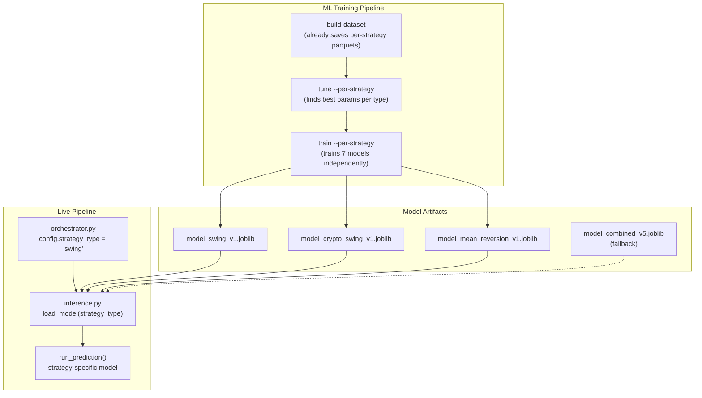

# Per-Strategy ML Models (with Dataset Improvements)

## Phase A: Fix and Improve the Dataset

### Problem: 6 Fundamental Features Are Hidden by Key Mismatches

The acquisition pipeline stored 705 fundamental files with 117 columns each. But
`compute_fundamental_features` in
[engineering.py](src/ml_training/ml_training/features/engineering.py) uses wrong
key names, so 6 features show as 100% missing when the data exists on disk.

| Feature        | Code looks for                            | Actual column name                      |
| -------------- | ----------------------------------------- | --------------------------------------- |
| pe_ratio       | `ratios_ttm_peRatioTTM`                   | `ratios_ttm_priceToEarningsRatioTTM`    |
| ev_ebitda      | `ratios_ttm_enterpriseValueOverEBITDATTM` | `ratios_ttm_enterpriseValueMultipleTTM` |
| debt_equity    | `ratios_ttm_debtEquityRatioTTM`           | `ratios_ttm_debtToEquityRatioTTM`       |
| roe            | `ratios_ttm_returnOnEquityTTM`            | `key_metrics_ttm_returnOnEquityTTM`     |
| roa            | `ratios_ttm_returnOnAssetsTTM`            | `key_metrics_ttm_returnOnAssetsTTM`     |
| revenue_growth | `key_metrics_ttm_revenuePerShareTTM`      | `ratios_ttm_revenuePerShareTTM`         |

**Fix:** Update the 6 `_get()` calls in `compute_fundamental_features` (lines
140-156 of `engineering.py`). No re-acquisition needed.

### Remaining 5 Missing Features: Compute or Fetch

| Feature                  | Source                             | Approach                                                                |
| ------------------------ | ---------------------------------- | ----------------------------------------------------------------------- |
| analyst_target_upside    | FMP `/stable/analyst-estimates`    | New FMP endpoint in acquisition; falls back to None for crypto          |
| insider_buy_ratio        | FMP parquet has no insider columns | New FMP endpoint `/stable/insider-trading`; or drop if not on plan tier |
| composite_score          | Derived                            | Weighted composite of pe_ratio, roe, piotroski_score, altman_z          |
| sector_relative_strength | Derived                            | Compute from per-sector mean returns in the price data                  |
| market_breadth_proxy     | Derived                            | % of tickers with close > 200-day EMA from price data                   |

`composite_score`, `sector_relative_strength`, and `market_breadth_proxy` can be
computed from existing price/fundamental data without any new API calls.
`analyst_target_upside` and `insider_buy_ratio` need new FMP endpoints (may hit
tier limits; graceful fallback to None).

### New Technical Features (free from existing OHLCV)

Add to `compute_technical_features` in `engineering.py`:

- `volatility_20d` -- 20-day rolling standard deviation of daily returns
- `high_low_range` -- `(high - low) / close * 100` daily range
- `gap_pct` -- `(open - prev_close) / prev_close * 100` overnight gap
- `distance_from_20d_high` -- `(close - rolling_max_20) / rolling_max_20 * 100`
- `distance_from_20d_low` -- `(close - rolling_min_20) / rolling_min_20 * 100`

These are strong mean-reversion and breakout signals computed purely from OHLCV.

### Class Balancing

Add `is_unbalanced: True` to `CLASSIFIER_PARAMS` in
[predictor.py](src/ml_training/ml_training/models/predictor.py) line 25.
LightGBM auto-adjusts class weights to handle the 29% UP / 71% DOWN+FLAT
imbalance.

### Phase A Flow

```bash
# No re-acquisition needed for key fixes + derived features
uv run python -m ml_training.pipeline.cli build-dataset   # regenerate with fixed features
uv run python -m ml_training.pipeline.cli validate         # confirm improvement
uv run python -m ml_training.pipeline.cli train            # quick combined test
```

Expected validate changes:

- pe_ratio: 100% missing --> ~35% missing (crypto only)
- ev_ebitda, debt_equity, roe, roa: same
- revenue_growth: same
- composite_score, sector_relative_strength, market_breadth_proxy: 0% missing
- New technical features: 0% missing
- Feature count: 56 --> ~61

---

## Phase B: Per-Strategy Model Infrastructure

### Problem

The combined model trains on all 1.2M samples. `swing` (736K) dominates, so
smaller types fail the judge. Per-strategy models let each type train on its own
data with its own optimal hyperparameters.

### Architecture



### Key Design Decisions

- **Model key = `strategy_type`** (not `strategy_id`). The 7 strategy_types map
  cleanly between training data, templates, and the live pipeline's
  `StrategyConfig.strategy_type`.
- **Datasets already exist per-strategy.** `build-dataset` already saves
  `swing_features.parquet`, `crypto_swing_features.parquet`, etc.
- **Fallback model.** If no strategy-specific model exists, fall back to the
  combined model. Covers new/custom strategies.
- **Artifact naming.** Per-strategy: `model_{strategy_type}_v{N}_{date}.joblib`.
  Combined fallback: `model_combined_v{N}_{date}.joblib`.

### Changes Required

**1. Storage helper** --
[storage.py](src/ml_training/ml_training/data/storage.py)

- Add `list_strategy_datasets()` to discover available `{type}_features`
  parquets

**2. Model registry** --
[registry.py](src/ml_training/ml_training/models/registry.py)

- `save_artifact(strategy_type=)`: include in filename
- `get_latest(strategy_type)`: find latest model for a specific strategy
- `promote_to_shadow()`: copy all strategy models as
  `model_{strategy_type}_active.joblib`

**3. Training loop** --
[training_loop.py](src/ml_training/ml_training/pipeline/training_loop.py)

- Add `strategy_type: str | None` to `TrainingLoopConfig`
- Pass through to artifact naming and metadata

**4. CLI** -- [cli.py](src/ml_training/ml_training/pipeline/cli.py)

- `train --per-strategy`: iterate strategy datasets, train each independently
- `train --per-strategy --strategy swing`: train one specific strategy
- `tune --per-strategy`: tune params per strategy type
- Without flag: current combined behavior as fallback

**5. Tuner** --
[hyperparameter_tuning.py](src/ml_training/ml_training/pipeline/hyperparameter_tuning.py)

- Save/load `best_params_{strategy_type}.json` when per-strategy

**6. Backend inference** -- [inference.py](src/backend/ml/inference.py)

- Load models into `{strategy_type: ModelArtifact}` dict + fallback
- `run_prediction(features, strategy_type)` picks the right model
- `reload_model()` reloads all strategy models

### Phase B CLI Flow

```bash
# Full per-strategy pipeline:
uv run python -m ml_training.pipeline.cli tune --per-strategy
uv run python -m ml_training.pipeline.cli train --per-strategy
uv run python -m ml_training.pipeline.cli promote

# Single strategy:
uv run python -m ml_training.pipeline.cli train --per-strategy --strategy swing

# Combined fallback:
uv run python -m ml_training.pipeline.cli train
```

---

## Execution Order

1. Phase A: fix keys, add features, add class balance, rebuild dataset, validate
2. Phase B: per-strategy infra, tune per-strategy, train per-strategy, compare
