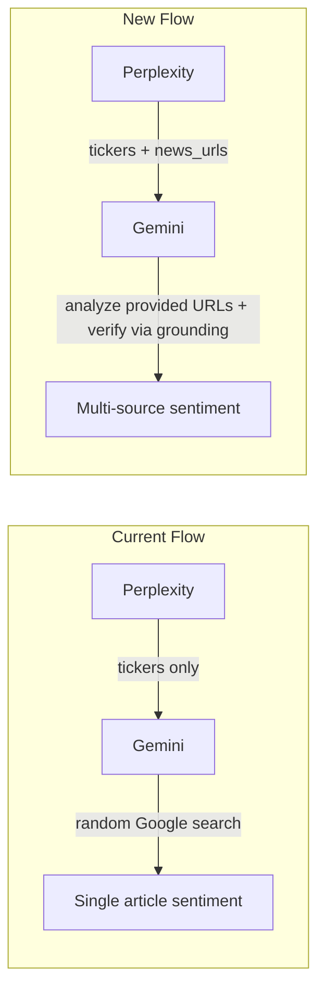

# Perplexity-Fed Gemini Sentiment Enrichment

## Problem

Gemini's sentiment analysis currently receives only a ticker symbol and does a
single Google Search grounding call, often landing on a single low-quality
source (e.g. moomoo.com). This produces weak sentiment data for stock-picking
decisions.

## Solution

Leverage Perplexity's superior search capabilities to gather recent news article
URLs per ticker. Pass those URLs to Gemini so it has concrete, curated sources
to analyze. Gemini still uses Google Search grounding to verify/enrich, but now
starts from a solid foundation of 3+ articles.

## Data Flow (Before vs After)

## Changes

### 1. Schema: Add `news_urls` to `FundamentalData`, `url` to `NewsCatalyst`

File: [src/backend/pipeline/schemas.py](src/backend/pipeline/schemas.py)

- Add `news_urls: list[str] = Field(default_factory=list)` to `FundamentalData`
  -- these are the article URLs Perplexity finds
- Add `url: str = ""` to `NewsCatalyst` -- so Gemini's output links back to
  specific articles

### 2. Perplexity prompts: Instruct to gather news URLs

Files:

- [src/backend/pipeline/prompts/perplexity_discovery.py](src/backend/pipeline/prompts/perplexity_discovery.py)
- [src/backend/pipeline/prompts/perplexity_analysis.py](src/backend/pipeline/prompts/perplexity_analysis.py)
- Add `"news_urls": ["<url1>", "<url2>", "<url3>"]` to the JSON schema in both
  system prompts
- Add instructions: "For each ticker, find at least 3 recent news article URLs
  from the past week covering earnings, analyst actions, company developments,
  or sector trends. Prefer reputable financial sources (Reuters, Bloomberg,
  CNBC, Barron's, Seeking Alpha, Yahoo Finance, etc.)."
- Bump `PROMPT_VERSION` in both files

### 3. Gemini prompt: Analyze provided URLs instead of blind search

File:
[src/backend/pipeline/prompts/gemini_sentiment.py](src/backend/pipeline/prompts/gemini_sentiment.py)

- Update `SENTIMENT_SYSTEM_PROMPT` to instruct Gemini to analyze the provided
  article URLs, not just randomly search. Add `"url"` field to the key_catalysts
  JSON schema.
- Update `build_sentiment_prompt()` signature to accept `news_urls: list[str]`
  parameter and include them in the prompt text
- Add instruction: "You are provided with specific news article URLs. Use Google
  Search grounding to read and analyze each article. Extract sentiment from
  these articles first, then supplement with any additional relevant news you
  find."
- Require minimum 3 catalysts sourced from the provided URLs
- Bump `PROMPT_VERSION` to v2

### 4. Gemini stage: Thread news URLs through the call chain

File:
[src/backend/pipeline/stages/gemini.py](src/backend/pipeline/stages/gemini.py)

- Update `_analyze_ticker()` to accept `news_urls: list[str]` and pass them to
  `build_sentiment_prompt()`
- Update `run_sentiment()` signature to accept
  `ticker_news: dict[str, list[str]]` (mapping ticker -> URLs) alongside the
  existing params
- Extract news_urls for each ticker from the dict and pass to
  `_analyze_ticker()`

### 5. Orchestrator: Build and pass the news URL mapping

File:
[src/backend/pipeline/orchestrator.py](src/backend/pipeline/orchestrator.py)

- After Perplexity returns `screening`, build a `ticker_news` dict:
  `{t.ticker: t.news_urls for t in screening.tickers}`
- Pass `ticker_news` to `run_sentiment()`
- If no news_urls exist for a ticker (backward compat), Gemini falls back to its
  current behavior (blind search)

### 6. Frontend: Display source URLs in catalyst list (optional, low priority)

The frontend `NewsCatalyst` TypeScript interface would gain a `url` field. If
present, catalyst headlines become clickable links. This is a small optional
enhancement.

## Backward Compatibility

- `news_urls` defaults to an empty list, so existing runs and schemas still
  validate
- `url` on `NewsCatalyst` defaults to empty string
- If Perplexity returns no `news_urls` for a ticker, Gemini falls back to its
  current blind-search behavior
- No database migration needed (these fields are stored as JSON blobs in
  `parsed_output`)
