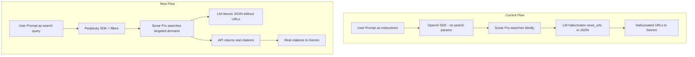

# Perplexity Sonar Pro Full Overhaul

## Problem

Five issues identified through deep research on Sonar Pro's architecture:

1. **Zero API search parameters** -- `_call_perplexity` passes only model +
   messages. No `search_domain_filter`, `search_recency_filter`, or
   `search_context_size`.
2. **Hallucinated news URLs** -- system prompt asks for `news_urls` in JSON
   output, but the LM cannot see search URLs. Real URLs come from the
   `citations` / `search_results` field in the API response.
3. **No anti-hallucination clauses** -- documented issue with Sonar fabricating
   financial metrics when search results are insufficient.
4. **User prompts are instructions, not search queries** -- Sonar's search
   component triggers on the user prompt text. "Strategy: Intraday Scalp,
   Screening criteria: Find Canadian stocks..." makes poor search queries.
5. **Screening prompts ask for unfindable data** -- RSI, VWAP, intraday volume,
   15-min candle patterns are invisible to a web search model.

Reference:
[docs/Optimizing Sonar Pro Prompts for a Stock Finder & News Aggregator.md](docs/Optimizing%20Sonar%20Pro%20Prompts%20for%20a%20Stock%20Finder%20%26%20News%20Aggregator.md)

## Solution

Migrate from OpenAI SDK to the official Perplexity SDK (`perplexityai`), add
search filter parameters, parse real citations from the API response, rewrite
prompts, and add anti-hallucination safeguards.



## Implementation Steps

### Step 1: install-sdk

Add `perplexityai` to the project via `uv add perplexityai`.

Verify the async client works:

```python
from perplexity import AsyncPerplexity
```

### Step 2: migrate-api-client

Rewrite
[src/backend/pipeline/stages/perplexity.py](src/backend/pipeline/stages/perplexity.py).

**Key changes to `_call_perplexity`:**

- Replace `AsyncOpenAI(base_url=...)` with `AsyncPerplexity(api_key=...)`
- Add `search_params: dict | None` parameter
- Pass `search_domain_filter`, `search_recency_filter`, `web_search_options` to
  the API call
- Parse `response.citations` or `response.search_results` from the response
- Return `tuple[str, list[str]]` (text + citation URLs) instead of just `str`

**Add search param builder:**

```python
def _build_search_params(config: StrategyConfig | None) -> dict:
    params = {
        "web_search_options": {"search_context_size": "high"},
    }
    # Map news_recency to search_recency_filter
    if config:
        recency_map = {"today": "day", "week": "week", "month": "month"}
        params["search_recency_filter"] = recency_map.get(config.news_recency, "week")
    else:
        params["search_recency_filter"] = "week"

    # Domain filter based on strategy content
    stock_domains = [
        "finance.yahoo.com", "reuters.com", "bloomberg.com",
        "marketwatch.com", "theglobeandmail.com", "financialpost.com",
        "seekingalpha.com", "barrons.com",
    ]
    crypto_domains = [
        "coindesk.com", "cointelegraph.com", "theblock.co",
        "coingecko.com", "decrypt.co",
    ]
    if config and "crypt" in (config.name or "").lower():
        params["search_domain_filter"] = crypto_domains
    else:
        params["search_domain_filter"] = stock_domains
    return params
```

**Update `run_discovery`, `run_prompted_discovery`, `run_analysis`:**

- Pass config to `_build_search_params`
- Collect citations from the new return value
- Store citations on a per-ticker basis (distribute across tickers returned, or
  store as a flat list on the result)

### Step 3: update-system-prompts

**[src/backend/pipeline/prompts/perplexity_discovery.py](src/backend/pipeline/prompts/perplexity_discovery.py)
-- `DISCOVERY_SYSTEM_PROMPT`:**

Remove:

- The `news_urls` field from the JSON schema
- "For each ticker, include at least 3 recent news article URLs..." paragraph
- "Prefer reputable financial sources (Reuters, Bloomberg...)" (handled by API
  params)

Add anti-hallucination clauses:

```
CRITICAL RULES:
- If you cannot verify a financial metric from search results, return null.
- Never estimate, interpolate, or fabricate financial data.
- Only include information you found in your search results.
- If no tickers match the criteria, return an empty tickers array.
```

Keep: JSON schema structure (minus news_urls), ticker format rules, crypto
handling rules.

**[src/backend/pipeline/prompts/perplexity_analysis.py](src/backend/pipeline/prompts/perplexity_analysis.py)
-- `ANALYSIS_SYSTEM_PROMPT`:** Same changes: remove news_urls, add
anti-hallucination.

### Step 4: rewrite-user-prompts

`**build_discovery_prompt` -- currently produces:

```
Strategy: Intraday Scalp

Screening criteria:
Find Canadian stocks...

Apply strict filtering...

Return up to 5 tickers as JSON.
```

Rewrite to be search-query-style (what you'd type into Google):

```python
def build_discovery_prompt(config: StrategyConfig) -> str:
    parts = [config.screening_prompt]
    if config.constraint_style == "tight":
        parts.append("strict match all criteria")
    parts.append(f"top {config.max_tickers} picks")
    return " ".join(parts)
```

The screening_prompt itself becomes the search query, with minimal metadata
appended. Strategy name and formatting instructions stay in the system prompt.

`**build_prompted_discovery_prompt**` -- strip instructional wrapper, pass user
text more directly as the search query:

```python
def build_prompted_discovery_prompt(
    user_prompt: str,
    config: StrategyConfig | None = None,
) -> str:
    parts = [user_prompt]
    if config and config.screening_prompt:
        parts.append(config.screening_prompt)
    if config:
        parts.append(f"top {config.max_tickers} picks")
    else:
        parts.append("top 10 picks")
    return " ".join(parts)
```

### Step 5: wire-citations

**[src/backend/pipeline/schemas.py](src/backend/pipeline/schemas.py):**

- Keep `news_urls` on `FundamentalData` for backward compat but it will now be
  populated from API citations, not LM output.
- Add `citations: list[str] = Field(default_factory=list)` to `ScreeningResult`
  to store the raw citation list from the API.

**[src/backend/pipeline/orchestrator.py](src/backend/pipeline/orchestrator.py):**

- After Perplexity returns, populate `ticker_news` from `screening.citations`
  (distributed across tickers or as a shared list).
- Fallback: if individual `news_urls` are populated by the LM (legacy), use
  those.

### Step 6: rewrite-screening-prompts

Update [templates/strategies.json](templates/strategies.json) with
search-query-style screening prompts:

**Momentum Breakout:** "Canadian TSX stocks strong price momentum analyst
upgrades accelerating earnings growth high average daily volume mid-to-large cap
making new highs"

**Value Accumulation:** "Canadian TSX stocks undervalued low P/E P/B discount to
sector peers recent insider buying growing free cash flow strong balance sheet
analyst buy ratings"

**Mean Reversion:** "Canadian TSX stocks recently sold off 15-30% past month
strong fundamentals analysts maintain buy ratings insider buying during decline
oversold bounce candidates"

**Earnings Play:** "Canadian TSX stocks reporting earnings next 2 weeks strong
earnings beat history upward estimate revisions analyst attention meaningful
catalyst potential"

**Crypto Swing:** "cryptocurrencies strong momentum growing on-chain activity
active addresses TVL growth developer activity protocol upgrades social buzz top
100 market cap"

**Crypto Intraday Scalp:** "cryptocurrencies trending today high 24-hour volume
breaking news token unlocks exchange listings viral social activity top 50
market cap deep liquidity major exchanges"

**Intraday Scalp:** "Canadian TSX stocks in play today breaking news earnings
releases analyst upgrades sector catalysts liquid large-cap mid-cap high daily
volume active day trading names"

### Step 7: sync-supabase

Run 7 UPDATE statements to sync screening_prompt in Supabase template rows.

### Step 8: bump-versions

- `PROMPT_VERSION = "v5"` in `perplexity_discovery.py`
- `PROMPT_VERSION = "v4"` in `perplexity_analysis.py`

### Step 9: quality-check

Run `ruff format`, `ruff check --fix`, verify backend starts cleanly.

## Files Changed

- `src/backend/pipeline/stages/perplexity.py` (API client migration)
- `src/backend/pipeline/prompts/perplexity_discovery.py` (system + user prompts)
- `src/backend/pipeline/prompts/perplexity_analysis.py` (system prompt)
- `src/backend/pipeline/schemas.py` (add citations field)
- `src/backend/pipeline/orchestrator.py` (wire citations to Gemini)
- `templates/strategies.json` (screening prompt rewrites)
- `pyproject.toml` / `uv.lock` (new dependency)

## Risks / Open Questions

- **Perplexity SDK async support** -- need to verify `AsyncPerplexity` exists.
  If not, wrap sync calls with `asyncio.to_thread`.
- **Citations are per-response, not per-ticker** -- when screening returns 8
  tickers, the citations are a flat list. We may need to distribute them
  heuristically or pass all citations to every ticker's Gemini call.
- `**response_format` with json_schema -- could enforce structured output via
  API param instead of hoping the LM follows the system prompt. Worth adding but
  the first request incurs a 10-30s schema compilation delay. Consider for a
  follow-up.
- **search_domain_filter for mixed strategies** -- strategies that could find
  both stocks and crypto need a merged domain list. The 20-domain limit gives us
  room.

## Branch

Current feature branch off `dev`.
