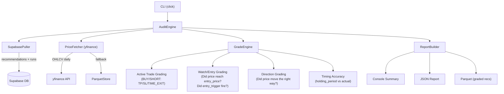

# Pipeline Auditor Package

## Context / Prior Art

Significant grading logic already exists in `src/ml_training/`:

- `[outcome_grader.py](src/ml_training/ml_training/pipeline/outcome_grader.py)`
  -- triple-barrier (TP/SL/TIME_EXIT) grading using `ParquetStore` price data
- `[outcome_tracker.py](src/ml_training/ml_training/pipeline/outcome_tracker.py)`
  -- direction-based prediction tracking with horizon resolution
- `[supabase_provider.py](src/ml_training/ml_training/data/supabase_provider.py)`
  -- paginated Supabase pulls for recommendations, decisions, outcomes, shadow
  predictions

The Auditor will **not** duplicate this code -- it will import from
`ml_training` where possible and extend with its own grading dimensions.

## Architecture



## Package Structure

```
src/auditor/
  pyproject.toml          # UV package, Python 3.14, deps: yfinance, supabase, pandas, click, rich
  auditor/
    __init__.py
    cli.py                # Click CLI: `audit run`, `audit report`
    config.py             # Settings from env vars (SUPABASE_URL, SUPABASE_SERVICE_KEY)
    pull.py               # Supabase data puller (recommendations, runs, decisions, outcomes)
    prices.py             # Price fetcher: yfinance primary, ParquetStore fallback
    grader.py             # Core grading engine (active trades, watch, direction, timing)
    report.py             # Report builder (console, JSON, parquet output)
    models.py             # Pydantic models for audit records and reports
```

## Key Design Decisions

- **Separate UV package** (`src/auditor/`) with its own `pyproject.toml` -- not
  nested inside `ml_training` or `backend`, keeping dependencies minimal
- **yfinance for price data** -- free, no API key, works for US stocks and
  crypto. Falls back to `ParquetStore` if `ml_training` data directory exists
- **Reuse `normalize_ticker()`** from `ml_training.data.supabase_provider` by
  importing it, or duplicate the small function if we want zero coupling
- **Pydantic models** for structured audit results (not just dicts)
- **Rich console output** for readable CLI reports with tables and color coding
- **Click CLI** with two commands:
  - `audit run` -- pull from Supabase, fetch prices, grade, save results
  - `audit report` -- regenerate reports from previously saved graded data

## Grading Dimensions

1. **Active Trade Grade** (BUY/SHORT): Triple-barrier walk-forward using GPT's
   own SL/TP/entry levels. Labels: `TP_HIT`, `SL_HIT`, `TIME_EXIT`. Mirrors
   `outcome_grader.py` logic.
2. **Watch/Entry Grade** (WATCH + BUY with `entry_trigger`):

- Did the price reach `entry_price` within `entry_valid_window`?
- If yes, what happened after -- would the trade have been profitable?
- Grade: `ENTRY_REACHED_PROFITABLE`, `ENTRY_REACHED_UNPROFITABLE`,
  `ENTRY_NEVER_REACHED`

1. **Direction Grade** (all actions):

- Over the `holding_period` window, did the price move in the predicted
  direction?
- For BUY: price went up; for SHORT: price went down; for NO_TRADE/WATCH: flat
  or down
- Simple boolean + magnitude of actual return

1. **Timing Grade**:

- If `holding_period` was specified, compare it to actual bars-to-resolution
- Score: `EARLY` (resolved sooner), `ON_TIME`, `LATE` (took longer), `EXPIRED`

1. **Confidence Calibration**:

- Bucket recommendations by confidence level
- Compute actual win rate per bucket
- Measure calibration error (predicted confidence vs actual win rate)

## Data Flow

1. **Pull**: Query Supabase `recommendations` table (all columns), join with
   `pipeline_runs` for strategy info, `decisions` for user actions, `outcomes`
   for logged P&L
2. **Price Fetch**: For each unique ticker, download daily OHLCV from yfinance
   (lookback: signal date minus 30 days to today)
3. **Grade**: Apply all 4 grading dimensions to each recommendation
4. **Report**: Aggregate by strategy, action type, confidence bucket, time
   period

## Supabase Columns Used

From `recommendations`:

- `id`, `ticker`, `action`, `confidence`, `confidence_label`
- `entry_price`, `stop_loss`, `take_profit`
- `holding_period`, `entry_valid_window`
- `signal_generated_at`, `price_at_signal`, `created_at`
- `bull_case`, `bear_case`, `judge_reasoning`
- `track_agreement`, `expected_value`

From `pipeline_runs`: `strategy_id`, `mode` From `strategies`: `name` (for
grouping by strategy) From `decisions`: `decision` (follow/pass) From
`outcomes`: `pnl_percent`, `exit_reason` (for comparison with audit grades)

## CLI Usage

```bash
cd src/auditor

# Full audit run
uv run python -m auditor.cli run --output-dir ./audit_results

# With date range filter
uv run python -m auditor.cli run --since 2025-01-01 --until 2026-04-15

# Only specific tickers
uv run python -m auditor.cli run --tickers AAPL,NVDA,BTC

# Regenerate report from saved data
uv run python -m auditor.cli report --input ./audit_results/graded_recs.parquet
```

## Dependencies (pyproject.toml)

- `yfinance` -- historical OHLCV
- `supabase` -- DB access
- `pandas` + `pyarrow` -- data manipulation and parquet I/O
- `pydantic` -- structured models
- `click` -- CLI framework
- `rich` -- console output formatting
- `python-dotenv` -- load `.env` for Supabase credentials
