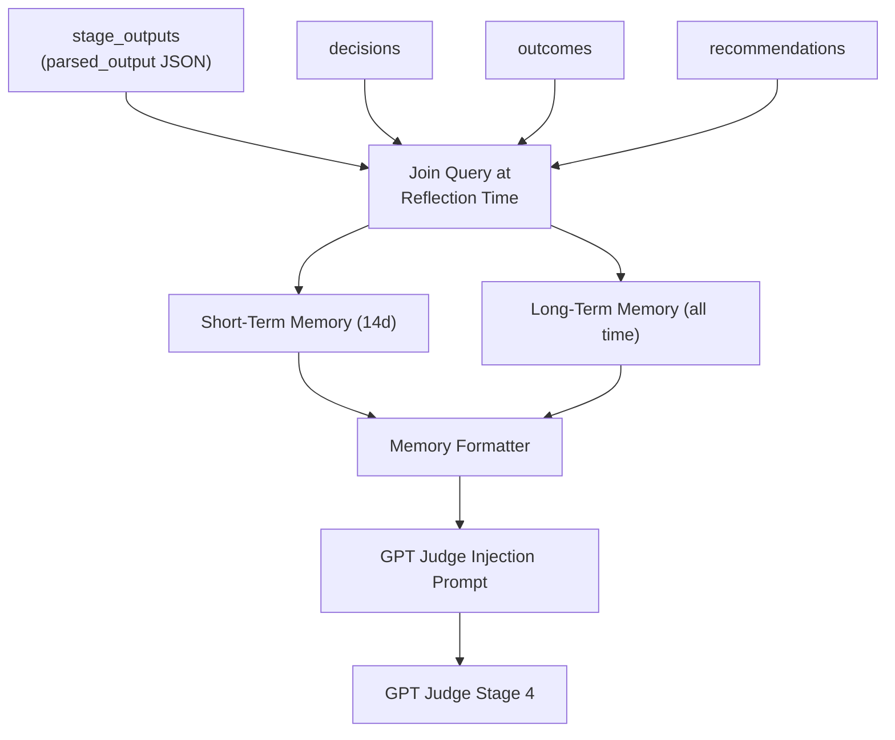
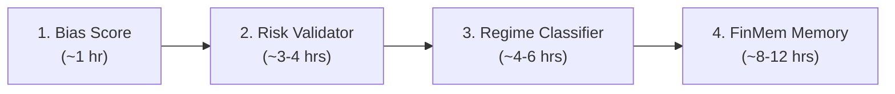

# Pipeline Enhancement Gaps Plan

## Status Check: What's Already Done

Before building, note these are **complete** (not just feedback loop + ATR):

- **Dashboard Journal UI** -- `FeedbackTab.tsx` (823 lines) has full
  decision/outcome CRUD with follow/pass, outcome logging, editing, undo
- **Sentiment Recency** -- `published_date` and `hours_ago` on `NewsCatalyst` in
  both Python and TypeScript, formatted in GPT Judge via `_format_catalyst()`
- **Reflection Engine** -- `services/reflection.py` computes win rates,
  confidence calibration, buy/sell accuracy, calls GPT-4o-mini for strategic
  advice, injects into Judge prompt

---

## Gap 1: Bias Score Numeric (Effort: ~1 hr)

**What:** Add a weighted numeric score across all analyzed timeframes so GPT
Judge gets a concrete number instead of parsing text biases.

**Where:**
`[src/backend/pipeline/prompts/gpt_debate.py](src/backend/pipeline/prompts/gpt_debate.py)`
-- modify `_synthesize_timeframes()` (line 295)

**Implementation:**

1. Add bias-to-score mapping at module level:

```python
_BIAS_SCORE: dict[str, int] = {
    "strongly_bullish": 2, "bullish": 1, "neutral": 0,
    "bearish": -1, "strongly_bearish": -2,
}
```

1. In `_synthesize_timeframes()`, compute a weighted score. Current code already
   has `biases = {ca.timeframe: ca.overall_bias for ca in charts}`. Add after
   line 308:

```python
TF_WEIGHT = {"W": 0.40, "D": 0.40, "4H": 0.15, "2H": 0.10, "1H": 0.05, "15m": 0.05}
weighted = sum(
    _BIAS_SCORE.get(b, 0) * TF_WEIGHT.get(tf, 0.10)
    for tf, b in biases.items()
)
lines.append(f"Weighted bias score: {weighted:+.2f} (threshold: +/-1.2 to fire with conviction)")
```

1. Add to JUDGE*SYSTEM_PROMPT guidance: *"The weighted bias score is a numeric
   summary of multi-TF alignment. Scores above +1.2 support a BUY with elevated
   confidence. Below -1.2 supports a SELL. Between -0.8 and +0.8 suggests HOLD
   or reduced position sizing."
2. Bump `PROMPT_VERSION` to v6.

**Risks:** The `overall_bias` field is a free-form string from Claude. Need to
verify Claude consistently returns values matching the `_BIAS_SCORE` keys. Check
the Claude prompt instructions for allowed bias values -- if needed, add a
normalizer that maps variations (e.g., "mildly bullish" -> "bullish").

---

## Gap 2: Risk Validator -- Stage 4.7 (Effort: ~3-4 hrs)

**What:** A pure Python post-GPT validator that flags (not blocks) risk
violations on each Recommendation. Violations are shown in the UI with "Take
Anyway" semantics.

**Where:**

- New file:
  `[src/backend/pipeline/stages/risk_validator.py](src/backend/pipeline/stages/risk_validator.py)`
- Schema changes:
  `[src/backend/pipeline/schemas.py](src/backend/pipeline/schemas.py)`
- Orchestrator integration:
  `[src/backend/pipeline/orchestrator.py](src/backend/pipeline/orchestrator.py)`
- Frontend display:
  `[src/frontend/src/components/recommendations/SynthesisTab.tsx](src/frontend/src/components/recommendations/SynthesisTab.tsx)`
- TypeScript types:
  `[src/frontend/src/types/index.ts](src/frontend/src/types/index.ts)`

**Schema additions to `Recommendation`:**

```python
risk_violations: list[str] = Field(default_factory=list)
risk_approved: bool = True
```

**Validation rules (v1 -- no portfolio state tracking):**

- R:R ratio below strategy's `min_risk_reward` -> violation
- Position size above strategy's `max_position_pct` -> violation
- Earnings within 5 days (from FMP data if available) -> warning flag
- Stop loss tighter than 0.8x ATR or wider than 2.5x ATR (if ATR readable from
  chart data) -> violation
- Confidence below 0.45 on a BUY/SELL -> "low conviction" flag

**Orchestrator integration:**

Insert after Stage 4 (GPT debate), before Stage 4.5 (annotated charts). The
validator runs synchronously over the recommendations list, attaching violations
to each one. No async needed -- pure computation.

```python
# Stage 4.7: Risk Validation (deterministic)
recommendations = validate_risks(recommendations, config, fmp_context)
```

**Frontend:** Add a violations banner in `SynthesisTab` -- amber warning strip
at the top with each violation listed. The existing `FeedbackTab` "Took the
Trade" button serves as the "Take Anyway" override since violations are
informational.

**Future v2:** Add portfolio state tracking (open positions, sector exposure)
via a new `positions` table and API. This requires the user to log when they
enter a position, not just when they close it. Defer to after FinMem.

---

## Gap 3: Regime Classifier -- Stage 0.5 (Effort: ~4-6 hrs)

**What:** A pre-pipeline market regime assessment via Perplexity web search that
produces structured regime context injected into all downstream stages.

**Where:**

- New file:
  `[src/backend/pipeline/stages/regime.py](src/backend/pipeline/stages/regime.py)`
- New prompt:
  `[src/backend/pipeline/prompts/regime_classifier.py](src/backend/pipeline/prompts/regime_classifier.py)`
- Schema additions:
  `[src/backend/pipeline/schemas.py](src/backend/pipeline/schemas.py)`
- Orchestrator:
  `[src/backend/pipeline/orchestrator.py](src/backend/pipeline/orchestrator.py)`
- Prompt modifications: all stage prompts get a regime header block

**Schema:**

```python
class RegimeOutput(BaseModel):
    regime_type: Literal[
        "trending_bull", "trending_bear", "range_bound",
        "high_volatility", "risk_off", "sector_rotation"
    ]
    vix_estimate: Literal["calm", "normal", "elevated", "fear"]
    breadth_estimate: Literal["strong", "moderate", "weak", "deteriorating"]
    dominant_sectors: list[str]
    defensive_rotation: bool
    summary: str
    implications: str  # 1-2 sentences for downstream stages
```

**Stage implementation:**

- Uses Perplexity Agent API (same SDK as Stage 1) with a focused
  regime-assessment prompt
- Prompt asks Perplexity to search for: current S&P 500 trend, VIX level, market
  breadth (advance/decline), sector rotation signals
- Single call, lightweight (~3-5 seconds)
- Cached per pipeline run (regime doesn't change within a run)
- Uses the same semaphore as Perplexity (Semaphore(3))

**Orchestrator placement:** Before Stage 1 (Perplexity screening). The regime
output is passed to all downstream prompt builders.

```
Stage 0:   FMP Pre-Screening (optional)
Stage 0.5: Regime Classifier (Perplexity web search) <-- NEW
Stage 1:   Perplexity Screening
Stage 2:   Gemini Sentiment
...
```

**Downstream injection:** Each prompt builder gets a
`regime: RegimeOutput | None` parameter. When present, a header block is
prepended:

```
## MARKET REGIME
Current: TRENDING_BULL | VIX: calm | Breadth: strong
Dominant sectors: Energy, Financials | Defensive rotation: No
Implications: Favour momentum breakouts. Increase position sizing confidence for trend-aligned trades.
```

**Prompt modifications required:**

- `[gemini_sentiment.py](src/backend/pipeline/prompts/gemini_sentiment.py)` --
  `build_sentiment_prompt()` gets regime param
- `[claude_chart.py](src/backend/pipeline/prompts/claude_chart.py)` --
  `build_chart_prompt()` gets regime param (lighter -- just regime type for bias
  context)
- `[gpt_debate.py](src/backend/pipeline/prompts/gpt_debate.py)` --
  `build_judge_prompt()` gets regime param (fullest use -- affects confidence
  thresholds)
- Perplexity screening prompt in strategy config could reference regime but
  simpler to just pass regime context as a prefix

**Degraded mode:** If the regime call fails, pipeline continues without regime
context (all prompts omit the MARKET REGIME section). Log error to
`stage_errors`.

---

## Gap 4: FinMem-Style Short/Long Term Memory (Effort: ~8-12 hrs)

**What:** Two-layer memory system that replaces/augments the current flat
reflection injection with structured short-term (14 days) and long-term (all
history) pattern memory.

**Architecture:**



### Sub-task 4a: Join-Based Pattern Retrieval (No Migration Needed)

Patterns are **already captured** by Claude in `ChartAnalysis.patterns_detected`
(free-form strings like "ascending triangle", "bearish flag", "head and
shoulders", "cup and handle") and stored in `stage_outputs.parsed_output` JSON.

**Join chain:**
`outcome -> decision -> recommendation -> pipeline_run -> stage_outputs`

At reflection time, the enhanced `_compute_metrics()` function queries
`stage_outputs` for each recommendation's `run_id` + `ticker`, filters for
`stage = "claude"`, and extracts `patterns_detected`, `overall_bias`, and
`timeframe` from the `parsed_output` JSON. Sector comes from
`stage = "perplexity"` stage output's `FundamentalData.sector`.

**No new migration, no schema changes, no API changes.** The data is already
there -- we just need to traverse the relationships.

**Query approach in `services/reflection.py`:**

```python
# For each outcome, get the recommendation's run_id
run_ids = list({rec_map[o["recommendation_id"]]["run_id"] for o in outcomes if ...})

# Batch-fetch stage_outputs for those runs
stage_resp = await client.table("stage_outputs") \
    .select("run_id, ticker, stage, parsed_output") \
    .in_("run_id", run_ids) \
    .in_("stage", ["claude", "perplexity"]) \
    .execute()
```

Then build lookup maps:
`(run_id, ticker) -> {patterns: [...], biases: {...}, sector: "..."}`.

**Note:** This query may be heavier than a snapshot approach for users with many
trades (100+). If performance becomes an issue, we can add a `context_snapshot`
column to decisions later as a denormalization optimization.

### Sub-task 4b: Enhanced Metrics Computation

Extend `_compute_metrics()` in
`[services/reflection.py](src/backend/services/reflection.py)` to compute:

**Pattern accuracy:**

```python
pattern_stats: dict[str, dict] = {}  # pattern_name -> {wins, losses, total, win_rate}
```

Built by iterating outcomes, joining to stage_outputs via the recommendation's
`run_id` and `ticker`, extracting `parsed_output.patterns_detected` from Claude
stage outputs, and tallying wins/losses per pattern.

**Sector win rates:**

```python
sector_stats: dict[str, dict] = {}  # sector -> {wins, losses, win_rate}
```

From Perplexity stage output's `FundamentalData.sector` field, joined via
`run_id` and `ticker`.

**Timeframe alignment correlation:**

```python
alignment_stats: dict[str, dict] = {}
# "all_agree" -> {wins, losses, win_rate}
# "partial" -> {wins, losses, win_rate}
# "single_tf" -> {wins, losses, win_rate}
```

From Claude stage outputs' `overall_bias` field across all timeframes for a
given ticker.

**Recent trade streak:**

```python
recent_streak: list[dict] = []  # Last 5 trades with ticker, pnl, pattern, what_went_wrong
```

### Sub-task 4c: Two-Layer Memory Formatter

New function `build_memory_injection()` in `services/reflection.py` that
replaces `_build_data_section()`:

**Short-term (last 14 days):**

- Raw recent outcomes with tickers and P&L
- Active streaks: "lost 3 of last 4 tech trades"
- Temporary suppressions: patterns that are 0/N in last 2 weeks get flagged
- Format: concise, action-oriented

**Long-term (all history):**

- Per-pattern win rates with sample sizes (min 3 trades to report)
- Sector performance summary
- Timeframe alignment correlation
- Confidence calibration (already exists)
- Format: statistical, baseline reference

**Combined injection format** (replaces current HISTORICAL PERFORMANCE CONTEXT):

```
## HISTORICAL PERFORMANCE (Live Trades)

### SHORT-TERM MEMORY (Last 14 days)
Last 5 trades: ENB +2.3%, SHOP -1.1%, RY +0.8%, CNR -3.2%, SU +1.5%
Active streaks: Tech sector 1/4 wins — suppress tech signals
Pattern alert: breakout_fakeout 0/2 in last 2 weeks — reduce confidence by 40%

### LONG-TERM MEMORY (87 trades, 8 months)
PATTERN ACCURACY:
  ascending_triangle: 15/20 (75%) -- increase confidence
  golden_cross: 8/12 (67%) -- neutral
  breakout_fakeout: 3/9 (33%) -- reduce confidence by 40%

SECTOR WIN RATES:
  Energy: 12/15 (80%) | Tech: 5/12 (42%) | Financials: 3/5 (60%)

TIMEFRAME ALIGNMENT:
  All TFs agree: 18/20 (90%) -- HIGH confidence
  Partial agreement: 8/14 (57%) -- moderate confidence
  Single TF only: 1/6 (17%) -- DO NOT FIRE

CONFIDENCE CALIBRATION:
  High (>0.75): 72% actual win rate (18 trades)
  Medium (0.55-0.75): 55% actual (22 trades)
  Low (<0.55): 30% actual (10 trades)
```

### Sub-task 4d: Short-Term Suppression Logic

In `build_memory_injection()`, add rules for temporary pattern/sector
suppression:

- Pattern with 0 wins in last 14 days AND >= 2 trades -> "suppress, reduce
  confidence by 40%"
- Sector with < 33% win rate in last 14 days AND >= 3 trades -> "suppress sector
  signals this week"
- These are **recommendations**, not hard blocks -- GPT Judge interprets them

### Sub-task 4e: Integration

- Modify `generate_reflection()` to call `build_memory_injection()` instead of
  `_build_data_section()`
- The injection prompt format changes but the injection point stays the same
  (line 520-521 in `gpt_debate.py`)
- Add system prompt guidance to JUDGE_SYSTEM_PROMPT about interpreting
  short-term vs long-term memory conflicts

---

## Implementation Order



**Rationale:**

- Bias Score is the smallest change and immediately improves Judge decisions
- Risk Validator depends on nothing and provides immediate safety value
- Regime Classifier is independent but benefits from having the bias score to
  validate its regime assessment
- FinMem is the largest and builds on the reflection infrastructure -- do it
  last so the simpler improvements are already generating data

---

## Cross-Cutting Concerns

- **Schema sync:** Every schema change in `schemas.py` must be mirrored in
  `types/index.ts` (use schema-sync skill)
- **Prompt versioning:** Each prompt file touched must get a version bump and
  hash recalculation
- **Quality gates:** `ruff format` + `ruff check --fix` + `ty check` after each
  gap; `bunx tsc --noEmit` for frontend changes
- **Degraded mode:** Regime classifier and FinMem failures must not break the
  pipeline -- both inject context strings that default to empty on failure
