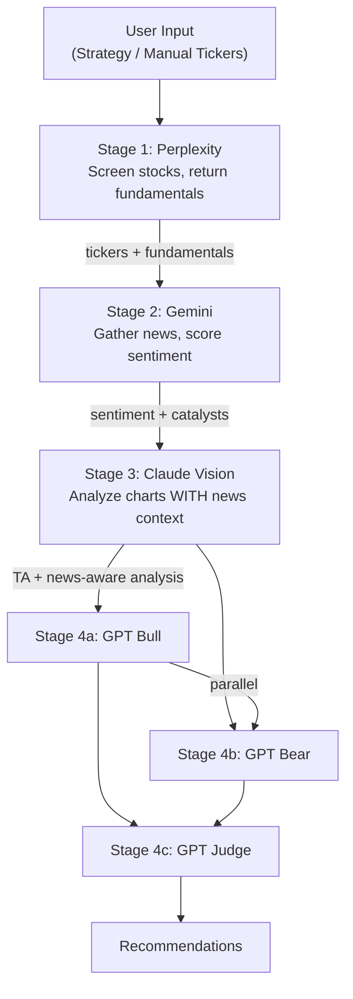

# Pipeline Reorder: Gemini Before Claude

## Motivation

Claude currently would analyze charts in isolation without knowing about recent
news catalysts. By running Gemini **first**, Claude receives news/sentiment
context alongside chart images, enabling news-aware technical analysis. For
example, Claude can correctly interpret a price gap as earnings-driven rather
than a breakout pattern when it knows about a recent earnings catalyst.

## New Pipeline Flow



**Key difference from current docs:** Claude and Gemini are no longer parallel.
The pipeline is now fully sequential through Stage 3, with only Bull/Bear GPT
calls running in parallel.

**Trade-off:** Pipeline execution is ~10-15s slower (Gemini and Claude can't
overlap). Quality improvement from news-aware chart analysis justifies this.

## Files to Update

### 1. [docs/ARCHITECTURE.md](docs/ARCHITECTURE.md) -- Section 3

- **Section 3.1 Pipeline Flow:** Replace the diagram. Gemini moves to Stage 2,
  Claude to Stage 3. Remove the parallel fork between them.
- **Section 3.4 Parallel Execution:** Update the pseudocode. The
  `asyncio.gather(claude, gemini)` call is removed. New flow:

```python
# Stage 1: Perplexity
screening = await run_perplexity_stage(config)
tickers = extract_tickers(screening, config.manual_tickers)

# Stage 2: Gemini (news gathering)
sentiment_analyses = await run_gemini_stage(tickers, config)

# Stage 3: Claude (chart analysis with news context)
chart_analyses = await run_claude_stage(tickers, config, sentiment_analyses)

# Stage 4: GPT Debate
bull_cases, bear_cases = await asyncio.gather(
    run_gpt_bull(tickers, screening, chart_analyses, sentiment_analyses, config),
    run_gpt_bear(tickers, screening, chart_analyses, sentiment_analyses, config),
)
recommendations = await run_gpt_judge(...)
```

- **Note in Section 3.4:** Claude's stage function signature now accepts
  `sentiment_analyses: list[SentimentAnalysis]` as an input. The Claude prompt
  template will include a "Recent News Context" section populated from Gemini's
  output.

### 2. [docs/PRD.md](docs/PRD.md) -- Sections 4.2 and 8

- **Section 4.2 Pipeline Execution:** Update the three-step description.
  Currently says "Claude Vision + Gemini (Parallel)". Change to:
  - Step 2: Gemini gathers news/sentiment for each ticker
  - Step 3: Claude analyzes chart images with strategy config AND Gemini's news
    context
  - Step 4: GPT bull/bear/judge debate
- **Section 8 MVP Phasing:** Swap Phase 2 and Phase 3:
  - **Phase 2: News Sentiment** -- Gemini integration, Google Search grounding,
    sentiment scoring, catalyst extraction
  - **Phase 3: Chart Analysis** -- Claude Vision + Chart-Img API. Claude
    receives Gemini sentiment data as context for chart interpretation.
    Configurable indicators per strategy.

### 3. [CLAUDE.md](CLAUDE.md) -- Pipeline Description

- Update "The core loop" paragraph: change "Claude reads charts + Gemini reads
  news (parallel)" to reflect the sequential Gemini-then-Claude flow.
- **Parallel Execution section:** Remove the `asyncio.gather(claude, gemini)`
  example. Replace with Gemini running first, then Claude receiving its output.
  Keep the bull/bear parallel example.
- **Degraded Pipeline section:** Update to note that if Gemini fails, Claude
  proceeds WITHOUT news context (graceful degradation). The Claude prompt should
  have an optional news section.

### 4. [src/backend/pipeline/orchestrator.py](src/backend/pipeline/orchestrator.py) -- Docstring/Comments

- Update the module docstring: change "Future phases add Claude, Gemini, and GPT
  stages with parallel execution" to reflect the new sequential Gemini -> Claude
  ordering.
- No code changes needed yet (Phase 1 only runs Perplexity).

## Degraded Mode Design

When Gemini fails (API error, timeout, validation failure):

- Claude still runs but without news context
- Claude's prompt omits the "Recent News Context" section
- The `PipelineResult.stage_errors` records the Gemini failure
- GPT judge is told sentiment data is unavailable

When Claude fails after receiving news:

- GPT proceeds with Perplexity fundamentals + Gemini sentiment (no chart
  analysis)
- Same degraded pattern as before, just noting chart analysis is missing

## No Schema Changes Needed

- `ChartAnalysis` Pydantic model stays the same -- news context is prompt input,
  not output
- `SentimentAnalysis` stays the same -- it's just consumed by Claude's prompt
  now
- `PipelineResult` already has both `chart_analyses` and `sentiment_analyses` as
  separate lists
