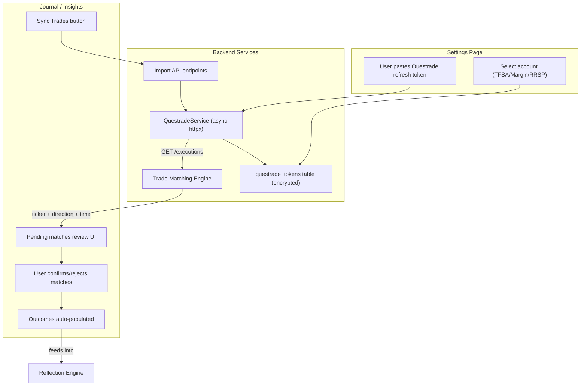
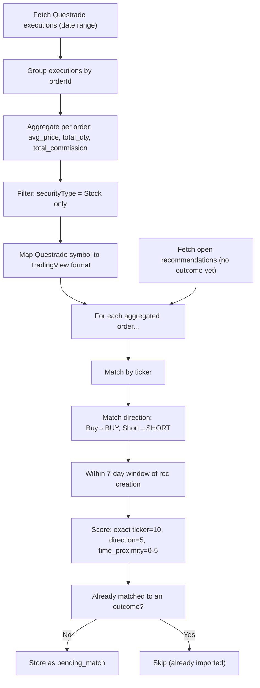

# Questrade Trade Journal Integration

## Architecture Overview



## Key Design Decisions

- **Matching**: Hybrid auto-suggest — match Questrade executions to
  recommendations by ticker + direction + time proximity, user confirms
- **Scaling**: Aggregate partial fills into single avg-price outcomes (keep
  current 1:1 outcome model)
- **Sync mode**: On-demand MVP with background polling added later
- **Unmatched trades**: Ignored — only track trades matching pipeline
  recommendations
- **Auth**: OAuth2 with single-use rotating refresh tokens stored in Supabase
- **Client**: Custom async httpx (no external Questrade library — none are
  async)

## Phase 1: Questrade Service + Token Management

### New file: `src/backend/services/questrade_service.py` (~200 lines)

Thin async httpx client following the same pattern as `fmp_service.py`:

- `QuestradeService` class with `httpx.AsyncClient`
- Token exchange via `POST https://login.questrade.com/oauth2/token`
- Auto-refresh with `asyncio.Lock` (single-use refresh tokens require atomic
  exchange)
- Dynamic `api_server` URL stored per-token (changes on every refresh)
- Methods: `get_accounts()`, `get_executions(account_id, start, end)`,
  `get_orders(account_id, start, end)`, `get_positions(account_id)`,
  `verify_connection()`

### New migration: `src/backend/database/migrations/011_questrade_tokens.sql`

```sql
CREATE TABLE questrade_tokens (
    id              TEXT PRIMARY KEY,
    user_id         TEXT NOT NULL UNIQUE,
    refresh_token   TEXT NOT NULL,
    access_token    TEXT,
    api_server      TEXT,
    account_id      TEXT,        -- selected Questrade account number
    account_type    TEXT,        -- "Margin", "TFSA", "RRSP", etc.
    expires_at      TIMESTAMPTZ,
    is_practice     BOOLEAN DEFAULT FALSE,
    connected_at    TIMESTAMPTZ DEFAULT NOW(),
    updated_at      TIMESTAMPTZ DEFAULT NOW()
);
CREATE INDEX idx_questrade_tokens_user ON questrade_tokens(user_id);
```

**Token security**: Stored as plaintext in Supabase (service_role access only,
RLS blocks anon). Same security model as all other user data. Tokens are
short-lived (30min access, single-use refresh) so exposure risk is limited.

### Critical gotcha: Single-use refresh tokens

Every token exchange invalidates the old refresh token. The service must:

1. Lock before refresh (prevent concurrent refresh attempts)
2. Exchange token
3. Persist new token to DB atomically
4. Update in-memory state
5. If persist fails, the user must re-authorize (warn in logs, return clear
   error)

## Phase 2: API Endpoints

### New file: `src/backend/api/questrade.py`

| Method | Path                               | Purpose                                                                |
| ------ | ---------------------------------- | ---------------------------------------------------------------------- |
| POST   | `/api/brokerage/connect`           | Exchange initial refresh token, store in DB, return accounts list      |
| DELETE | `/api/brokerage/disconnect`        | Revoke token, delete from DB                                           |
| GET    | `/api/brokerage/status`            | Connection status (connected, account info, token health)              |
| GET    | `/api/brokerage/accounts`          | List Questrade accounts for account selection                          |
| POST   | `/api/brokerage/select-account`    | Save which account to import from                                      |
| POST   | `/api/brokerage/sync`              | Trigger import: fetch executions, run matching, return pending matches |
| GET    | `/api/brokerage/pending-matches`   | List unconfirmed trade-to-recommendation matches                       |
| POST   | `/api/brokerage/confirm-match`     | Confirm a match — creates/updates the outcome                          |
| DELETE | `/api/brokerage/reject-match/{id}` | Reject a suggested match                                               |

## Phase 3: Trade Matching Engine

### New file: `src/backend/services/trade_matcher.py`

The matching algorithm:



**Symbol mapping** (Questrade → TradingView):

- `ENB.TO` → strip `.TO` → prepend `TSX:` → `TSX:ENB` (reverse of existing
  `EXCHANGE_SUFFIX_MAP` in
  [services/chart_image.py](src/backend/services/chart_image.py))
- `AAPL` (bare US) → keep as-is or prepend exchange from Questrade's
  `listingExchange` field
- Use `GET /v1/symbols/{symbolId}` for exchange resolution when needed

**Direction mapping** (Questrade → SignalForge):

- `Buy` → `BUY`
- `Sell` → closing a BUY position (match to existing BUY recommendation as exit)
- `Short` → `SHORT`
- `Cov` → closing a SHORT position (match to existing SHORT recommendation as
  exit)

**Aggregation**: Multiple executions for the same `orderId` get combined:

- `avg_entry_price` = volume-weighted average of fill prices
- `total_shares` = sum of quantities
- `total_commission` = sum of commission + executionFee + secFee +
  canadianExecutionFee

### New migration: `src/backend/database/migrations/012_pending_matches.sql`

```sql
CREATE TABLE pending_matches (
    id                  TEXT PRIMARY KEY,
    user_id             TEXT NOT NULL,
    recommendation_id   TEXT NOT NULL REFERENCES recommendations(id),
    questrade_order_id  TEXT NOT NULL,
    ticker              TEXT NOT NULL,
    side                TEXT NOT NULL,          -- 'Buy', 'Sell', 'Short', 'Cov'
    avg_price           REAL NOT NULL,
    total_shares        INTEGER NOT NULL,
    total_commission    REAL DEFAULT 0,
    currency            TEXT DEFAULT 'CAD',
    executed_at         TIMESTAMPTZ NOT NULL,
    match_score         REAL NOT NULL,          -- confidence of the match
    match_reason        TEXT,                   -- "ticker + direction + 2d proximity"
    status              TEXT DEFAULT 'pending', -- 'pending', 'confirmed', 'rejected'
    created_at          TIMESTAMPTZ DEFAULT NOW()
);
CREATE INDEX idx_pending_matches_user ON pending_matches(user_id);
CREATE INDEX idx_pending_matches_status ON pending_matches(user_id, status);
```

## Phase 4: Outcome Schema Extension

### Migration: `src/backend/database/migrations/013_outcome_brokerage_fields.sql`

Add nullable columns to the existing `outcomes` table (backward compatible):

```sql
ALTER TABLE outcomes ADD COLUMN source TEXT DEFAULT 'manual';
ALTER TABLE outcomes ADD COLUMN brokerage_order_id TEXT;
ALTER TABLE outcomes ADD COLUMN commission REAL;
ALTER TABLE outcomes ADD COLUMN fees REAL;
ALTER TABLE outcomes ADD COLUMN currency TEXT;
ALTER TABLE outcomes ADD COLUMN gross_pnl REAL;
ALTER TABLE outcomes ADD COLUMN net_pnl REAL;
ALTER TABLE outcomes ADD COLUMN entry_timestamp TIMESTAMPTZ;
ALTER TABLE outcomes ADD COLUMN exit_timestamp TIMESTAMPTZ;
```

### Schema updates

- [src/backend/pipeline/schemas.py](src/backend/pipeline/schemas.py): Add new
  optional fields to `OutcomeCreate` and `OutcomeResponse`
- [src/frontend/src/types/index.ts](src/frontend/src/types/index.ts): Mirror new
  fields in TypeScript interfaces
- Reflection engine: Update `_compute_metrics()` in
  [services/reflection.py](src/backend/services/reflection.py) to prefer
  `net_pnl` over `pnl_dollars` when available (commission-aware win/loss
  classification)

## Phase 5: Frontend — Settings + Journal UI

### Settings page addition ([src/frontend/src/views/SettingsView.tsx](src/frontend/src/views/SettingsView.tsx))

New "Brokerage Connection" section:

- **Not connected**: Input field for Questrade refresh token + "Connect"
  button + practice/production toggle
- **Connected**: Shows account info (type, number), "Sync Trades" button,
  "Disconnect" button, last sync timestamp

### Journal integration ([src/frontend/src/views/InsightsView.tsx](src/frontend/src/views/InsightsView.tsx))

- "Sync Trades" button in the InsightsView header (next to "Generate
  Reflection")
- When pending matches exist, show a banner: "X trades matched — Review"
- **Pending matches review**: Modal or expandable section showing each match:
  - Left side: Questrade execution (ticker, price, shares, date, commission)
  - Right side: Matched recommendation (ticker, action, confidence, suggested
    entry)
  - Buttons: "Confirm" (creates outcome) or "Reject" (dismisses)
- Confirmed matches auto-create outcomes with `source: "questrade"` and all
  brokerage fields populated

### FeedbackTab enhancement ([src/frontend/src/components/recommendations/FeedbackTab.tsx](src/frontend/src/components/recommendations/FeedbackTab.tsx))

- When a recommendation has a brokerage-sourced outcome, show a "Imported from
  Questrade" badge
- Show commission and net P&L alongside gross P&L
- Disable editing of brokerage-imported price fields (they come from real fills)

## Phase 6 (Later): Background Polling

- Add a background task that polls `GET /v1/accounts/{id}/executions` every 5
  minutes during market hours (9:30 AM - 4:00 PM ET, weekdays)
- Uses `asyncio.create_task` in FastAPI's lifespan
- Stores last poll timestamp per user to avoid re-processing
- Only active for users with a connected Questrade account
- Auto-runs matching, stores pending matches, does NOT auto-confirm

## File Impact Summary

| File                                                      | Change                                            |
| --------------------------------------------------------- | ------------------------------------------------- |
| `services/questrade_service.py`                           | **NEW** — async Questrade API client              |
| `services/trade_matcher.py`                               | **NEW** — matching engine                         |
| `api/questrade.py`                                        | **NEW** — brokerage API router (9 endpoints)      |
| `database/migrations/011_questrade_tokens.sql`            | **NEW** — token storage                           |
| `database/migrations/012_pending_matches.sql`             | **NEW** — match staging table                     |
| `database/migrations/013_outcome_brokerage_fields.sql`    | **NEW** — outcome extensions                      |
| `pipeline/schemas.py`                                     | **MODIFY** — add fields to OutcomeCreate/Response |
| `services/reflection.py`                                  | **MODIFY** — prefer net_pnl over pnl_dollars      |
| `main.py`                                                 | **MODIFY** — mount brokerage router               |
| `frontend/src/types/index.ts`                             | **MODIFY** — add brokerage types                  |
| `frontend/src/api/client.ts`                              | **MODIFY** — add brokerage API methods            |
| `frontend/src/views/SettingsView.tsx`                     | **MODIFY** — add brokerage connection UI          |
| `frontend/src/views/InsightsView.tsx`                     | **MODIFY** — sync button + pending matches        |
| `frontend/src/components/recommendations/FeedbackTab.tsx` | **MODIFY** — brokerage badge                      |

## Risk Assessment

| Risk                               | Mitigation                                                             |
| ---------------------------------- | ---------------------------------------------------------------------- |
| Token loss on crash during refresh | Lock + atomic DB write; clear error message to re-auth                 |
| Questrade API rate limits          | 30 req/s is generous; add exponential backoff on 429                   |
| False positive matches             | Hybrid confirmation — user always approves                             |
| Questrade API deprecation          | API has been stable since 2015; read-only endpoints unlikely to change |
| Multiple accounts confusion        | User explicitly selects one account in settings                        |
