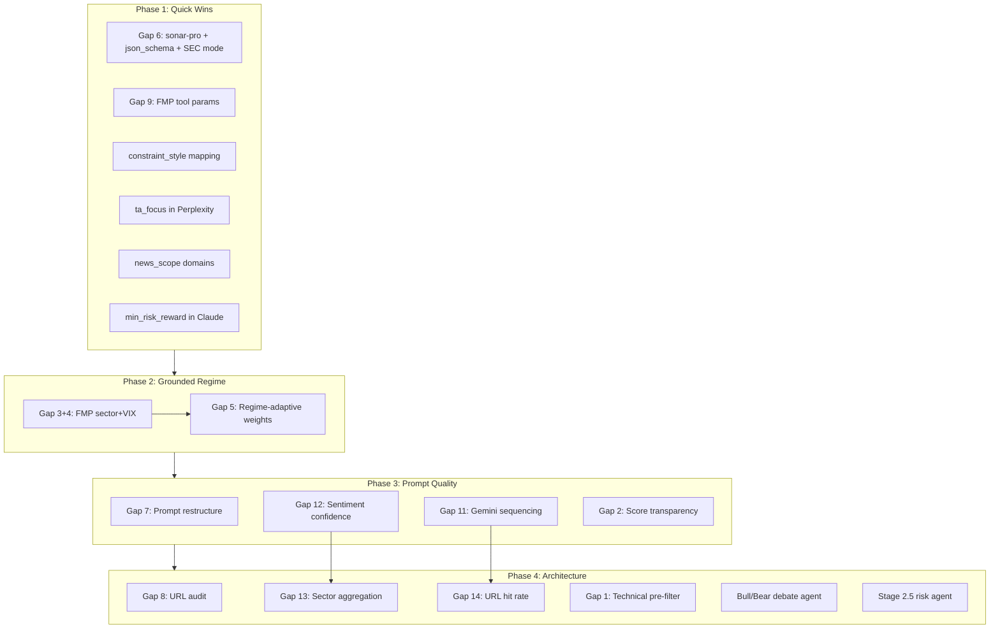

# Research Team Architecture Upgrades — Implementation Plan

Based on the
[full review document](docs/guides/SignalForge%20Research%20Team%20—%20Architecture%20Review%20&%20Upgrade%20Recommendations.md),
here is the gap-by-gap implementation plan. One finding upfront:

**Gap 10 is already implemented.** The `_build_web_search_tool()` function in
[perplexity.py](src/backend/pipeline/stages/perplexity.py) already maps
`news_recency` to `search_recency_filter`:

```151:161:src/backend/pipeline/stages/perplexity.py
recency_map = {"today": "day", "week": "week", "month": "month"}
recency = recency_map.get(config.news_recency, "week") if config else "week"
```

---

## Phase 1 — Quick Wins (config changes + small code, high impact)

### Gap 6: Upgrade Perplexity screening to `sonar-pro` + API-level optimizations

**Files:** [perplexity.py](src/backend/pipeline/stages/perplexity.py)

**Regime stays on `sonar`** — it's a lightweight single-call classifier that
doesn't need multi-step search. Only the main screening/analysis stage upgrades.

Three changes bundled together per
[sonar-pro optimization research](docs/research/sonar-pro-optimization.md):

**6a. Model upgrade:**

- Change `AGENT_MODEL = "perplexity/sonar"` to `"perplexity/sonar-pro"` in
  `perplexity.py` line 50 only (NOT `regime.py`)
- Sonar Pro runs multi-step searches, returns ~2x more citations, and benchmarks
  higher on factual accuracy for multi-company research

**6b. Native structured output via `response_format`:**

- Add
  `response_format={"type": "json_schema", "json_schema": {"schema": ScreeningResult.model_json_schema()}}`
  to the `_call_agent_api()` kwargs
- This enforces JSON schema at the API level instead of relying solely on
  prompt-level instructions + validation retry
- First request with a new schema incurs a 10-30s compilation delay; subsequent
  requests are fast
- The existing `validate_llm_json` retry loop remains as a safety net but should
  trigger far less often

**6c. SEC filing mode for earnings/value strategies:**

- For strategies with `strategy_type` in `("event", "value")`, add
  `search_mode="sec"` to the API kwargs — this searches SEC EDGAR filings (10-K,
  10-Q, 8-K) directly for fundamentals data
- Covers the last 1 year of filings; best for revenue breakdowns, risk factors,
  management guidance
- Can be combined with a follow-up web search call for real-time pricing
- Requires strategy_type to be threaded through to `_call_agent_api()` or
  handled in the public entry points

**6d. Anti-hallucination layer alignment:**

- The sonar-pro docs confirm: never ask for URLs in the user prompt (the LLM
  can't see them). URLs come from `search_results` in the API response.
- The current `_extract_citations()` from `SearchResultsOutputItem` is already
  correct. The `sources` field in `FundamentalData` (populated by the LLM)
  should be treated as contextual references only — reinforces Gap 8 audit.

### Gap 9: Add missing FMP tool parameters

**File:** [fmp_tool.py](src/backend/pipeline/tools/fmp_tool.py)

- `altman_z_min` and `is_etf` are missing from `FMP_TOOL_DEFINITION`
- `beta_max`, `price_max`, and `piotroski_min` are already present (report was
  partially wrong here)
- Add 2 new parameter entries to the `properties` dict
- Wire `altman_z_min` and `is_etf` through to `execute_fmp_tool()` arguments
  pass-through (currently `screen_stocks_from_params` already accepts
  `altman_z_min` implicitly via kwargs but not `is_etf` — verify)

### Cross-cutting: `constraint_style` to `search_context_size`

**File:** [perplexity.py](src/backend/pipeline/stages/perplexity.py)

Per the
[sonar-pro optimization research](docs/research/sonar-pro-optimization.md),
`search_context_size` controls retrieval depth at the API level — `"high"` for
thorough analysis, `"medium"` for quick news.

- Add `web_search_options={"search_context_size": size}` to the API kwargs in
  `_call_agent_api()` or `_build_web_search_tool()`:
  - `tight` constraint_style maps to `"high"` (more sources, higher confidence)
  - `loose` maps to `"medium"` (faster, fewer sources)
- Requires threading `config.constraint_style` into `_call_agent_api` or
  embedding it in the web_search tool definition

### Cross-cutting: Inject `ta_focus` into Perplexity system prompt

**File:**
[perplexity_discovery.py](src/backend/pipeline/prompts/perplexity_discovery.py)

- In `build_system_prompt()`, accept an optional `ta_focus: str | None`
  parameter
- Append a line like:
  `"TECHNICAL FOCUS: The user's strategy targets stocks exhibiting {ta_focus} patterns. Prioritize candidates showing these technical characteristics in recent price action."`
- Update callers in `_build_dynamic_system_prompt()` in
  [perplexity.py](src/backend/pipeline/stages/perplexity.py) to pass
  `config.ta_focus`

### Cross-cutting: Inject `news_scope` into Perplexity domain filter

**File:** [perplexity.py](src/backend/pipeline/stages/perplexity.py)

- In `_get_domain_set()`, when `config.news_scope == "macro"`, append
  macro-focused domains: `"federalreserve.gov"`, `"bls.gov"`, `"statscan.gc.ca"`
  to the domain list

### Cross-cutting: Inject `risk_params.min_risk_reward` into Claude prompt

**File:** [claude_chart.py](src/backend/pipeline/prompts/claude_chart.py)

- After the `ta_focus` injection (line 154), add:
  `"Risk/reward requirement: Only flag as BUY if price structure shows R:R >= {config.risk_params.min_risk_reward}. If not identifiable from chart, flag as HOLD."`

---

## Phase 2 — FMP-Grounded Regime Classifier (medium effort, high impact)

### Gap 3 + Gap 4: Replace LLM estimation with real FMP data

**Files:** [regime.py](src/backend/pipeline/stages/regime.py),
[regime_classifier.py](src/backend/pipeline/prompts/regime_classifier.py),
[fmp_service.py](src/backend/services/fmp_service.py),
[orchestrator.py](src/backend/pipeline/orchestrator.py)

The `fetch_sector_performance()` function already exists in `fmp_service.py`
(line 674) but is never called by the pipeline. The plan:

1. **Add FMP VIX fetch** — new function `fetch_vix_quote()` in `fmp_service.py`
   calling `/stable/quote/^VIX` (or `/api/v3/quote/^VIX`)
2. **Add VIX-to-label mapping** — `vix < 15 → "calm"`, `15-20 → "normal"`,
   `20-30 → "elevated"`, `>30 → "fear"`
3. **Restructure orchestrator** — move FMP sector + VIX fetches to run
   concurrently with (or just before) the regime classifier call:

```python
# In orchestrator.py, before the regime classifier
sector_perf, vix_quote = await asyncio.gather(
    fetch_sector_performance(),
    fetch_vix_quote(),
)
```

1. **Restructure regime prompt** — change `build_regime_prompt()` to accept
   `sector_data` and `vix_level` parameters, embedding them as ground-truth data
   blocks. The LLM's job becomes interpreting the data and writing
   `implications`, not estimating the numbers.
2. **Bump `PROMPT_VERSION`** to `"v2"` in `regime_classifier.py`

### Gap 5: Regime-adaptive FMP scoring weights

**Files:** [orchestrator.py](src/backend/pipeline/orchestrator.py),
[fmp_service.py](src/backend/services/fmp_service.py) (or a new utility)

1. **Add weight delta table** — a dict mapping `regime_type` to weight
   adjustments (the exact table from the report)
2. **Apply before scoring** — in the orchestrator, after `classify_regime()`
   returns and before `screen_and_enrich()` runs, apply the weight deltas to
   `config.fmp_screener` weight fields
3. **Problem:** Currently `screen_and_enrich` runs before `classify_regime` in
   the orchestrator (Stage 0 before Stage 0.5). This requires **reordering**:
   either run regime first (it's fast, one Perplexity call), or split FMP into
   screen+enrich (pre-regime) and scoring (post-regime)
4. **Recommended approach:** Split the flow — FMP screening + enrichment runs
   first, then regime, then composite scoring with regime-adjusted weights, then
   Perplexity. This changes orchestrator Stage 0/0.5 ordering.

---

## Phase 3 — Prompt Quality Upgrades (medium effort, medium-high impact)

### Gap 7: Restructure Perplexity prompt per sonar-pro best practices

**Files:**
[perplexity_discovery.py](src/backend/pipeline/prompts/perplexity_discovery.py),
[perplexity.py](src/backend/pipeline/stages/perplexity.py)

Per [sonar-pro optimization research](docs/research/sonar-pro-optimization.md),
Sonar Pro's search component and language generation component operate
independently. The user prompt (`input`) triggers the web search; the system
prompt (`instructions`) controls output format. These must not compete.

Current anti-pattern in `build_discovery_prompt()`:
`"Find Canadian TSX stocks showing strong momentum... as of March 30 top 10 picks"`

This mixes search-triggering keywords with generation instructions. The
sonar-pro docs explicitly warn against this.

**Restructure into two clean layers:**

- `**input` (search-optimized):
  `"Canadian TSX momentum breakout stocks high relative volume analyst upgrades {today} {session} sector leaders"`
- `**instructions` (generation-focused): JSON schema, anti-hallucination rules,
  market constraints, FMP trust block (already in system prompt)

Key rules from the sonar-pro research:

- Never include few-shot examples in user prompt (triggers searches for
  examples)
- Never ask for URLs in user prompt (LLM can't see search URLs)
- One topic per user message (multi-topic fragments search quality)
- Include ticker symbols, timeframes, specific metrics in user prompt

Bump `PROMPT_VERSION` to `"v16"`

### Gap 11: Gemini prompt sequencing (URL-first)

**File:**
[gemini_sentiment.py](src/backend/pipeline/prompts/gemini_sentiment.py)

- Restructure `SENTIMENT_SYSTEM_PROMPT` into explicit STEP 1/2/3 ordering:
  - STEP 1: Read provided URLs (mandatory)
  - STEP 2: Perform ONE additional search
  - STEP 3: Synthesize into JSON
- Counteracts documented Gemini 2.5 Pro behavior of ignoring pre-provided URLs
  in favor of its own grounding search
- Bump `PROMPT_VERSION` to `"v6"`

### Gap 12: Add `confidence` field to `SentimentAnalysis`

**Files:** [schemas.py](src/backend/pipeline/schemas.py),
[gemini_sentiment.py](src/backend/pipeline/prompts/gemini_sentiment.py),
[types/index.ts](src/frontend/src/types/index.ts)

- Add `confidence: float = Field(ge=0.0, le=1.0, default=0.5)` to
  `SentimentAnalysis`
- Update the JSON schema in `SENTIMENT_SYSTEM_PROMPT` to include `confidence`
  with the scoring guide (source authority, count, recency, consistency)
- Update the TypeScript `SentimentAnalysis` interface to match
- Bump prompt version

### Gap 2: Composite score transparency in downstream prompts

**File:** [fmp_context.py](src/backend/pipeline/fmp_context.py)

- In `format_fmp_for_claude()` and `format_fmp_for_gpt()`, expand each
  dimensional score to show its raw drivers:
  - Momentum score 91 shows `(3m: +47%, rvol: 2.8x)`
  - Fundamental score 72 shows `(ROE: 18%, PE: 14)`
  - Quality score 68 shows `(Piotroski: 7, Altman: 3.2)`
  - Sentiment score 65 shows `(insider: NET BUY, analyst upside: +14%)`
- This enriches the text blocks without changing any function signatures

---

## Phase 4 — Architectural Additions (high effort, high impact)

### Gap 8: Audit URL source integrity

**Files:** [perplexity.py](src/backend/pipeline/stages/perplexity.py),
[schemas.py](src/backend/pipeline/schemas.py)

- Current state: `_distribute_citations()` correctly populates `news_urls` from
  API-level `SearchResultsOutputItem` citations. The `sources` field in
  `FundamentalData` IS populated by the LLM's generated JSON (potential
  hallucination risk).
- Action: Add a docstring/comment clarifying that `sources` are LLM-generated
  references (not verified URLs). Consider renaming to `source_names` to
  distinguish from navigable URLs. Optionally cross-check `sources` against
  `citations` and flag unmatched ones.

### Gap 13: Sector sentiment aggregation before GPT

**Files:** [orchestrator.py](src/backend/pipeline/orchestrator.py),
[gpt_debate.py](src/backend/pipeline/prompts/gpt_debate.py)

- After `run_sentiment()` returns, aggregate `sector_sentiment` by sector:
  - Group sentiments by `FundamentalData.sector`
  - Compute median `sector_sentiment.score` per sector
  - Find most common `key_driver` per sector
- Format as a `SECTOR SENTIMENT CONSENSUS` block and pass to `run_debate()` as a
  new parameter
- Inject into GPT prompts as a pre-header

### Gap 14: URL hit rate monitoring

**Files:** [orchestrator.py](src/backend/pipeline/orchestrator.py)

- After Gemini completes, for each ticker compare `key_catalysts[].url` against
  the `ticker_news` URLs that were provided
- Log `provided_url_hit_rate` metric per ticker in metadata
- If rate drops below 30% consistently, it signals Gap 11's prompt fix needs
  revisiting

### Gap 1: FMP technical pre-filter

**Files:** [fmp_service.py](src/backend/services/fmp_service.py),
[orchestrator.py](src/backend/pipeline/orchestrator.py) or inline in
`screen_and_enrich()`

- Add `fetch_technical_indicator(symbol, timeframe, indicator_type, period)`
  calling
  `/api/v3/technical_indicator/{timeframe}/{symbol}?type={type}&period={period}`
- After composite scoring and before sector cap, run RSI check on top-N
  candidates
- Reject overbought (>75) for momentum strategies, reject oversold (<30) for
  mean-reversion (inverted)
- This adds ~20 FMP calls per run but prevents technically invalid candidates
  from consuming Perplexity/Gemini/Claude credits

### Bull/Bear Debate Agent (new architecture)

**Files:** [perplexity.py](src/backend/pipeline/stages/perplexity.py),
[orchestrator.py](src/backend/pipeline/orchestrator.py)

- When `enable_debate: true`, run two parallel Perplexity discovery calls with
  opposed prompt suffixes (bull catalysts vs. bear risks)
- Merge results: overlap = high conviction, bull-only = speculative, bear-only =
  risk-flagged
- Pass conviction markers to GPT
- This is the highest-effort change and should be implemented last

### Stage 2.5: Risk management micro-agent

**Files:** New stage file,
[orchestrator.py](src/backend/pipeline/orchestrator.py)

- Lightweight LLM call (GPT-4o-mini or Claude Haiku) between Gemini and Claude
- Takes sentiment output + `risk_params` as hard constraints
- Outputs `risk_adjusted_score` per ticker; tickers below threshold demoted to
  HOLD before expensive Claude chart analysis
- Prevents wasted Claude API spend on structurally ineligible candidates

---

## Ordering and Dependencies



## What is NOT changing

- **Gap 10** — already implemented (recency filter mapping at line 151 of
  `perplexity.py`)
- **Regime classifier stays on `sonar`** — lightweight single-call classifier
  that doesn't need multi-step search; `sonar-pro` would add cost with no
  meaningful quality gain for this task
- Pipeline stage contract pattern (validate → retry → degrade) is sound
- FMP 9-step enrichment pipeline is sound
- Citation extraction from `SearchResultsOutputItem` is correct
- Concurrency patterns (semaphores, asyncio.gather) are correct
