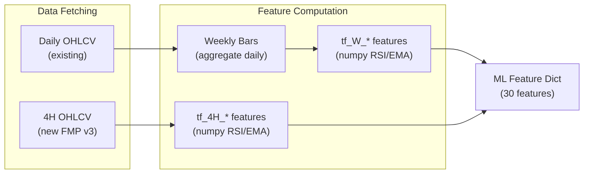

# Scanner: Multi-Timeframe, Filters, and Actionable Toggle

## Current State

The scanner currently:

- Fetches **daily-only** OHLCV via `fetch_ohlcv_stable()` (FMP
  `/stable/historical-price-eod/full`)
- Passes **22 of 48** expected features to ML models -- 8 multi-timeframe
  features are always NaN
- `tf_W_rsi_14` is the **#1 most important feature** (SHAP 0.21) but is never
  populated
- `runScan()` takes **zero parameters** -- filters are disconnected from scanner
- No way to filter out weak setups that will result in WATCH/HOLD at pipeline
  time

---

## Part 1: Multi-Timeframe Features (Weekly + 4H)

### Strategy

- **Weekly**: Aggregate existing daily candles into weekly bars using numpy.
  Zero extra API calls.
- **4H**: Fetch from FMP v3 `/historical-chart/4hour/{symbol}` (NOT the
  deprecated `/technical_indicator/` endpoint that 403'd). Batch 20 at a time
  with 0.5s delays, same as daily.

### 8 Features to Populate

| Feature                  | Timeframe | Source                                 |
| ------------------------ | --------- | -------------------------------------- |
| `tf_W_rsi_14`            | Weekly    | Computed from aggregated daily candles |
| `tf_W_price_vs_ema_200`  | Weekly    | Computed from aggregated daily candles |
| `tf_W_ema_stack_score`   | Weekly    | Computed from aggregated daily candles |
| `tf_W_momentum_score`    | Weekly    | Computed from aggregated daily candles |
| `tf_4H_rsi_14`           | 4-Hour    | FMP v3 intraday endpoint               |
| `tf_4H_price_vs_ema_200` | 4-Hour    | FMP v3 intraday endpoint               |
| `tf_4H_ema_stack_score`  | 4-Hour    | FMP v3 intraday endpoint               |
| `tf_4H_momentum_score`   | 4-Hour    | FMP v3 intraday endpoint               |

### Files to Change

**[src/backend/services/technical_analysis.py](src/backend/services/technical_analysis.py)**

- Add `fetch_intraday_ohlcv(symbol, timeframe="4hour", limit=200)` using FMP v3
  `/historical-chart/4hour/{symbol}` -- this is a different endpoint from the
  deprecated `/technical_indicator/` path
- Add `aggregate_daily_to_weekly(candles)` that groups daily candles by ISO week
  and returns weekly OHLCV bars
- Add `compute_tf_features(candles, label)` that takes OHLCV candles + timeframe
  label ("W" or "4H") and returns dict with the 4 prefixed features:
  `{tf_{label}_rsi_14, tf_{label}_price_vs_ema_200, tf_{label}_ema_stack_score, tf_{label}_momentum_score}`

**[src/backend/services/strategy_scanner.py](src/backend/services/strategy_scanner.py)**

- Update `_fetch_all_ta()` to also fetch 4H candles (batched) and aggregate
  daily-to-weekly
- Store the 8 tf features on `TickerFeatures` dataclass (add 8 new fields)
- Update `_quick_ml_score()` to include the 8 `tf` features in `ta_dict`

### Data Flow



### Performance Impact

- Weekly: **Zero** extra API calls (computed from existing daily data)
- 4H: ~20 extra batched API calls for 400 tickers (20/batch). Adds ~15-20s to
  scan time.
- Consider making 4H optional (feature flag) if scan time becomes a concern

---

## Part 2: Wire Screener Filters into Scanner

### Current Disconnect

The frontend has filter dropdowns (country, exchange, sector, market cap) in
`SearchScreen.tsx` at lines 115-119, but `buildOverrides()` only sends them to
the LLM pipeline via `ScreenerOverrides`. The scanner's `runScan()` is a
parameterless POST.

### Files to Change

**[src/backend/api/scanner.py](src/backend/api/scanner.py)**

- Add a Pydantic request body model `ScannerRunRequest` with optional fields:
  `country`, `exchange`, `sector`, `market_cap_min`, `market_cap_max`, `limit`
  (default 400)
- Update `POST /scanner/run` to accept this body and pass filters to
  `scanner.run_scan()`

**[src/backend/services/strategy_scanner.py](src/backend/services/strategy_scanner.py)**

- Update `run_scan()` signature to accept optional filter params
- Update `_fetch_universe()` to use the passed filters instead of hardcoded
  values:

Currently hardcoded at line ~380:

```python
config = FmpScreenerConfig(
    market_cap_min=500_000_000,
    volume_min=500_000,
    price_min=5.0,
    limit=400,
    is_actively_trading=True,
)
```

Change to merge user filters (country, exchange, sector, market_cap range) into
this config.

**[src/frontend/src/api/client.ts](src/frontend/src/api/client.ts)**

- Update `runScan()` to accept an optional filters object and send as POST body:

```typescript
runScan: (filters?: ScannerFilters) =>
  request<{ scan_run_id: string; status: string }>("/api/scanner/run", {
    method: "POST",
    body: filters ? JSON.stringify(filters) : undefined,
  }),
```

**[src/frontend/src/hooks/useScanner.ts](src/frontend/src/hooks/useScanner.ts)**

- Update the `runScan` function to accept and forward filter params

**[src/frontend/src/components/search/SearchScreen.tsx](src/frontend/src/components/search/SearchScreen.tsx)**

- Pass filter state (country, exchange, sector, market cap) to
  `PrescreenerPanel` as props

**[src/frontend/src/components/search/PrescreenerPanel.tsx](src/frontend/src/components/search/PrescreenerPanel.tsx)**

- Accept filter props and pass them to `useScanner().runScan(filters)` when "Run
  Prescreener" is clicked
- Show active filter count on the panel header (e.g., "Prescreener (3 filters)")

**[src/frontend/src/types/index.ts](src/frontend/src/types/index.ts)**

- Add `ScannerFilters` interface:

```typescript
export interface ScannerFilters {
  country?: string;
  exchange?: string;
  sector?: string;
  market_cap_min?: number;
  market_cap_max?: number;
}
```

### Result

Selecting "Canada" + "Technology" in the filter dropdowns, then clicking "Run
Prescreener" will fetch only Canadian tech stocks from FMP's screener API, scan
those ~100-400 tickers, and return results filtered to that universe.

---

## Part 3: Actionable-Only Toggle

### Problem

The scanner shows 300+ setups, but when run through the pipeline, many produce
WATCH/HOLD recommendations. The user wants to filter these out pre-pipeline.

### Approach

Since the scanner runs before the pipeline (no GPT judgment available), we use
**score thresholds** as a proxy for actionability:

- **Actionable**: `combined_score >= 0.70` AND `ml_probability >= 0.65` (when ML
  available)
- **Watchlist**: Everything else above `MIN_COMBINED_SCORE` (0.50)

### Files to Change

**[src/backend/services/strategy_scanner.py](src/backend/services/strategy_scanner.py)**

- Add a computed `is_actionable` boolean field to `ScanResult`:

```python
is_actionable: bool = False  # True when combined_score >= 0.70 and ml_prob >= 0.65
```

- Set this field during result construction based on score thresholds
- Persist `is_actionable` to Supabase `scanner_results` table

**[src/backend/api/scanner.py](src/backend/api/scanner.py)**

- Add `actionable_only: bool = False` query param to `GET /scanner/latest`
- When `True`, filter results to only return items where `is_actionable == True`

**[src/frontend/src/types/index.ts](src/frontend/src/types/index.ts)**

- Add `is_actionable: boolean` to `ScannerResultItem`

**[src/frontend/src/components/search/ScannerResultsGrid.tsx](src/frontend/src/components/search/ScannerResultsGrid.tsx)**

- Add a toggle switch in the grid header: "Actionable Only"
- When enabled, filter displayed results to `is_actionable === true`
- Update strategy group counts to reflect filtered totals
- Store toggle state in localStorage for persistence

**[src/frontend/src/components/search/PrescreenerPanel.tsx](src/frontend/src/components/search/PrescreenerPanel.tsx)**

- Pass the toggle state down to `ScannerResultsGrid` or lift it up to
  SearchScreen

### Visual Indicator

Each ticker row in `ScannerResultsGrid` should show a subtle visual indicator:

- Actionable setups: normal display (signal-colored border, full opacity)
- Watch-tier setups (when toggle is off): slightly dimmed, with a "WATCH" chip

---

## Also Fill Missing Daily Features

While implementing multi-timeframe, we should also fill several **daily**
features that are currently NaN. These can be computed from the existing daily
OHLCV data with zero extra API calls:

| Feature            | Computation                                         |
| ------------------ | --------------------------------------------------- |
| `price_change_1d`  | `(close - prev_close) / prev_close * 100`           |
| `price_change_5d`  | `(close - close_5d_ago) / close_5d_ago * 100`       |
| `price_change_20d` | Already in `distance_from_20d_` logic, just extract |
| `bollinger_width`  | `(2 * std(close, 20) / sma(close, 20)) * 100`       |
| `volatility_20d`   | `std(daily_returns, 20) * 100`                      |
| `high_low_range`   | `(high - low) / close * 100`                        |
| `gap_pct`          | `(open - prev_close) / prev_close * 100`            |

This would bring coverage from **22/48 to 37/48** features (before multi-TF), or
**37+8 = 45/48** with multi-TF. The remaining 3 (`ffd_close`, `ffd_return_1d`,
`primary_signal`) require FFD computation which is complex and low SHAP
importance -- skip for now.

---

## Build Order

1. **Part 1a**: Weekly features from daily data (zero API cost, fills #1 SHAP
   feature)
2. **Part 1b**: Fill missing daily features (zero API cost, +7 features)
3. **Part 2**: Wire screener filters (frontend + backend, independent of Part 1)
4. **Part 1c**: 4H features from FMP intraday (adds API calls, test 403 risk)
5. **Part 3**: Actionable toggle (depends on having good ML scores from Parts
   1a/1b)

---

## Database Migration

Add `is_actionable BOOLEAN DEFAULT FALSE` column to `scanner_results` table
(small ALTER TABLE, no new migration file needed -- can use Supabase MCP).
