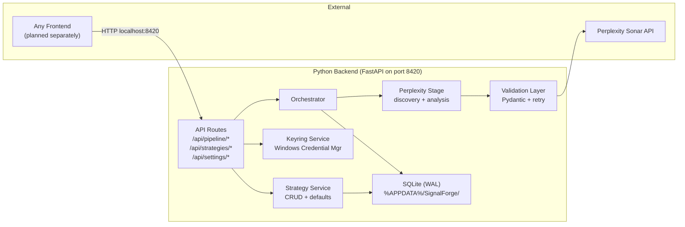

# SignalForge Phase 1: Python Backend -- Screening Foundation

Phase 1 delivers the Python backend only: Perplexity screens stocks/crypto,
validates results via Pydantic, stores in SQLite, and exposes a clean REST API.
The frontend (React + Tailwind) and Tauri desktop shell will be planned and
built separately by another AI.

## Key Decisions

- **Python 3.14** with `uv` (per user preference, not 3.12 from CLAUDE.md)
- **Crypto included from start** -- `asset_type` field in schemas, Perplexity
  prompts cover both stocks and crypto
- **Build only what Phase 1 needs** -- no empty placeholder modules for future
  stages
- **Backend only** -- frontend and Tauri shell are out of scope for this plan
- **AppData storage** -- SQLite DB, chart images, and logs stored in
  `%APPDATA%\SignalForge\` (not in the project tree), following the pattern in
  [docs/appdata-storage-pattern.md](docs/appdata-storage-pattern.md)

## 1. Project Setup

Create `src/backend/` with these files:

- `pyproject.toml` -- uv project config targeting py314, dependencies:
  `fastapi`, `uvicorn[standard]`, `pydantic>=2.0`, `httpx`, `openai` (Perplexity
  uses OpenAI-compatible API), `keyring`, `aiosqlite`, `platformdirs`
- `main.py` -- FastAPI app entry point, CORS middleware (permissive for local
  dev -- any frontend can connect), lifespan handler for DB init + AppData dir
  creation
- `config.py` -- app configuration (port 8420) + `AppDataPaths` class that
  resolves all storage paths under `%APPDATA%\SignalForge\` using
  `platformdirs.user_data_dir("SignalForge")`. Exposes: `db_path`, `charts_dir`,
  `logs_dir`. Creates directories on first access.

## 2. Database Layer (`database/`)

- `connection.py` -- async SQLite connection pool, WAL mode at connect time,
  `aiosqlite`
- `migrations/001_initial.sql` -- full schema from
  [docs/ARCHITECTURE.md](docs/ARCHITECTURE.md) section 4: `strategies`,
  `pipeline_runs`, `stage_outputs`, `chart_images`, `recommendations`,
  `decisions`, `outcomes`, `reflections` tables + indexes. Create all tables now
  even if Phase 1 only writes to a few -- avoids migration pain later.

## 3. Pipeline Layer (`pipeline/`)

- `schemas.py` -- Pydantic models: `FundamentalData`, `ScreeningResult` (as
  defined in [docs/ARCHITECTURE.md](docs/ARCHITECTURE.md) section 3.2). Add
  `asset_type: Literal["stock", "etf", "crypto"]` field to `FundamentalData` for
  crypto support.
- `validation.py` -- `@with_validation_retry` decorator: call LLM, parse JSON,
  validate Pydantic, retry with error context on failure (max 2 retries). This
  is the core retry pattern from [CLAUDE.md](CLAUDE.md).
- `stages/perplexity.py` -- Perplexity Sonar integration via `openai` SDK
  (compatible API). Two modes: discovery (screen market) and analysis (research
  given tickers). Rate limiting via semaphore.
- `prompts/perplexity_discovery.py` -- Discovery prompt template with
  `PROMPT_VERSION` constant + `get_prompt_hash()`. Prompt accepts
  `StrategyConfig` and covers both stocks and crypto.
- `prompts/perplexity_analysis.py` -- Analysis prompt template for researching
  user-provided tickers.
- `orchestrator.py` -- Pipeline execution engine. Phase 1: only runs Perplexity
  stage. Returns `PipelineResult` with empty chart/sentiment/recommendation
  lists. Tracks timing and errors.

## 4. Services Layer (`services/`)

- `keyring_service.py` -- API key CRUD via `keyring` library (Windows Credential
  Manager). Service name: "signalforge". Providers: "perplexity" (and
  placeholders for "anthropic", "google", "openai", "chartimg").
- `strategy.py` -- Strategy CRUD service. Loads a single hardcoded "Default
  Screener" strategy on first run. Reads/writes `strategies` table.

## 5. API Layer (`api/`)

- `pipeline.py` -- `POST /api/pipeline/run` (trigger run),
  `GET /api/pipeline/status/{id}` (poll status), `GET /api/pipeline/runs`
  (list), `GET /api/pipeline/runs/{id}` (detail)
- `strategies.py` -- `GET /api/strategies` (list),
  `GET /api/strategies/templates` (list templates)
- `settings.py` -- `POST /api/settings/api-keys` (store key),
  `GET /api/settings/api-keys/status` (check configured)
- Health endpoint: `GET /health` in `main.py`

## 6. Utilities (`utils/`)

- `hashing.py` -- prompt version hash helper (`sha256` truncated to 8 chars)

## 7. Project Root Config

- `.gitignore` -- Python, .env, **pycache**, .venv, .db (no data/ dir needed in
  project tree since everything goes to AppData)
- Update `CLAUDE.md` to reflect py314, crypto support, AppData storage decisions

## Phase 1 Backend Architecture



## File Tree (Phase 1)

### Source tree (in repo)

```
signalforge/
├── src/
│   └── backend/
│       ├── pyproject.toml
│       ├── main.py
│       ├── config.py
│       ├── database/
│       │   ├── __init__.py
│       │   ├── connection.py
│       │   └── migrations/
│       │       └── 001_initial.sql
│       ├── pipeline/
│       │   ├── __init__.py
│       │   ├── schemas.py
│       │   ├── validation.py
│       │   ├── orchestrator.py
│       │   ├── stages/
│       │   │   ├── __init__.py
│       │   │   └── perplexity.py
│       │   └── prompts/
│       │       ├── __init__.py
│       │       ├── perplexity_discovery.py
│       │       └── perplexity_analysis.py
│       ├── services/
│       │   ├── __init__.py
│       │   ├── keyring_service.py
│       │   └── strategy.py
│       ├── api/
│       │   ├── __init__.py
│       │   ├── pipeline.py
│       │   ├── strategies.py
│       │   └── settings.py
│       └── utils/
│           ├── __init__.py
│           └── hashing.py
├── templates/
│   └── strategies.json
├── docs/
│   ├── ARCHITECTURE.md
│   ├── PRD.md
│   ├── appdata-storage-pattern.md
│   └── signalforge_pipeline_architecture.svg
├── .gitignore
└── CLAUDE.md
```

### Runtime data (AppData -- NOT in repo)

Following the pattern from
[docs/appdata-storage-pattern.md](docs/appdata-storage-pattern.md), all
persistent data lives in the OS-standard AppData directory. Resolved via
`platformdirs`:

```
%APPDATA%\SignalForge\                  (Windows: C:\Users\Steve\AppData\Roaming\SignalForge\)
~/Library/Application Support/SignalForge/  (macOS)
~/.config/SignalForge/                      (Linux)
├── databases/
│   └── signalforge.db                  SQLite database (WAL mode)
├── charts/
│   └── (chart PNGs downloaded by Chart-Img API in later phases)
└── logs/
    └── (application logs)
```

The `config.py` module exposes an `AppDataPaths` class:

```python
from platformdirs import user_data_dir

APP_NAME = "SignalForge"

class AppDataPaths:
    def __init__(self) -> None:
        self.base_dir = Path(user_data_dir(APP_NAME, appauthor=False))

    @property
    def db_path(self) -> Path:
        return self.base_dir / "databases" / "signalforge.db"

    @property
    def charts_dir(self) -> Path:
        return self.base_dir / "charts"

    @property
    def logs_dir(self) -> Path:
        return self.base_dir / "logs"

    def ensure_directories(self) -> None:
        for d in [self.db_path.parent, self.charts_dir, self.logs_dir]:
            d.mkdir(parents=True, exist_ok=True)
```
