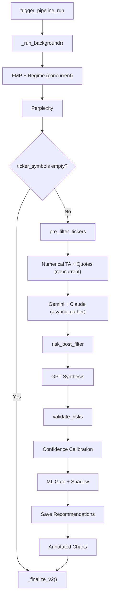

# V2 Pipeline Audit Fix

## Architecture — Current v2 Pipeline Flow



## Bugs Found (8 total, all in [orchestrator.py](src/backend/pipeline/orchestrator.py))

### Bug 1 (CRITICAL): Annotate stage never saves stage_output in v2

The `annotate` stage is in `_STAGE_ORDER` but the v2 pipeline never calls
`_save_stage_output` for it. The progress bar is permanently stuck at 5/6 even
after completion. Compare v1 (lines ~917-927) which explicitly saves.

**Fix:** Add `_save_stage_output(run_id, {"stage": "annotate", ...})` after the
annotated charts block in `_run_pipeline_v2`, plus a "skipped" save when there
are no chart analyses.

### Bug 2 (HIGH): Perplexity saves empty dict on error (no-op)

Line ~1191:
`await _save_stage_output(run_id, stage_metadata if screening else {})` — when
Perplexity fails, `screening` is `None`, so `{}` is passed. But
`_save_stage_output` has `if not metadata: return` (line ~1700), making this a
no-op. Progress shows Perplexity as "pending" forever on failure.

**Fix:** Save an explicit error row when Perplexity fails:

```python
if not screening:
    await _save_stage_output(run_id, {
        "stage": "perplexity", "status": "error", "model": "", "duration_ms": 0,
        "raw_response": "", "error": "Screening returned no results",
    })
```

### Bug 3 (HIGH): GPT error statuses not recognized by progress endpoint

The GPT stage saves errors with status `"api_error"` or `"validation_failed"`
(in `stages/gpt.py`), but the progress endpoint's `_stage_status()` only checks
for `counts.get("error", 0)`. When ALL GPT sub-stages fail with non-standard
statuses, the progress bar shows GPT as "running" forever.

**Fix:** In [pipeline.py](src/backend/api/pipeline.py) `_stage_status()`, count
any status that isn't `"success"`, `"skipped"`, `"pending"`, or `"running"` as
an error:

```python
errors = sum(v for k, v in counts.items() if k not in ("success", "skipped"))
```

### Bug 4 (HIGH): asyncio.gather loses successful track results on partial failure

When one of Gemini/Claude fails in `asyncio.gather`, the destructuring
`gemini_result, claude_result = await asyncio.gather(...)` never executes. The
successful track's in-memory results are lost (stage_outputs ARE saved to DB
since the wrappers save immediately, but the in-memory
`result.sentiment_analyses` / `result.chart_analyses` stays empty). The salvage
logic then re-runs BOTH tracks from scratch, wasting API calls.

**Fix:** Use `return_exceptions=True` and check each result individually:

```python
raw_results = await asyncio.gather(
    asyncio.wait_for(_track_b_gemini(), ...),
    asyncio.wait_for(_track_c_claude(), ...),
    return_exceptions=True,
)
if isinstance(raw_results[0], BaseException):
    result.stage_errors.append({"stage": "gemini", ...})
else:
    gemini_result = raw_results[0]
# same for raw_results[1]
```

Remove the salvage/retry logic since each track already saves to DB inside its
wrapper.

### Bug 5 (HIGH): FMP error row not saved when task throws

When `fmp_enabled=True` but `_fmp_screening()` raises an exception, lines
1091-1093 catch it and append to `stage_errors`, but no `_save_stage_output` is
called with `stage: "fmp"`. Progress shows FMP as "pending" forever.

**Fix:** Save an error stage_output in the FMP except block.

### Bug 6 (HIGH): Three unwrapped stages can crash the background task

`risk_post_filter`, `validate_risks`, and the confidence calibration block have
no try/except. An exception in any of them crashes the pipeline, losing all
downstream work. The outer `_run_background()` catch saves it as "failed" but
overwrites any partial `stage_errors`.

**Fix:** Wrap each in try/except, append to `stage_errors`, and continue to let
downstream stages attempt graceful degradation.

### Bug 7 (MEDIUM): v2 save_recommendations failure not tracked

Unlike v1 which tracks `recs_saved` and downgrades status to "partial", v2 logs
the error but doesn't track it. `_finalize_v2` has no way to know
recommendations failed to persist.

**Fix:** Track `recs_saved` in v2 and pass it to `_finalize_v2` for status
determination, matching v1 behavior.

### Bug 8 (LOW): Dead code — first_pending_set

In the progress endpoint, `first_pending_set` is computed but never used. Remove
it.

## Files to Change

- [src/backend/pipeline/orchestrator.py](src/backend/pipeline/orchestrator.py) —
  Bugs 1, 2, 4, 5, 6, 7
- [src/backend/api/pipeline.py](src/backend/api/pipeline.py) — Bugs 3, 8
