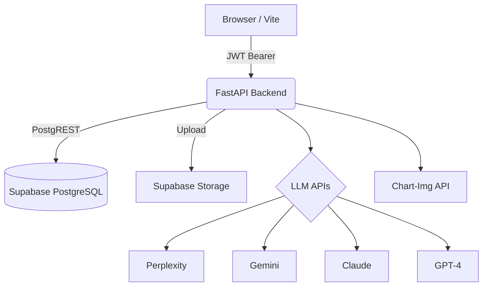

<div align="center">
  
  
  # SignalForge

  **AI-powered stock analysis platform that chains four LLM providers into a structured pipeline to produce trading recommendations.**

  [](https://www.python.org/)
  [](https://fastapi.tiangolo.com/)
  [](https://react.dev/)
  [](https://www.typescriptlang.org/)
  [](https://tailwindcss.com/)
  [](https://supabase.com/)

  *Note: This app does not execute trades. You review recommendations and trade manually (e.g., in TradingView).*
</div>

---

## 🚀 The Pipeline

SignalForge runs a sequential, multi-agent pipeline (with internal parallelism). If a non-terminal stage fails, the run continues in **degraded** mode so later stages can still execute.

1. **Screen & Research** (Perplexity) — Discovers or analyzes tickers, gathering fundamentals and optional news URLs for downstream stages.
2. **Sentiment** (Gemini) — Scores news and catalysts per ticker.
3. **Charts** (Claude Vision) — Reads Chart-Img chart images with sentiment context across multiple timeframes per ticker.
4. **Synthesis** (GPT) — Runs bull and bear cases in parallel, then a judge produces the final recommendations (or a single synthesis path when debate is disabled).
5. **Annotated Charts** (Chart-Img) — Overlays key levels and trade parameters on charts post-synthesis. Images are stored in **Supabase Storage**.

---

## 🏗️ Architecture



The backend uses the **Supabase Python async client** (`create_async_client`) to communicate with Postgres via Supabase's API. This avoids wire-protocol pooler issues on hosts like Railway.

> **Note:** [`docs/ARCHITECTURE.md`](docs/ARCHITECTURE.md) describes an older Tauri + SQLite layout in places. Treat this README and the `src/backend` code as the source of truth for the current web deployment.

---

## 🛠️ Tech Stack

| Layer | Technology |
|-------|------------|
| **Frontend Hosting** | Vercel (static build) |
| **Backend Hosting** | Railway (Docker [`Dockerfile`](Dockerfile)) |
| **Auth** | Supabase Auth (email/password; JWT `Bearer` to API) |
| **Frontend** | React 19, TypeScript, Vite 8, Tailwind CSS v4, React Router 7 |
| **Backend** | Python 3.14, FastAPI, Pydantic v2 |
| **Data & Storage** | PostgreSQL (Supabase), Supabase Storage (charts bucket) |
| **Package Managers**| `uv` (Python), `bun` (Frontend) |
| **Validation** | Pydantic; stage outputs use retry helpers in `pipeline/validation.py` |
| **Rate Limiting** | `slowapi` (e.g., `POST /api/pipeline/run` is rate-limited per IP) |

---

## 🚦 Getting Started

### Prerequisites

- **Python 3.14** — [python.org](https://www.python.org/) or `winget install Python.Python.3.14`
- **uv** — `winget install astral-sh.uv`
- **Bun** — `winget install Oven-sh.Bun`
- **Git** — `winget install Git.Git`

### 1. Clone & Install

```bash
git clone https://github.com/savagelysubtle/signalForge.git
cd signalForge

# Backend dependencies
cd src/backend
uv sync --all-groups --python 3.14

# Frontend dependencies
cd ../frontend
bun install
```

### 2. Environment Configuration

Copy the root template and fill in your values:

```bash
# From the project root
cp .env.example .env
```

<details>
<summary><strong>Backend <code>.env</code> Variables</strong></summary>

| Variable | Purpose |
|----------|---------|
| `PERPLEXITY_API_KEY` | Perplexity Sonar |
| `ANTHROPIC_API_KEY` | Claude |
| `GOOGLE_API_KEY` | Gemini |
| `OPENAI_API_KEY` | GPT |
| `CHARTIMG_API_KEY` | Chart-Img |
| `ENVIRONMENT` | `development` or `production` |
| `SUPABASE_URL` | Project URL (required for real auth — backend fetches JWKS for ES256 JWT verification) |
| `SUPABASE_ANON_KEY` | Public anon key |
| `SUPABASE_SERVICE_KEY` | Service role (backend PostgREST / admin operations) |
| `SUPABASE_JWT_SECRET` | Present in config; verification uses JWKS |
| `ALLOWED_ORIGINS` | Comma-separated CORS origins (e.g., `http://localhost:5173`) |
| `DATABASE_URL` | Loaded in settings but not used by `database/connection.py` |

</details>

Create the frontend environment file at `src/frontend/.env.local`:

```env
VITE_API_URL=http://localhost:8420
VITE_SUPABASE_URL=https://your-project.supabase.co
VITE_SUPABASE_ANON_KEY=your-anon-key
```

> ⚠️ **Never commit real secrets.**

### 3. Database Setup

Run [`001_initial.sql`](src/backend/database/migrations/001_initial.sql) in the Supabase SQL editor (or your migration process). This sets up tables like `strategies`, `pipeline_runs`, `stage_outputs`, `chart_images`, `recommendations`, and more.

### 4. Run Locally

Open two terminals:

```bash
# Terminal 1: Backend
cd src/backend
uv run uvicorn main:app --reload --port 8420

# Terminal 2: Frontend
cd src/frontend
bun run dev
```

- **Frontend:** `http://localhost:5173`
- **API:** `http://localhost:8420`
- **Health Check:** `GET /health` (checks DB via Supabase; may report `degraded` if unreachable)

> **Authentication in Development:** If `SUPABASE_URL` is unset, the API falls back to a fixed dev user ID (`middleware/auth.py`). This is convenient for local hacking but **not for production**.

---

## 📡 API Surface & Routing

All `/api/*` routes expect an `Authorization: Bearer <Supabase access token>` unless running without Supabase locally.

<details>
<summary><strong>Backend Endpoints</strong></summary>

| Method | Path | Description |
|--------|------|-------------|
| `GET` | `/health` | Liveness + DB check |
| `POST` | `/api/pipeline/run` | Trigger run. Body: `strategy_id`, `manual_tickers`, and/or `user_prompt` |
| `GET` | `/api/pipeline/status/{run_id}` | Full `PipelineResult` |
| `GET` | `/api/pipeline/runs` | Recent runs (summaries) |
| `GET` | `/api/pipeline/runs/{run_id}` | Same as status |
| `GET` | `/api/strategies` | User strategies |
| `GET` | `/api/strategies/templates` | Built-in templates |
| `GET` | `/api/strategies/{id}` | One strategy |
| `POST` | `/api/strategies` | Create strategy |
| `GET` | `/api/settings/api-keys/status` | Which env keys are set (booleans only) |

</details>

<details>
<summary><strong>Frontend Routes</strong></summary>

| Path | View |
|------|------|
| `/login` | Login |
| `/` | Recommendations (default) |
| `/history` | History |
| `/strategies` | Strategies |
| `/insights` | Insights |
| `/settings` | Settings |

</details>

---

## ⚙️ Development & Deployment

### Code Quality

Run these commands from `src/backend/` before committing:

```bash
uv run ruff format
uv run ruff check --fix
uv run ty check
```

For the frontend, run `bun run build` (which runs `tsc -b`) and `bun run lint`.

### Git Workflow

- **`main`** — Production; deploy via PR only.
- **`dev`** — Integration branch; feature branches merge here first.
- **Feature Branches** — Name them `feature/<short-description>` and branch off `dev`.

### Production Deployment

- **Backend:** Build from repo root using [`Dockerfile`](Dockerfile). Set `ENVIRONMENT=production`, secrets, and `ALLOWED_ORIGINS` to your Vercel domain.
- **Frontend:** Build with `bun run build` in `src/frontend`. Set `VITE_API_URL` to your Railway URL and configure Supabase variables.

### Editor Tasks

This repository does **not** ship a `.vscode/tasks.json`. You can add your own local tasks (e.g., "Backend: uvicorn" and "Frontend: Vite") which will be gitignored.

---

## 📚 Documentation

- [`docs/ARCHITECTURE.md`](docs/ARCHITECTURE.md) — Extended design notes.
- [`docs/PRD.md`](docs/PRD.md) — Product requirements.

## 📄 License

This project is licensed under the [GNU Affero General Public License v3.0](LICENSE). You are free to use, modify, and distribute this software, but any derivative work or network service using it must also be open-sourced under the same license.
